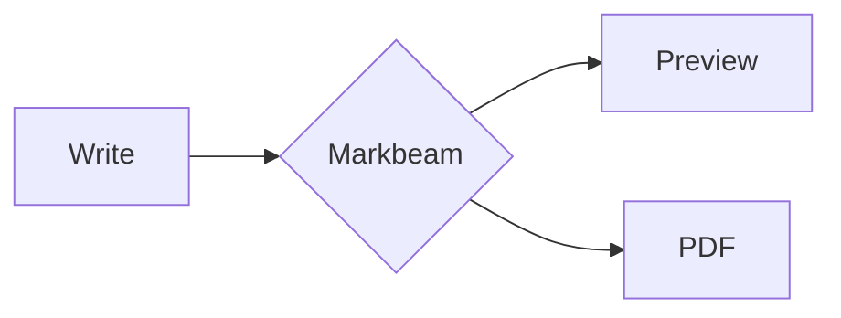

# Markbeam — Tasks

Ordered by priority. **File order is priority order** — `/work` takes the first `[ ]` it
finds unless you name a task.

Status: `[ ]` not started · `[~]` in progress · `[x]` done (moved to Completed)

Commands: **`/work`** picks the next task and completes it · **`/ship`** verifies it,
records how to check it against the reference site, marks it done, commits and pushes.

---

## P0 — Bugs

*Empty — T54 and T56 are done. New bugs go here, above P1.*

---

## P1 — Editor gaps

*Empty — T40, T41, T42, T43 and T44 are all done. New editor gaps go here.*

---

## P2 — Product

*Empty — T45, T46, T47 and T48 are all done. New product work goes here.*

---

## P2 — Bigger bets, decide before building

*Empty — T49 is done. New bets go here.*

---

## P3 — Housekeeping

### [ ] T63 · GitLab sync has never met the real API either

**Why:** T52 closed this gap for GitHub and found the client correct. GitLab is still covered
only by intercepted fixtures in `tests/gitlab.test.mjs`, and a fixture agrees with whatever the
client sends. Its shape is the riskier of the two — GitHub's write path is one verb with a
conditional field; GitLab's is two verbs and a status-code branch.

**What a fixture cannot vouch for**, each named because each fails in a different direction:

- **`writeFile()` sends `PUT`, then retries as `POST` on 400 or 404** (`src/gitlab.js:144`).
  GitLab splits create and update, and answers a POST onto an existing file with **400** rather
  than 404 — which is why PUT goes first. If that status is wrong, creating a new file fails
  while updating works, or the reverse, and only against the real API does it show.
- **The branch is hardcoded to `main`** (`src/gitlab.js:16`). A project defaulting to `master`
  would fail every read and write, and nothing asks GitLab what its default actually is.
- **`readFile()` reports `last_commit_id` as `id`** (`src/gitlab.js:136`) — the value auto-sync
  compares to decide whether the remote moved. Wrong, and conflict detection either never fires
  or fires constantly.
- **The project route is a URL-encoded path** (`:32`) and `listMarkdown` pages the tree at
  `per_page=100` (`:96`). Encoding and pagination are where a generous fixture and a strict API
  disagree.

**Done when:** `tests/live/gitlab.mjs` exists in the shape `tests/live/github.mjs` already
proved — `.env` or environment variables, never a token in the output, cleans up what it
creates, outside `npm test` so it cannot report a run that never happened — and one pass against
a scratch project confirms create, update, list, open and the rejected-token path. The result is
recorded here **including anything the fixtures had wrong**, which is the part T52 could only
report as "nothing".

### [ ] T53 · Two export paths no suite can reach

**Why:** `.doc` is only really validated by Word, and *Copy rendered HTML* by an actual email
client. Both have shipped on the strength of their MIME types and inlined styles alone.

**Done when:** the Word export is opened in Word and the clipboard HTML pasted into Outlook,
with the outcome recorded — tables keeping their borders and header shading is the specific
thing at risk, since that is what the inlining exists for.

---

## Out of scope

**#133 linter.** `MonacoEnvironment.getWorker` returns a no-op `Proxy`, so Monaco runs
with zero web workers and anything worker-backed silently does nothing. Not implementable
as requested without changing that foundation.

**Upstream contribution.** The project is developed independently; there is no upstream
to contribute back to.

**Google Drive and Dropbox sync, and publishing to Blogger, WordPress, Zendesk or Tumblr.**
StackEdit does all of these; every one needs OAuth and a callback server to hold the redirect.
Standing one up ends "there is no server that sees what you write" — the claim T36 turned down
an external image host to keep, one commit before T37 was written around it. Token-based targets
carry no such cost, which is why T47 and T48 are in the backlog and these are not. Revisit only
if the project ever decides to run a server, and revisit `/about` in the same breath.

**Collaborative workspaces and inline comments.** StackEdit's headline differentiator, and the
one gap that is not a feature. Real-time collaboration needs a server, accounts, identity and
conflict-free replicated state; comments need all of that plus a permission model. That is a
different product built on a different persistence model, not something to add to this one.

**ABC musical notation.** StackEdit renders it. It is an entire rendering dependency for an
audience that does not overlap with a developer-facing Markdown editor.

**The duplicate `html2canvas` in the build.** `dist/` contains both
`html2canvas-pro.esm` (248 KB) and `html2canvas.esm` (200 KB), which looks alarming given how
emphatically `CLAUDE.md` says the `-pro` fork is the dependency and the original must not come
back. It is not a regression and there is nothing to fix.

`html2canvas@1.4.1` is an **optionalDependency of jspdf**, and jspdf reaches it through a
*dynamic* import inside its `.html()` method:

```js
i.html2canvas ? Promise.resolve(i.html2canvas) : import("html2canvas")
```

Markbeam never calls `.html()` — `src/export/pdf.js` imports `html2canvas-pro` directly and
hands jsPDF finished canvases. So Rollup emits the chunk, and **no browser ever fetches it**:
the cost is deploy size only, with zero bandwidth and zero first-paint cost. Removing it would
mean fighting an optional transitive dependency for no user-visible gain.

Re-check both halves of that claim with:

```
node -e "console.log(Object.keys(require('jspdf/package.json').optionalDependencies))"
grep -c 'import("html2canvas")' node_modules/jspdf/dist/jspdf.es.min.js
```

If jspdf ever makes it a hard dependency, or the app starts using `.html()`, this stops being
free and the entry should be revisited.

---

## Completed

### [x] T52 · GitHub sync had never met the real API — 2026-09-01

**Why:** carried forward from T37, which shipped saying this rather than glossing it. Every
check in `tests/github.test.mjs` is served from an intercepted fixture, and a fixture agrees
with whatever the client sends — so the request *shape* was unproven.

**The result, which is an anticlimax worth recording: the fixtures were right.** Nothing in
`src/github.js` had to change. Both claims only GitHub could settle now hold against the real
API:

- `writeFile()` sends **no** `sha` when creating — `PUT accepted without a sha`.
- It sends the `sha` it looked up first when replacing — `PUT accepted with the looked-up sha`,
  and the sha moved `3dd606b7 -> 06eafa74`. Without that lookup GitHub answers 422, so this is
  the branch a fixture could never vouch for.

**One correction to this task's own framing.** It listed the 401 path as needing a scratch
repository and a token. It did not: running the harness with a deliberately invalid token
exercises the live 401 with no credential at all, and that is how it was first proven — the
same run that demonstrated the harness reports failures rather than passing vacuously
(6/10 failing, three passing).

**Why the harness is a script and not a suite.** `tests/live/github.mjs` is deliberately outside
`npm test`: it needs a credential and it writes to a real repository. A suite that quietly
no-ops when an environment variable is missing would report success for a run that never
happened — the vacuous green this repo keeps catching. Running it is a decision someone makes,
and CI, which has no token, never makes it. Credentials come from `.env` (gitignored, with a
committed `.env.example`) or real environment variables, which win over the file so a stale
`.env` cannot override a one-off run. The script never interpolates the token and scans its own
log for it before exiting.

**Measured:** `PASS github live — 10/10` against `sharjeelfaiq/markbeam-scratch`: create,
read-back (44 chars), update, sha moved, `id === sha` (the field auto-sync compares), list found
it among 2 markdown files, a rejected token refused with 401 on read, list and write, the
message naming no credential, the created file deleted again (HTTP 200), and nothing in the
output containing the token. Build clean and the full suite 39/39 either side — the harness sits
outside `npm test` and perturbs nothing.

**Still open:** GitLab remains fixture-only. `src/gitlab.js` splits create and update across
`PUT` and `POST` and answers a POST onto an existing file with **400**, which is exactly the
kind of shape a fixture cannot vouch for — the same gap this task closed for GitHub, from the
other side.

### Verify vs reference — T52

*On the reference* — https://markdownlivepreview.com has no sync of any kind, so there is no
client to prove and nothing to compare. This is a check on our own claim, not a feature
difference.

*On ours* — no user-visible change; the client was already correct. What changed is that it is
now proven, and re-provable in about ten seconds:

```
cp .env.example .env          # fine-grained token, Contents read+write, one scratch repo
node tests/live/github.mjs    # expect: PASS github live — 10/10
```

Two things worth doing without any credential, because they cost nothing and prove the harness
is honest:

```
node tests/live/github.mjs                                   # exit 2, "This is not a pass."
MARKBEAM_GH_TOKEN=invalid MARKBEAM_GH_REPO=octocat/Hello-World node tests/live/github.mjs
# 6/10 fail with a real 401 from api.github.com; the rejected-token checks pass
```

Revoke the token afterwards. The run takes seconds and the credential has no reason to outlive
it.

### [x] T59 · No Content-Security-Policy — 2026-09-01

**Why:** `readSharedPayload()` renders **attacker-controlled Markdown** in this origin — a share
link is a document a stranger wrote — and DOMPurify was the only thing between that and script
execution. T58 gave the app its own domain and a `headers` block to put a second layer in.

**The policy, and every concession in it:**

- **No `'unsafe-eval'`.** The task suspected mermaid, jspdf and html2canvas-pro of needing it.
  Measured instead: **zero `eval(` and zero `new Function` across all 71 built chunks**,
  cytoscape included. The suspicion was wrong and the policy is stricter for it.
- **`script-src` carries the sha256 of the inline pre-paint script**, not `'unsafe-inline'` —
  otherwise the directive would be worthless against exactly the Markdown this exists to
  contain. The cost is real: change that script without changing the hash and the browser
  blocks it, so every reload flashes the wrong theme with nothing in the console a user would
  report. `tests/csp.test.mjs` recomputes the hash from the **built** page and fails on drift.
- **`style-src 'unsafe-inline'` is unavoidable**, and worth saying plainly rather than glossing:
  Monaco injects its stylesheet as a `<style>` tag and `src/customCss.js` injects the user's.
  Nonces need a per-request server; this is static hosting. Script injection is the dangerous
  half and it stays locked.
- **`font-src data:` — the one the source could not tell me.** Vite inlines KaTeX's sub-4 KB
  `.woff2` files into `katex-renderer-*.css` under `assetsInlineLimit`, so the app loads a font
  from a data URL. Nothing in `src/` says so; it appeared only when the built app ran under the
  policy, which is the entire argument for how this was tested.
- `img-src data: blob:` for base64 images and the Mermaid-to-bitmap step in the PDF exporter;
  `cdn.jsdelivr.net` in `script-src` for Monaco; `api.github.com` and `gitlab.com` in
  `connect-src` for the sync clients. Nothing else leaves this origin.

**The suite is shaped oddly on purpose.** Every other suite drives the dev server, where
`vercel.json` does not exist — its headers are applied by Vercel to the built output. So
`tests/csp.test.mjs` builds the app, serves that build from a throwaway `node:http` server with
the real headers attached, and drives Chrome against it. A policy verified by reading the config
is a policy nobody has run the app under, and a wrong CSP fails silently: a diagram that never
appears, a PDF that comes out blank.

**Why it asserts the header exists, separately from asserting no violations:** with no policy
there are no violations either. The red-first run proved that — eight behavioural checks passed
against a build carrying no CSP at all, and only `no CSP header served` and the missing hash
failed. A suite that counted violations alone would have been green on nothing.

**Measured:** red first — `1 inline script(s): sha256-bgIKBZ… MISSING`, `no CSP header served`.
Green after — Monaco loads from the CDN, `mermaid svg=1, katex=1, data image=1`, injected user
CSS applies (`rgb(200, 0, 100)`), PDF export 1 page, slide export 2 slides, a share link
restores its document, **zero violations**, console clear of CSP complaints. Full suite 39/39.

**Verified by hand, 2026-09-01:** exercised on production in a real browser with DevTools open
— mermaid, maths, custom preview CSS and PDF export — with **no CSP violation messages**. That
check matters more than it looks: a CSP failure does not throw, the feature simply does nothing,
so a passing suite and a broken feature look identical from here.

### Verify vs reference — T59

*On the reference* — https://markdownlivepreview.com serves no `Content-Security-Policy` header
at all:

```
curl -sI https://markdownlivepreview.com | grep -i content-security-policy   # nothing
```

Its preview renders Markdown in its own origin with no second layer behind its sanitiser, which
is the same position Markbeam was in until this shipped.

*On ours*, after deploy:

```
curl -sI https://markbeam.app/ | grep -i content-security-policy
```

shows the policy, including `script-src` with a hash and no `'unsafe-eval'`.

**The check worth doing by hand**, because it is the one that would embarrass us: open
https://markbeam.app, then in DevTools → Console confirm there are no CSP violation messages
while you exercise a Mermaid fence, a `$x^2$` formula, an image paste, *Custom preview CSS*,
*Export as PDF* and *Present slides…*. A CSP failure does not throw — the feature simply does
nothing — so the console is where it shows.

Locally there is **no user-visible difference at all**: `vercel.json` headers do not apply to
`npm run dev`, so `http://localhost:5173` behaves exactly as before. `npm test -- "content
security"` is the local equivalent, and it is the only place the policy is exercised before
production.

### [x] T62 · Speed Insights, and the promise it had to be squared with — 2026-08-31

**Why:** no measurement of how fast the app actually is for real visitors — only local numbers
on a developer machine, which is the one machine that never has a slow connection.

**The decision was which half to take.** Vercel offers Web Analytics (page views, referrers,
per-visitor counting) and Speed Insights (Web Vitals). Only the second shipped. The claim on
`/about` is that nothing counts your visits or identifies you, and page-view analytics is
exactly the thing that claim is about; timings are not. Taking both would have meant retracting
the promise rather than qualifying it.

**Three bounds, each one a real failure avoided:**

- **Production only** (`import.meta.env.PROD`, dynamic import). The script lives at
  `/_vercel/speed-insights/script.js`, and the Vite dev server answers unknown paths with
  `index.html` — so a dev-time injection puts a console error into every suite that treats
  console errors as failures, which is most of them.
- **Same origin.** Script and beacon are served by Vercel from `markbeam.app`, so "no
  third-party requests" survives intact and stays checkable in the network panel.
- **`public/sw.js` skips `/_vercel/`.** Caching the script would serve a stale one, and
  replaying a beacon from cache would report a visit that is not happening.

**The wording moved with the code**, as T37 and T49 did before it: `/about` now says there is
no analytics tag, no cookie and no visitor identifier, *and* that page-speed timings are
collected — with a new FAQ answer, "Do you track me?", that says so plainly. `README.md` and the
welcome document match.

**Measured:** the pasted setup snippets were the Next.js/React ones; this app has no framework,
so the integration is `injectSpeedInsights()` from a dynamic import in `src/main.js`. Build
clean, full suite green, and no telemetry request is made in development — which is why the
suites are unaffected either way.

### Verify vs reference — T62

Not a user-facing feature; the honest check is that it is invisible where it should be and
present where it should be.

- Locally (`npm run dev`): the network panel shows **no** `/_vercel/` request at all.
- In production, after deploy: `/_vercel/speed-insights/script.js` loads from `markbeam.app`
  and nothing else appears — no cookie is set, and no request carries document text. Data lands
  in the Speed Insights tab of the Vercel dashboard within a few real visits.

### [x] T61 · Nothing to rank: the site had two pages and pointed at the old host — 2026-08-31

**Why:** searching *markdown viewer* did not find markbeam.app. Four separate causes, measured
on 2026-08-31, only the last about competition:

1. **Not indexed at all.** `site:markbeam.app` returned nothing — a days-old domain with no
   Search Console property, no submitted sitemap and no inbound links.
2. **The live pages named the old host.** Served canonical and `og:url` said
   `markbeam.vercel.app`, and so did the live `robots.txt` and `sitemap.xml`. A canonical
   pointing elsewhere is a page asking not to be indexed — T58 fixes it and was unpushed.
3. **The word nobody typed.** Title and description said *Editor with Live Preview*; "viewer"
   appeared nowhere on the site, despite the app being one.
4. **Two indexable pages**, neither aimed at any particular intent.

**What shipped.** The title becomes *Markbeam — Online Markdown Editor & Viewer with Live
Preview* (60 chars, inside the 65 the suite caps), descriptions name viewing, slides and PDF,
the JSON-LD gains `alternateName: "Markdown Viewer"` and an open-and-read feature entry, and
`/about` gains a *Reading a Markdown file* section plus `FAQPage` structured data over the Q&A
already on it. Four topic pages answer specific intents: `/markdown-viewer`,
`/markdown-to-pdf`, `/mermaid-diagrams`, `/markdown-slides`.

**They are pages, not keywords with a heading.** Each carries ~2,000 characters of real
explanation including what the thing *cannot* do — the PDF excludes custom CSS, Mermaid needs
one online run before it works offline, three dashes are not always a slide break. The suite
enforces that shape: ≥900 characters of prose, ≥3 sections, a description in the 50–160 window,
its own absolute canonical, and a link back to the app. A doorway page fails those checks,
which is the point of writing them that way.

**The check that would otherwise have lied.** The dev server answers an unknown path with
`index.html`, so a page that was never created returns 200 and looks fine. Every page assertion
first checks the response is *not* the app shell (`#editor` absent) — the same guard the
`/about` check has carried since T28, and the reason the fail-first run reported "served the
app shell — the page does not exist" rather than a green tick.

**Five inline copies of the colour ramp avoided.** `about.html` carried its own `<style>`; four
more pages would have meant five copies of the same six token values. They now share
`public/page.css` — still one duplication of `tokens.css`, because `public/` never passes
through Vite, but one instead of five.

**Measured:** fail-first — sitemap listing 2 URLs where 6 were required, and all four pages
reported as the app shell. Green after: sitemap lists 6, and the pages measure 2422 / 2377 /
2179 / 2021 characters across 5 / 4 / 4 / 4 sections, with descriptions of 151 / 155 / 152 /
149 characters. CI now smoke-tests all four clean URLs and `page.css` on the live host.

**Not claimed:** any ranking change. Rankings are not observable from this repo, "markdown
viewer" is held by exact-match domains and sites with a decade of links, and a fresh domain
starts with no history. What is measurable is the served markup and, once Search Console is
verified, indexation. `docs/seo-brief.md` records the rest as off-site work.

### Verify vs reference — T61

*On the reference* — https://markdownlivepreview.com is a single page. There are no topic
pages, no `/about`, and no structured data beyond the basics, so this is a comparison of one
page against six.

*On ours*, after deploy:

```
curl -sI https://markbeam.app/markdown-viewer | head -1     # 200, and the same for the other three
curl -s  https://markbeam.app/markdown-to-pdf | grep -o 'rel="canonical"[^>]*'
curl -s  https://markbeam.app/sitemap.xml | grep -c "<loc>"  # 6
```

Locally the `.html` spellings are what work — `cleanUrls` is a Vercel behaviour and the dev
server knows nothing about it, which is why the suite asks for `markdown-viewer.html` and CI
asks for `/markdown-viewer`.

### [x] T60 · Installable since T33, and never once mentioned — 2026-08-31

**Why:** the manifest, the icons and the service worker have been there since T33, so the app
could always be installed — and nothing ever said so. Chrome removed its own mini-infobar years
ago, leaving an address-bar icon nobody looks at; on iOS there is no signal at all, and no
programmatic install either.

**The offer is earned, not automatic.** `src/install.js` holds the whole policy and imports
nothing, so "when do we interrupt someone?" is one short file: never in standalone or after
`appinstalled`, never inside the backoff, and otherwise only once one of three signals says the
visitor is actually writing — 40 characters typed, 45 seconds with the tab in front of them, or
a second visit. One offer per session, or every later keystroke re-opens a banner already seen.

**"Not now" is an answer, and is treated as one:** 14 days, then 90, then never again. A
declined *browser* prompt is deliberately not counted as a dismissal — the browser already
asked, and counting it twice would burn two of the three refusals.

**The bug the suite caught, which is the interesting part.** Engagement was first counted from
the change event's text, on the reasoning that document length would wrongly count an opened
document as typing. Not enough: `setValue()` — which is how a document is opened, restored,
reset, or adopted from a share link — emits a change event carrying the *entire* text, so the
welcome document itself registered as 5,700 characters and the banner appeared the instant
anybody arrived. That is precisely the on-arrival prompt this task exists not to be. Monaco
flags those events with **`isFlush`**, and that flag is now the guard.

**iOS gets instructions rather than nothing**, since Share → Add to Home Screen is the only
route there; iPadOS reports itself as a Mac, so the touch-point count is what distinguishes it
from a desktop Safari. The banner is **not** a `<dialog>`: it never blocks the editor, and the
palette command *Install Markbeam* stays available whatever the policy has decided, so three
refusals are never a lock-out.

**Measured:** the suite was red first on five checks — no banner after real typing, no
`prompt()` call, nothing for a returning visitor, no dismissal recorded, no palette command.
Green after, including `prompt() called 1 time(s)`, `dismissals: 1` with a timestamp, silence
inside the backoff window, silence with `installedAt` set, and `0px` horizontal overflow at
375px with the banner up.

**Verified by hand, 2026-09-01:** the install flow was run in a real browser, which is the only
place it can be — headless Chrome can raise `beforeinstallprompt` but never completes an
install, so the suite proves the policy and a person proves the outcome.

### Verify vs reference — T60

*On the reference* — https://markdownlivepreview.com ships no manifest and no service worker,
so there is nothing to install: the browser offers no install affordance at all, and closing
the tab is the end of it.

*On ours* — http://localhost:5173, in Chrome:

- Type about fifty characters. The banner appears **above the status bar**, does not block the
  editor, and offers *Install* and *Not now*.
- Reload without typing and it stays away: arrival alone earns nothing.
  ```js
  JSON.parse(localStorage.getItem('markbeam:install')).v   // { visits, dismissals, lastDismissedAt, installedAt }
  ```
- Click *Not now*, then reload and type again — silent, because `dismissals` is 1 and the
  first backoff is 14 days. `Ctrl+K` → *Install Markbeam* still works, which is the difference
  between a backoff and a lock-out.
- Install for real: the app opens in its own window, and inside it the banner never appears —
  `display-mode: standalone` and the stored `installedAt` both say so.

### [x] T58 · The site moved to markbeam.app — 2026-08-31

**Why:** every absolute URL in the repo named `markbeam.vercel.app` — canonical, OG, Twitter,
JSON-LD, `robots.txt`, `sitemap.xml`, the README, the welcome document and the CI smoke
target — so a crawler was still being told the platform subdomain was the real address, and
both hosts served the same content.

**The discovery that made this two jobs, not one.** `https://markbeam.app` **308ed to
`https://www.markbeam.app`**: Vercel had www as the primary domain, so the apex was the
redirect and www was the site. Writing the canonical as the apex before flipping that would
have produced a canonical pointing at a redirect — worse than the stale host it replaced,
because it looks correct. The dashboard flip is the fix for www, and there must **never** be a
`www → apex` rule in `vercel.json` while the dashboard says the opposite: that pair is a
redirect loop.

**The old alias 308s rather than dying.** The rule lives in `vercel.json`, keyed on
`has: host`, not in a dashboard nobody diffs. Every link posted before the move keeps working,
and the duplicate stops competing for the same content. CI checks the redirect *separately*
from checking the site is up, because a redirect that silently stops working is invisible for
months.

**What the owned domain bought, beyond the name.** The `vercel.app` alias inherited Vercel's
HSTS; our host inherits nothing, so `vercel.json` now sets HSTS, `nosniff`,
`strict-origin-when-cross-origin`, `X-Frame-Options: DENY` and a `Permissions-Policy`. Worth
recording so nobody over-claims it: **`.app` is on the HSTS preload list as an entire TLD**, so
browsers already refuse plain HTTP to any `.app` host — the header covers subdomains and the
preload requirements, and is not what makes this site HTTPS-only. A CSP was deliberately *not*
bundled in: it needs measuring against the Monaco CDN, the inline pre-paint script and the
rasterisers' eval use, and that is **T59**.

**The guard, because a host swap is exactly the kind of change that half-lands.**
`tests/tooling.test.mjs` fails if any served file still names the old host, if `vercel.json`
loses the redirect, or if CI stops pointing at the canonical host. Asserted against the parsed
config rather than a grep: a redirect with the right strings in the wrong keys reads fine and
does nothing. `vercel.json`, `ci.yml`, `CLAUDE.md` and `docs/seo-brief.md` are excluded from
the string check on purpose — each *must* name the old host, to redirect it, to assert the
redirect, or to explain it.

**Measured:** guard red first, naming all nine files that still carried the old host; green
after. `docs/tasks.md` keeps its old-host occurrences — they record checks run against the site
as it was, and editing history to say something that was not true then is worse than a stale
string.

### Verify vs reference — T58

Not a product difference; the reference site has its own domain and always did. What is
checkable is the move itself:

```
curl -sI https://markbeam.app/            # 200, and the five security headers
curl -sI https://www.markbeam.app/        # 308 -> https://markbeam.app/
curl -sI https://markbeam.vercel.app/     # 308 -> https://markbeam.app/
curl -s  https://markbeam.app/ | grep -o 'rel="canonical"[^>]*'   # names the apex
```

The one that needs saying out loud: the first two lines only read that way **after** the Vercel
primary-domain flip. Before it, apex and www are the other way round, and the canonical this
commit ships points at a redirect.

### [x] T57 · The product moved and the words describing it did not — 2026-08-31

**Root cause:** three waves of features shipped (T45–T51) and the user-facing text stayed
where it was. The welcome document — the only thing a first-time visitor reads, and the only
place in the app that lists what the app *can do*, since the palette shows commands one search
at a time — named about twenty features and was missing thirteen: GitLab, Gists, automatic
sync, conflict handling, table editing, presentation mode, slide export, trash, custom preview
CSS, `[TOC]`, definition lists, typographic punctuation and folders. `public/about.html` still
described sync as GitHub-only. `README.md` carried a module tree missing eight files and a
suite list naming seven of thirty-seven. A feature nobody is told about may as well not have
shipped, which is the real cost, and it is invisible to every suite.

**`docs/seo-brief.md` was worse than stale — it was wrong.** It described a "verified starting
state" with no robots.txt, no sitemap, no canonical, no OG tags, no JSON-LD and no `<head>`
assertions, all of which T27–T29 had made false. A brief handed to an agent as fact is a brief
that produces work against a site that no longer exists; it is rewritten to what is served
today, with the custom domain named as the one genuinely open item.

**The repository link is gone from both footers** — the status bar and `/about`. The
`tests/ui.test.mjs` check that asserted it is **replaced rather than deleted**: it now asserts
the status bar contains no `#source-link`, no off-origin anchor and no `` at all. The
property that check was defending — the shell makes no third-party request and offers no
off-origin destination — outlived the link it was written for, and a deleted check defends
nothing.

**The constraint that shaped the welcome document.** It cannot contain a `$…$` pair, even
inside backticks: `hasMath()` in `src/markdown/math.js` scans raw source and knows nothing
about code spans, so a dollar-delimited example makes *every* first visit fetch KaTeX and
breaks the promise on `/about` that Markbeam does not fetch things you have never used. The
maths line describes the syntax in prose for that reason. It also carries no `---`: that would
render as a rule and cut the tour into slides in presentation mode.

**Measured:** the document went from 77 to ~150 lines, still exactly one Mermaid fence
(`tests/mermaid.test.mjs` counts one svg), still containing "Welcome to Markbeam"
(`tests/editor.test.mjs`), and `hasMath()` false against it, so the KaTeX chunk stays unfetched
on a first visit. Full suite green.

### Verify vs reference — T57

*On the reference* — https://markdownlivepreview.com opens with a sample document that
demonstrates Markdown syntax. It is a syntax sample, not a tour of the tool: there is nothing
else to tour.

*On ours* — http://localhost:5173 opens on a document that names every capability and
demonstrates the syntax while doing it, with a `[TOC]` built from its own headings. Check the
two things that are easy to get wrong:

- Hard-reload with the network panel open. **No KaTeX chunk is fetched** — the welcome text
  mentions maths without containing a dollar pair. Type `$x^2$` and watch it load on demand;
  that is the contrast worth seeing.
- The status bar has one link, *About*, and it stays on this origin:
  ```js
  [...document.querySelectorAll('.statusbar a')].map((a) => a.href)  // one, same-origin
  ```

### [x] T49 · Automatic sync, and what happens on a conflict — 2026-08-31

**Why:** StackEdit syncs every few minutes and merges automatically. T37 chose manual on purpose,
because every request happening at someone's request is what makes the claim on `/about` checkable
in the network panel rather than merely asserted.

**The decision, which was the task.** The timer is bounded on three sides, and each bound is a
failure someone else's autosync has:

- **Off unless enabled.** `loadAutoSync()` defaults to false, so anyone who never touches it sees
  exactly the T37 behaviour and an empty network panel.
- **Bound documents only.** A document becomes eligible only once a *manual* save has created a
  binding for it. The timer may repeat a decision the user already made; it may not make one. This
  is what stops files appearing in a repository nobody sent them to.
- **Changed, then idle** — 3s after typing stops (`IDLE_MS`, `src/autoSync.js`), never an
  interval. A blind timer resends unchanged documents and makes the network panel unreadable,
  which would cost the exact property being defended.

**There is no merge, and there must not be one.** On a conflict the remote copy is added as a new
document beside the local one and the user picks — the rule pulls already followed. A merge that is
wrong once costs someone a document; there is no version of "mostly right" here that is worth the
tail. Detection needed an identifier both services can supply, so `readFile()` in both clients now
returns `id`: GitHub's `sha`, GitLab's `last_commit_id`. Not GitLab's `content_sha256` — it changes
only when the bytes do, so two people writing identical text would look like no conflict at all.

`src/autoSync.js` imports nothing and `main.js` injects the clients, so the whole policy is
checkable by reading one 147-line file.

**Measured:** off — `0 request(s) after an edit`. On and bound — `1 write(s) after one edit`, then
`0 extra write(s) with nothing edited`. Moved remote — `0 write(s) against a moved remote`,
`1 -> 2 documents`, and the editor still holds the local text. Unbound document —
`0 write(s)`. The token is still `not stored` when a timer is the thing using it.

**Still open:** neither client has met the real API — **T52**.

### [x] T50 · A real table editor — an advantage, not parity — 2026-08-31

**Why:** *ahead of the reference rather than catching up.* StackEdit has had an open request for
one for years. T39 already inserted a table; editing one was the missing half, and Markdown tables
are the most tedious thing in the format to maintain by hand.

**A pipe splits a cell unless it is backslash-escaped — even inside backticks.** That reads like a
bug and is not: GFM requires `\|` for a literal pipe *including inside other inline spans*, so
`` `a|b` `` is two cells. Special-casing code spans in `src/markdown/table.js` would disagree with
the renderer sitting next to it, and the source would stop meaning what the preview shows. The
split is a scan rather than `split(/(?<!\\)\|/)`, because the regex leaves the backslash in the
cell and it reappears doubled on the next round trip.

`table.js` is pure — lines in, lines out — so the awkward half is tested without a browser.
`main.js` maps the cursor to a row and column, so *add row* lands under the row you are on rather
than at the bottom, and applies the result as one range through `executeEdits`: `setValue` would
drop the cursor and the undo stack, turning one edit into an unundoable rewrite.

**Measured:** `` `a\|b` `` survives a round trip byte-identical; an unescaped pipe inside backticks
splits (`["`a","b`","second"]`), matching the renderer; output comes back padded
(`| longer cell | c   |`); rows `2 -> 3 -> 2`; columns applied across every row (`header 3, rows
3,3`); removing the last column is refused, since a table without a column is not one; a run of
piped lines with no delimiter row is correctly not a table.

### [x] T51 · Presentation mode — an advantage, not parity — 2026-08-31

**Why:** *ahead.* Neither editor has one, and the pieces existed already — a preview that renders
without the app, and an exporter that already thinks in pages.

**Slides are cut on the rendered `<hr>`, never on the source `---`.** In Markdown those three
characters are also a setext heading underline and a front-matter fence, and inside a fenced block
they are just characters. The renderer has already decided which, so reading its output is the only
split that agrees with what the user sees. `tests/present.test.mjs` puts a `---` inside a fenced
block for exactly this reason: it is the check the obvious implementation fails, and it fails
silently — the deck simply gains slides nobody wrote.

Slides are **cloned** from `#output` rather than re-rendered, the same reasoning the PDF sandbox
uses: a clone carries the already-rendered Mermaid SVGs and KaTeX verbatim, and re-parsing is a
second chance to disagree with the preview.

`exportSlidesToPdf()` shares the page exporter's preamble (user CSS off, Mermaid forced light,
`decorateClone`, SVG-to-bitmap) and none of its machinery: no page offsets, no banding, because a
slide *is* a page. One landscape A4 page, one `html2canvas` call and one sandbox per slide. The
bitmap is fitted by aspect ratio and centred — stretching would blow a two-line slide up to fill
the page, and clipping would lose the bottom of a long one, which is a thing you discover on stage.

Full screen is **requested, not required**: it needs a user gesture and is refused outright in some
contexts, and a deck that fills the window is still a deck. A refusal must not take the feature
down with it.

**Measured:** the fenced-`---` document yields `3 slides (3 expected)`, `1 visible` at a time,
arrows move both ways, Escape closes, and the export produces `3 page(s) for 3 slides` — counted
by instrumenting `toDataURL`, so it counts bitmaps actually drawn rather than pages jsPDF claims.
Zero console errors in both passes.

**Verified by hand, 2026-09-01:** the deck and its exported PDF were opened and looked at. The
suite counts slides and canvases; it cannot see that a slide is centred rather than stretched,
or light rather than dark, which is why this one wanted eyes.

### Verify vs reference — T49, T50, T51

All three are features the reference does not have, so the comparison is absence versus presence.

*On the reference* — https://markdownlivepreview.com has no account and no sync of any kind, no
table editing beyond retyping the pipes (adding a column means editing every row by hand), and no
presentation mode: the only way to show a document is to show the editor.

*On ours* — http://localhost:5173:

- **T49.** Connect a repository, save a document manually once, then `Ctrl+K` →
  *Turn on automatic sync*. Type, stop, and watch the network panel: **one** `PUT`, about three
  seconds after the last keystroke. Keep waiting — nothing else fires, because it is idle-driven
  rather than an interval. Then create a *new* document and type in it: no request at all, ever,
  because it has never been saved to a repository. The precondition is the point, so state it
  before testing: with the toggle off, or the document unbound, the correct result is an empty
  network panel no matter how long you type.
  ```js
  JSON.parse(localStorage.getItem('markbeam:auto_sync')).v          // false until switched on
  Object.keys(JSON.parse(localStorage.getItem('markbeam:remote_bindings')).v)  // only manually saved docs
  ```
  For the conflict: edit the file in the repository's web UI, then edit locally and pause. The
  document count goes **up by one** — your text stays in the editor, theirs arrives beside it as
  *"<name> (from GitHub)"*. Nothing is overwritten in either direction.
- **T50.** Put the cursor inside a table → `Ctrl+K` → *Table: add column*. Every row gains a cell
  and the source comes back aligned. One `Ctrl+Z` undoes the whole thing, which is the visible
  proof it went through `executeEdits` rather than `setValue`. Type `` | `a\|b` | x | `` and check
  the preview shows a single cell containing `a|b` — then remove the backslash and watch it become
  two cells, in the preview *and* in the editor, together.
- **T51.** Separate blocks with `---`, then `Ctrl+K` → *Present slides…*: full screen, one slide
  at a time, `←`/`→`/`Space`/`Home`/`End`, `Esc` to leave. Put a `---` inside a fenced code block
  first — it must **not** create a slide. Then *Export slides as PDF…*: one landscape page per
  slide, light-themed even from a dark app.

### [x] T45 · Deleting a document destroys its history with it — 2026-08-31

**Root cause:** `deleteDocument()` called `forgetHistory()`, so one confirm removed the document
*and* every autosaved version of it. That is exactly the loss T22 was built to prevent, reached by
a different route — and unlike an accidental edit, nothing could bring it back.

**Shape.** `src/trash.js` is a **separate** bucket with its own cap: 10 entries, 256 KiB, seven
days. Sharing the history budget would have meant deleting one document could evict the snapshots
of documents still open — the same loss from the other side. `src/ui/toasts.js` grew
`toast(message, { action })` so the offer to undo appears at the moment of deletion rather than
only in a menu; a deletion nobody notices is one nobody goes looking for.

**Measured:** undo restores the text *and* 3 autosave snapshots. Seeded 12 oversized entries and
the sweep left 251 KB in 6, against a 256 KB budget.

### [x] T46 · Exports have a fixed appearance — 2026-08-31

**Why:** StackEdit offers templates for custom output; ours were fixed — one HTML style, one Word
style, one PDF layout, so any house style meant post-processing.

**The refusal is the interesting half.** `this is not css at all {{{` is *not* a parse error to
CSSOM — it reads as a selector with an empty body, so a naive "did it parse?" check accepts it and
replaces a working stylesheet with nothing. `src/customCss.js` drops declaration-less rules, which
is what makes nonsense refusable. `@import` is dropped too: it is a network fetch initiated from a
stylesheet, and the promise on `/about` is that nothing leaves the browser.

**The PDF is excluded, deliberately, and the sheet says so.** The export sandbox carries `mb-md`,
so preview-scoped user CSS applies to it and html2canvas-pro re-parses it — precisely the
blank-document failure `CLAUDE.md` warns about, and the reason the dependency is the `-pro` fork.
`exportPreviewToPdf()` disables `#markbeam-user-css` and restores it in `finally`. Excluded rather
than validated: no allowlist is as trustworthy as not handing the rasteriser the sheet at all.

**Measured:** the stylesheet is off at page-render time (`samples at page-render time: [true]`) and
back on afterwards (`disabled now=false, pdf 46 KB`). Nonsense is refused with *"No usable CSS
rules were found in that stylesheet"* and the previous rule stays in effect.

### [x] T47 · Publish to a Gist — 2026-08-31

**Why:** the smallest real extension of T37 — same token, same client, same auth model, no new
credential and no new trust decision. A share link carries the document in the URL; a Gist gives it
an address that survives being pasted into a chat window.

**Why `isPublic` is a required argument, not a defaulted one.** A Gist published publicly by
accident cannot be un-published by deleting it — the URL has already been handed out. `createGist`
in `src/github.js` therefore forces the caller to have decided, and the sheet ticks **Secret** by
default and says in words that publishing publicly cannot be undone later.

The URL is copied to the clipboard rather than merely shown. It is the entire point of publishing,
and a link someone has to retype out of a disappearing toast is not a link they have been given;
the toast carries the URL itself when the clipboard is denied.

**Measured:** `POST https://api.github.com/gists`, `public=false` when secret was chosen, token in
the header and not the URL, clipboard `["https://gist.github.com/octocat/abc123"]`.

### [x] T48 · GitLab as a second sync target — 2026-08-31

**Why:** token-based exactly like GitHub, so it needs no callback server and no OAuth — the
constraint that keeps Drive and Dropbox out of scope.

**The reversal worth recording.** T37 shipped a **single** credential slot. A second provider turns
that into a bug that stays invisible until it matters: connecting GitLab would silently sign you
out of GitHub, discoverable only by trying to save and being asked to connect again.
`src/githubAuth.js` is gone; `src/remoteAuth.js` holds one slot per provider, and `disconnect()`
forgets only the provider that failed — a token GitLab rejected says nothing about a GitHub one.
GitHub keeps the exact key names T37 wrote, so an existing connection needs no migration.

**GitLab's two verbs.** `writeFile` tries `PUT` and falls back to `POST`, because GitLab splits
create and update and answers a POST onto an existing file with **400**, not 404. The reverse order
would surface "already exists" as the failure for the ordinary case. Two clients rather than one
abstraction: the APIs disagree on how a project is identified, how a path is encoded, which verb
creates, and where the branch is named — a shared wrapper would be mostly branches.

**A test broke, and it is the second time this session for the same reason.** The commands were
renamed to `Save to a repository…` / `Open from a repository…` / `Disconnect repository`, because
"Save to GitHub" is wrong once a GitLab project can be the target. `tests/github.test.mjs` drives
the palette by literal title, so all of it went red with `no such palette command`. The needles
moved and its `connect` helper now pins the picker to `github`; 19/19 again, with the
briefly-vacuous checks substantive once more (`imported=true`, 2 authed requests, real toasts).
**A suite that encodes a product string as its driver will break on any rename — that is working
as intended, but only if the rename is the thing you then verify.**

**Measured:** `PUT .../projects/octocat%2Fhandbook/repository/files/gitlab-fixture.md`;
`github token intact=true, github repo={"v":"octocat/notes"}, gitlab repo={"v":"octocat/handbook"}`;
`url leak=false`; GitLab token not persisted by default.

**Still open:** both sync clients are proven against intercepted fixtures only. Neither has met the
real API — that is **T52**, and GitLab now inherits exactly that gap.

### Verify vs reference — T45, T46, T47, T48

All four are features the reference does not have, so the comparison is absence versus presence
rather than a behaviour difference.

*On the reference* — https://markdownlivepreview.com is a single-document pane. There is no
document list, so nothing to delete or restore (T45); no styling control, so the preview has one
fixed appearance (T46); and no account, token or sync of any kind, so neither Gist publishing (T47)
nor any repository target (T48) exists to compare against.

*On ours* — http://localhost:5173:

- **T45.** Create a second document, type into it so it autosaves, then delete it. The toast carries
  an **Undo**; click it and the document returns *with its history*. Confirm the snapshots came
  back, not just the text — the text alone would look identical:
  ```js
  JSON.parse(localStorage.getItem(`markbeam:history:${id}`)).v.length  // > 0 after Undo
  ```
- **T46.** Palette → the custom CSS sheet. Paste `h1 { color: rebeccapurple; }` and Apply — the
  preview heading changes, the editor and toolbar do not. Then paste `this is not css at all {{{`
  and Apply: it is **refused** and the previous sheet stays. Export HTML and the rule is in the
  file. Export **PDF** and it is deliberately absent — the documented exclusion, not a bug.
- **T47.** Needs a GitHub token. Palette → *Publish as Gist…*. **Secret** is ticked by default. On
  success the URL is on the clipboard, and in the toast if the clipboard was denied.
- **T48.** Palette → *Save to a repository…*. The sheet leads with a **Service** field. Pick GitLab,
  enter `group/project` and a `write_repository` token, save. Switch back to GitHub and the
  repository box repopulates with the GitHub path — the two are stored separately:
  ```js
  Object.keys(localStorage).filter((k) => /^markbeam:git(hub|lab)_repo$/.test(k))
  // ["markbeam:github_repo", "markbeam:gitlab_repo"] — both present, neither clobbered
  ```
  Watch the network panel: the token is in the `Authorization` header and never in the URL.

### [x] T37 · Sync between devices, via GitHub — 2026-08-29

**Why:** documents lived in one browser profile and could only leave as a share link or an
export. StackEdit syncs to Drive, Dropbox and GitHub.

**The decision this task was gated on.** GitHub was the only client-side option — Drive and
Dropbox want OAuth and a callback server. Three things were settled before any code:

- **Opt-in, and the promise reworded in the same commit.** The app claimed in three places
  that documents *never* leave the machine (`about.html` lede, its privacy section, `README`).
  Sync makes that false the moment anyone connects, so all three now say documents stay in
  the browser *unless you connect a repository yourself*, and the privacy section names the
  exception in full. `README`'s "No third-party requests" became "unless you ask for one".
- **Session-only credential by default**, with an explicit *remember on this device* opt-in.
- **Manual save and open**, not background sync. Every request happens because someone just
  asked for one, which is what makes the reworded promise checkable in the network panel
  rather than merely asserted.

**Why the token is not persisted by default.** This is the first credential the app holds,
and `readSharedPayload()` already renders **attacker-controlled Markdown** in this origin.
DOMPurify is the only thing between a share link and script execution; if it ever fails,
whatever is in localStorage is readable. Nothing to read beats something to read.

**Shape**

- `src/github.js` — Contents API client. No DOM, no storage, no token lifetime.
- `src/githubAuth.js` — the credential, and the only importer of the token storage functions.
  *(Superseded by `src/remoteAuth.js` in T48, which holds one slot per provider.)*
- `src/ui/remote.js` — one sheet with two faces, connect then pick a file.
- `src/storage.js` — repo name in the usual envelope; the token in its own bare-string pair,
  deliberately outside the generic helpers.

Pulled files become **new documents**, never a replacement — the rule share links already
follow, because a remote fetch that silently overwrites local work is a data-loss path.

**Three bugs the build did not catch**

1. `titleFromFilename` used but never imported — every pulled file would have crashed.
2. A name collision: `main.js` already had a local `openFiles()` for the file picker, which
   shadowed the import inside `init()`. GitHub listings were handed to the Markdown file
   reader as if the entries were `File` objects, producing `Could not read "roadmap.md"`.
   The suite showed an empty list; only a probe explained why.
3. The connect form rendered *behind* the file list. `.sheet__form { display: flex }` beats
   the user-agent `[hidden] { display: none }` rule, so hiding it did nothing. Assertions
   passed — they queried the list, which was correct. **Only looking at a screenshot caught
   it.** It now has its own check that measures the rendered box, not the attribute.

**Evidence — 19 checks, all fixtures**

The suite fulfils every `api.github.com` call from a fixture, so it never contacts GitHub and
never needs a real token; a test that only runs on one machine is a test nobody runs.

```
✓ the token travels in the Authorization header and never in the URL — 2 authed request(s)
✓ by default the token is not written to localStorage — 10 markbeam keys, none holding it
✓ a session-only token is gone after a reload
✓ disconnecting clears the stored token
✓ a hostile remote document renders inert — imported=true, executed=false, scripts=0
✓ the token reaches no document, no history snapshot and no URL
✓ a rejected token surfaces a specific message — GitHub rejected that token…
```

**Two checks were written to avoid passing vacuously**, which this repo has shipped twice
before. The leak check seeds a token *first* and then asserts absence — otherwise "no token
in history" is true of any build with no token concept. The hostile-content check is gated
on the import having happened, or a build that fetches nothing sails through it. The first
baseline run came back 12 red / 6 green, and **four of those greens were vacuous**; all four
were hardened before a line of the feature was written.

**Still unverified: the live round trip.** No fixture can prove the request shape against the
real API. Saving, the `sha` lookup that turns a create into an update, and the 401 path have
been exercised only against fixtures. Worth one pass with a fine-grained Contents-only token
on a scratch repository before relying on it.

**Verify vs reference**

*On the reference* — https://markdownlivepreview.com has no sync of any kind. A document
exists in the tab you typed it in.

*On ours* — http://localhost:5173, `Ctrl+K` → **Save to GitHub…**. The prompt appears and
**nothing is requested yet** — the network panel stays clear of `api.github.com`, which is the
reworded privacy claim being checkable rather than asserted. Give it `owner/repo` and a
fine-grained token with Contents read/write on that one repository; the document is written
there and the toast names the file. `Open from GitHub…` lists only Markdown files and opens
one as a **new** document, leaving the current one alone.

The credential, checkable by hand:

```js
Object.keys(localStorage).filter((k) => k.includes('github'))
```

reads `['markbeam:github_repo']` after a default connect — the repository is remembered, the
token is not. Tick *remember on this device* and `markbeam:github_token` joins it.
**Disconnect GitHub** removes it, and so does a 401.

---

### [x] T40 · Find and replace made discoverable, and search across documents — 2026-08-30

**Why:** two separate problems. Monaco's find widget already worked — `src/editor/index.js`
disables `contextmenu`, `folding` and `quickSuggestions` but never `find` — and nothing
anywhere said so. And since T9 allowed several documents, "which document did I write that
in" had no answer but opening each one.

**The trap, and the substance of this task.** `keys` on a palette command is **not a label**:
`handleGlobalKeys` in `src/ui/palette.js` binds it globally and calls `preventDefault`. The
obvious `keys: 'mod+f'` on a find command would therefore have stolen
<kbd>Ctrl</kbd>+<kbd>F</kbd> from the **preview pane**, where the browser's own find is what
people want — and it would never have fired in the editor anyway, since Monaco stops
propagation for keys it binds.

`matches()` already read a `command.hint` field for filtering that `render()` never
displayed, so the fix was half-built: **`hint` now renders as a badge without binding**. The
find commands carry `hint`; only *Search all documents* carries `keys`.

**Shape**

- `src/search.js` — pure. Capped at 50 hits total and 10 per document, reporting
  `truncated` rather than stopping silently. The per-document cap is what stops one flooded
  file crowding out every other document's matches.
- `src/ui/search.js` — the sheet, 160ms debounce, because scanning every document on each
  keystroke makes typing feel heavy.
- `src/editor/index.js` — <kbd>Ctrl</kbd>+<kbd>Shift</kbd>+<kbd>F</kbd> registered as an
  `editor.addCommand` **as well as** palette `keys`, per the rule in `CLAUDE.md`. Registered
  only on the palette it would work everywhere except the editor, which is where a writer is.

The open document is read from `editor.getValue()` rather than storage. The two agree today
because `saveDoc` runs on every keystroke, but a search that silently depended on that would
start lying the moment saving is debounced.

**A weak assertion of mine, caught by reading the output.** The first green run reported a
row as `"UntitledBeta also mentions…"` — the check for "each row names its document" was
passing on the word *Beta* appearing in the **body text**, not in a title. The fixture now
names its second document and the check reads `.sheet__result-title` directly:
`titles rendered: ["Beta notes","Alpha"]`.

**Measured:** baseline 11 red / 3 green, the greens being the standard console-error guards;
final 14/14. Result rows keep a positive gap at 375px, long snippets clip rather than wrap,
every row a uniform 44px, zero page overflow at either width.

**Verify vs reference**

*On the reference* — https://markdownlivepreview.com has one document and no search of its
own; StackEdit, the comparison this came from, describes its own find and replace as very
basic and has nothing that searches across files.

*On ours* — http://localhost:5173:

1. `Ctrl+K` shows **Find in document** and **Find and replace**, each with its shortcut
   printed beside it. Running either opens Monaco's widget on a focused editor.
2. Click into the **preview** pane and press <kbd>Ctrl</kbd>+<kbd>F</kbd>. The **browser's**
   find opens, not ours — that is the trap above, pinned by a check that dispatches Ctrl+F at
   `#output` and asserts `defaultPrevented === false`.
3. With two or more documents, press <kbd>Ctrl</kbd>+<kbd>Shift</kbd>+<kbd>F</kbd> **from
   inside the editor** and type a term both contain. Rows name their document and give a line
   number; choosing one switches document and selects the match.

**Not in this task:** replace *across* documents. The Done-when asked for search and open,
and a find-and-replace that rewrites files you cannot see is a data-loss path deserving its
own task and its own undo story.

---

### [x] T42 · `[TOC]`, with links that work everywhere — 2026-08-30

**Why:** T35 added an *outline* — a sheet you open. Nothing put a contents list **into the
document**, so no export had one and a long exported PDF had no way in.

**It reverses a decision T35 made deliberately.** That task set `headerIds: false` and
recorded in `src/ui/outline.js` that heading ids would be "a new public surface — anchor
links, duplicate-slug rules, and ids leaking into exported HTML". `[TOC]` needs targets, so
the surface is now taken on deliberately and written down in `src/markdown/slug.js`. The old
comment is rewritten rather than left contradicting the code.

**`headerIds: false` was dead code.** marked removed the option in v5 and v15 ignores it —
`m.parse('# Hello World')` returns `<h1>Hello World</h1>` either way. The line implied a
decision that nothing enforced. Ids now come from a `renderer.heading` override, which is the
only thing that ever assigned them.

**Duplicate slugs are the substance, not an edge case.** Two `## Notes` headings are ordinary
in a real document; a naive slugger gives both the same id, so every link to the second one
silently goes to the first and nothing looks broken. Measured:

```
["handbook","setup-config","notes","usage","notes-1"]
```

**Headings are collected by `walkTokens`**, which marked runs after lexing and before
rendering — so a `[TOC]` at the top can list headings that come after it, and
`renderer.heading` hands out ids by **position** rather than re-slugging, which is what makes
a link and its target unable to disagree.

**The PDF was not the risk I called it.** I flagged the coordinate maths as the part that
might not hold. It is exact:

```
pxPerMm = CONTENT_WIDTH_PX / PAGE_WIDTH_MM        // 720 / 190
page n covers content y in [start, start + pageHeightPx)
image drawn at (MARGIN_MM, MARGIN_MM), sized PAGE_WIDTH_MM x PAGE_HEIGHT_MM
```

`RENDER_SCALE` never enters — it changes bitmap resolution, not geometry. The real constraint
was **ordering**: the band loop mutates `content.style.marginTop`, so every rect must be
measured before it runs. Result: **5 link annotations across 3 pages**, destinations
`["3","3","3","3","7"]` — four entries to page 1, the second *Notes* to a later page.

**Three mistakes, all mine**

1. Splitting `lexer()` and `parser()` broke `marked-footnote`, which builds state during
   `parse()` and threw `Cannot read properties of undefined`. `walkTokens` replaced it.
2. `pages > 1` was a wrong expectation rather than a bug — `pageHeightPx` is 1049 and the
   fixture rendered about 1000px in the sandbox, so it genuinely fitted on one page.
3. **The suite's own download instrument broke a check.** It replaces
   `HTMLAnchorElement.prototype.click` with a stub that does not call through, so `.click()`
   on a contents entry did nothing and looked like a broken feature. It dispatches a real
   event now.

The pane check also read `pane 2` — two pixels into a smooth scroll — because the wait
returned on `> 0`. It waits for the value to settle, and reads **548**.

**Verify vs reference**

*On the reference* — https://markdownlivepreview.com renders `[TOC]` as the literal text
`[TOC]` and gives headings no ids at all, so there is nothing to link to.

*On ours* — http://localhost:5173, with `[TOC]` under the title and a few headings, two of
them sharing a name:

1. A boxed, indented contents list appears and the marker itself is gone.
2. Both same-named headings are listed, and they point at different sections.
3. Clicking an entry scrolls the preview; the header does not move (T56's path).

```js
[...document.querySelectorAll('#output h1,#output h2,#output h3')].map((h) => h.id)
// ["handbook","setup-config","notes","usage","notes-1"] — note the deduped last one
```

**Export as HTML** and the file carries both `id="setup-config"` and `href="#setup-config"`;
Word likewise. **Export as PDF** and the entries are clickable — the suite proves the
annotations exist and point at more than one destination, so clicking one in a real viewer is
the one part worth doing by hand once.

---

### [x] T44 · Typographic punctuation, off by default — 2026-08-30

**Why:** StackEdit ships SmartyPants on. Straight quotes to curly, `--` to a dash, `...` to
an ellipsis — it makes prose look typeset.

**Off by default, and that is the design rather than caution.** This is a developer-facing
editor, where a straight quote in prose is usually deliberate. On by default, the first time
someone pastes `curl -H "Accept: text/plain"` into a paragraph it comes out corrupted and
they have no idea what did it.

**Where it runs.** marked v15 dropped its own `smartypants` option, so the transform is
`src/markdown/typography.js`, applied in `renderer.text` on the token's **raw text, before
escaping** — after escaping a straight quote is already `&quot;` and no pattern would match
it.

**Code is untouched structurally, not by rule.** Code spans render through
`renderer.codespan` and fenced blocks through `renderer.code`; neither calls the text
renderer. A text token that carries child tokens is skipped too — its children arrive
individually, so transforming the container as well would corrupt any code span inside it.

**Rule order is load-bearing:** `---` before `--`, or an em dash is eaten as an en dash plus
a stray hyphen; and opening quotes before closing ones, so the decision is made on the
character *before* the quote. That is what makes `Don't` an apostrophe rather than an
opening quote, without the transform needing to know any English.

**A flaw found while verifying, not by a test.** The flag was set, the parse run, the flag
cleared. A parse that threw would have left it set, and every later render — including for
documents whose author never enabled this — would silently curl quotes with nothing to
indicate why. Now cleared in `finally`.

**Measured:** baseline 6 red / 2 green, one of those greens vacuous and gated before the
feature was written. Final 8/8.

```
prose  She said “hello” and then ‘goodbye’ – rather abruptly — twice… Don’t
code   git log --oneline | curl -H "Accept: text/plain" | grep --count "needle"
```

**Verify vs reference**

*On the reference* — https://markdownlivepreview.com applies no typographic substitution at
all; straight quotes stay straight with no way to change that. StackEdit, the comparison this
came from, applies it always, with no way to turn it off.

*On ours* — http://localhost:5173, paste:

```
She said "hello" -- then 'goodbye'... Don't stop.

Run `curl -H "Accept: text/plain"` in the shell.
```

1. Nothing changes. That is the default, and it is the point.
2. `Ctrl+K` → **Turn on typographic punctuation**. The prose curls; the code span does not.
3. Reload — still on. `Ctrl+K` → **Turn off** — the straight quotes come back exactly as
   typed.

The setting, checkable directly:

```js
JSON.parse(localStorage.getItem('markbeam:typography') || 'null')   // {v: true} once enabled
```

---

### [x] T43 · Definition lists — 2026-08-30

**Why:** Markdown Extra parity, and the one common list type Markbeam could not express.

**A block-level extension** (`src/markdown/deflist.js`), unlike the inline ones beside it —
a definition list is a block container, and inline extensions never see the line structure
this needs.

**The feature is the rejections, not the matching.** A line beginning with a colon is
ordinary punctuation far more often than it is markup, and a greedy tokenizer quietly
restructures any document containing a time, a ratio or a pasted YAML block. So:

- the colon must be the **first non-space character of its own line**, followed by
  whitespace — `14:30` and `3:1` are mid-line and never considered;
- the term line must not already be a heading, quote, list item, fence or another
  definition, which is what stops `A line ending in a colon:` followed by prose from
  becoming a term with no definition;
- fenced code is never reached, because marked's block lexer consumes a fence whole before
  extensions are consulted — the same reason the highlight extension can ignore backticks.

Four of the seven checks guard those cases; two cover the happy path. That ratio is the
point.

**Two of those four were vacuous on the first run** and were gated before the feature was
written: "no false positives" and "a colon in a fence stays code" are both trivially true
of a build with no definition lists at all. They now require at least one list to render
first.

**Measured:** baseline 4 red / 3 green, final 7/7. Terms `["Markbeam","Mermaid"]`, five
`dt`/`dd` elements surviving DOMPurify, definitions legible in both themes
(`rgb(169,180,198)` on `rgb(14,16,21)` dark, `rgb(71,83,95)` on white light) and indented
from their term.

**Styling note.** `src/styles/preview.css` is re-parsed by the PDF rasteriser, so the rules
use plain properties only — anything it cannot read breaks export while the app looks
perfect, and no visual check catches that.

**Verify vs reference**

*On the reference* — https://markdownlivepreview.com renders

```
Markbeam
: An online Markdown editor.
```

as two plain lines of prose, the colon included as literal text. It has no definition-list
support.

*On ours* — http://localhost:5173, the same input renders a bold term with an indented
definition beneath it, carrying a left rule. A second `: line` under the same term adds a
second definition to it rather than starting a new list.

The rejections are the interesting half, and they are checkable by hand:

```
The meeting is at 14:30 today.        -> stays prose
Ratio 3:1 in a sentence.              -> stays prose
A line ending in a colon:             -> stays prose, not a term
and the next line, which is prose.
```

and inside a ```yaml fence, `key: value` stays code. Console check:

```js
document.querySelectorAll('#output dl').length   // 1 for the block above, not 4
```

---

### [x] T55 · A stale dev server was indistinguishable from a real failure — 2026-08-30

**Why:** during T41 the dev server served an old `main.js` and an old `app.css` while both
files on disk were correct. Five checks failed and one CSS rule silently did nothing. Every
failure looked real — right suite, right names, plausible details — and most of a debugging
cycle went into the feature before `curl` showed the served file had none of the new code in
it. An mtime bump fixed it.

`CLAUDE.md` already forbids editing source *during* a run, because Vite hot-reloads mid-run.
This was the neighbouring failure: the server serving stale code *between* runs, where
nothing is racing and the result is simply wrong.

**Fix: force freshness, do not detect staleness.** `tests/run.mjs` now bumps the mtime of
every source file before any suite runs — 40 files, mtimes only, no content written — and
prints `Refreshed 40 source files` so the step is visible in every run.

**Detection was tried and rejected**, and that is the part worth remembering: `?raw` and
`?t=` are *different module ids with their own cache entries*, so a probe through either can
come back fresh while the module the app actually imports is stale. A check that can pass
while the bug is present is worse than no check, because it teaches everyone to trust it.

**On the red/green rule.** Every other suite in this repo was watched failing first. That is
not achievable here: Vite cache staleness is a race that nothing reproduces on demand. The
honest red was that `tests/freshness.mjs` did not exist, so the new suite could not import
and threw. That is recorded in the suite header rather than dressed up as a behavioural
failure it never was.

**What the new `tooling` suite proves** — 4/4, and no browser involved:

```
✓ the freshness pass touches every source file — 40 files touched, 0 older than 30s
✓ it covers stylesheets too, not only scripts — 3 stylesheets in the sweep
✓ the dev server serves current file contents, not a cached transform — token echoed back
✓ the probe file is removed afterwards — cleaned up
```

The third is end-to-end rather than inferential: it writes a file containing a token nothing
else could contain, asks the dev server for it, and requires the token back. The fourth
exists because a stray file under `src/` would show up in `git status` and get committed by
the next person running `git add -A`.

**Stylesheets are in the sweep deliberately** — `app.css` was one of the two files served
stale, so a JS-only pass would have missed half the original bug.

**Verify vs reference**

No user-visible difference; this is test infrastructure and the app is untouched. Inventing
a user-facing symptom would be dishonest.

What changed for anyone running the suite: `npm test` now prints `Refreshed 40 source files`
before the first suite. To see why it exists, edit a source file, then compare disk against
what the server hands out:

```
grep -c somethingYouJustAdded src/main.js
curl -s http://localhost:5173/src/main.js | grep -c somethingYouJustAdded
```

Those two disagreeing is the bug this prevents.

---

### [x] T56 · A link into the document scrolled the whole app, hiding the header — 2026-08-30

**Why:** reported from the welcome document. Clicking the footnote back-reference arrow —
the one the welcome text points at, *"click the arrow to jump back up"* — took the header off
screen and left a band of empty space at the bottom.

**Root cause.** `marked-footnote` renders the arrow as `<a href="#footnote-ref-1">`, so
clicking it is fragment navigation, and the browser scrolls **every** scrollable ancestor to
reveal the target — including the document root.

`body { height: 100dvh; overflow: hidden }` does **not** prevent that. `overflow: hidden`
suppresses scrollbars and *user* scrolling; programmatic and fragment scrolling still work.
That is the whole bug, and it is easy to assume otherwise.

**Measured**

```
the arrow      documentElement.scrollTop  0 -> 48    toolbar top  0 -> -48
the reference  documentElement.scrollTop  0 -> 800   toolbar top  0 -> -800
```

Not specific to footnotes: the reference jumping *down* was far worse than the arrow jumping
back, and any hand-written `[text](#heading)` would do the same.

**Fix.** The outline (T35) already scrolled the pane rather than using a fragment. That
logic is now `revealInPreview()`, shared by both, and in-document links are intercepted in
`#output` with `preventDefault` before the browser can act on them.

`location.hash` is deliberately left alone, for a second reason beyond the scroll: the
fragment is where share links live (`src/share.js`), so leaving `#footnote-ref-1` in the URL
would put unrelated content in the one place the app treats as a document payload.

**The check that mattered** asserts the target is revealed *and* the shell has not moved.
Against the unfixed build it reports `visible=true, root scrollTop 48` — the old code did
reveal the target, by scrolling the whole page. Either half alone would have passed.

**Verify vs reference**

*On the reference* — https://markdownlivepreview.com renders footnotes as plain text with no
links at all, so there is nothing to click and nothing to compare.

*On ours* — http://localhost:5173 on the welcome document. Scroll the preview to the bottom
and click the `↩` arrow after the footnote. The preview scrolls back to the reference; the
header stays put. Then click the `[1]` reference itself: the preview jumps down to the
footnote, header still fixed.

Checkable without looking, after clicking either:

```js
document.documentElement.scrollTop            // 0
document.querySelector('.toolbar').getBoundingClientRect().top   // 0
```

**Residual risk, stated rather than guarded:** any *future* code that calls
`scrollIntoView()` on something in the shell would reintroduce this, and nothing prevents
that generically. A blanket "reset the root scroll" watchdog was considered and rejected —
it would hide the cause instead of surfacing it, and this bug was only findable because the
symptom was visible.

---

### [x] T41 · Folders for the document list — 2026-08-30

**Why:** the index was `{ id, title, updatedAt }` with no hierarchy, and the sheet rendered one
flat list — while also being the switcher, the rename surface and the delete surface. At
twenty documents that is a scrolling problem.

**Shape.** One optional field on the index entry: `folder`, a trimmed string or absent.
One level, no nesting. Collapsible, with the state persisted. A `Move to folder…` prompt,
matching how Rename already works.

**Folders exist implicitly**, and that is the whole answer to "without becoming a second
file manager": a folder exists because a document names it and disappears when the last one
leaves. There is no folder create, rename or delete to write, and an orphaned folder is not
a state that can occur.

**The migration is a non-event, by construction.** `loadDocIndex()` already filtered only on
`typeof entry.id === "string"`, so an old index loads unchanged and every entry reads as
root. Nothing rewrites it. The safest migration is the one that does not exist — but it is
still checked, because the Done-when called it the part that mattered most.

**Measured**

- Grouping: headings `["Personal","Work"]`, counts `1 doc` / `2 docs`.
- Collapsing Work leaves `["Loose note","Recipes"]`, and survives a reload.
- With `collapsed ["Work"]` in storage and Roadmap open, Roadmap is **visible and current** —
  the open document is never hidden, or the sheet reads as broken.
- The prompt offers `Existing: Personal, Work`, so a folder is reused rather than retyped.
- Emptying Work leaves `headings ["Personal"]`.
- Nested labels sit at 49px against 37px for root rows, at both widths and in both themes.

**Two mistakes, both mine, both nearly shipped**

1. **The dev server served stale `main.js` and `app.css`** while the files on disk were
   correct. Five test failures and one invisible CSS bug, all of which looked genuine.
   `curl` against the dev server proved it; an mtime bump fixed it. `CLAUDE.md` warns about
   editing source *during* a run — this was the server serving old code *between* runs, which
   that rule does not cover. Filed as T55.
2. **The indent check measured the wrong box.** It read the button's `left`, but the rule
   sets `padding-left`, which moves content and not the border edge — so it read identical
   for nested and root rows and I nearly accepted it. Measuring the *label* is what showed
   the difference, and the screenshot is what showed the indent was missing entirely.

**Verify vs reference**

*On the reference* — https://markdownlivepreview.com holds a single document with no list at
all, so there is nothing to organise and nothing to compare. StackEdit, the comparison this
task came from, is the one with folders and workspaces.

*On ours* — http://localhost:5173, with a few documents:

1. Caret beside the title → **Move to folder…**, type `Work`. The document moves under a
   `▾ Work` heading showing its count.
2. Click the heading. It collapses to `▸ Work` and its documents leave the list. Reload — it
   is still collapsed.
3. Switch to a document inside a collapsed folder, then reopen the sheet: **that folder is
   drawn open**, because a sheet with no `current` row in it reads as broken.
4. Move the last document out of a folder. The folder disappears.

Checkable without looking:

```js
JSON.parse(localStorage.getItem('markbeam:docs')).v.map((d) => `${d.title}:${d.folder || 'root'}`)
JSON.parse(localStorage.getItem('markbeam:folders_collapsed')).v
```

**Not in this task:** nested folders, folder rename or delete as first-class operations,
drag and drop, and moving more than one document at a time — each is file-manager surface
the task warned against, and none is needed to answer the Done-when.

---

### [x] T54 · Every icon in the find widget was the same missing glyph — 2026-08-30

**Why:** reported the moment T40 made find reachable — <kbd>Ctrl</kbd>+<kbd>F</kbd> opened
Monaco's find widget and all eleven icons in it were the same meaningless box.

**Not a T40 regression.** True for as long as Monaco has been loaded from a CDN. The find
widget is simply the only surface where Monaco icons appear, since `contextmenu`, `folding`,
`minimap` and suggestions are all disabled in `src/editor/index.js`. T40 is what finally
made someone open it.

**Root cause.** Monaco's own stylesheet asks for the icon font relatively:

```css
src: url(./codicon.ttf) format("truetype");
```

jsdelivr's `+esm` build inlines that CSS into JavaScript and injects it as a `<style>` tag,
and a relative `url()` in an injected stylesheet resolves against **the document** rather
than the CDN. So the browser fetched `/codicon.ttf` from Markbeam's own origin.

**It never failed loudly, which is why it lasted.** That path does not 404 — the dev server
answers it with `index.html`: **HTTP 200, 29,229 bytes**. No failed request, no console
error. The font simply never parsed, and every codicon is a distinct glyph of that one
family, so they all collapsed to the same box.

**Fix.** Self-host from the already-pinned package:

```js
import codiconUrl from 'monaco-editor/esm/vs/base/browser/ui/codicons/codicon/codicon.ttf?url';
```

and inject an `@font-face` for the family. Two properties make it work: ours is declared
after Monaco's, and same-family faces resolve last-one-wins; and `?url` hashes it into
`/assets/`, which is exactly what `isImmutable()` in `public/sw.js` serves cache-first.

**Measured:** the built asset is `assets/codicon-DCmgc-ay.ttf`, 80,340 bytes, and the
service worker holds it after one visit — so the icons survive offline, which was checked
rather than assumed.

**Two wrong signals, both worth recording.** The first version of the test asserted that a
codicon request happened with a non-zero size — it **passed against the broken build**,
because 29 KB of HTML is a non-zero size. The second asserted `document.fonts.check('16px
codicon')` — that **fails even when the fix works**, because Monaco's broken face stays in
the document and `check()` is only true when *every* matching face has loaded. The check now
asks whether any codicon face reached `loaded`, and was re-proven by stashing the fix:
`faces [error]` broken, `faces [unloaded, loaded]` fixed.

**Verify vs reference**

*On the reference* — https://markdownlivepreview.com has no editor find widget at all; it is
a plain textarea, so there is nothing to compare against.

*On ours* — http://localhost:5173, click into the editor and press <kbd>Ctrl</kbd>+<kbd>H</kbd>
to open find with the replace row showing. Every icon should be distinct: `Aa` for
case-sensitive, `ab` for whole word, `.*` for regex, up and down arrows for previous and next,
find-in-selection, close, `AB` for preserve-case, and the two replace buttons. Before this
fix they were eleven copies of one box.

Checkable without looking:

```js
[...document.fonts].filter((f) => f.family === 'codicon').map((f) => f.status)
```

reads `['unloaded', 'loaded']` — Monaco's dead face, then ours. Before the fix it read
`['error']`.

---

### [x] T39 · No accessible editor formatting toolbar — 2026-08-29

**Renumbered from T38, which was already taken** by the completed CI `paths-ignore` task
below. Two tasks sharing an id makes every later reference ambiguous, so the newer one moved.

**Why:** formatting was reachable only by shortcut or command palette, and the formatting
layer covered six operations. Nothing on screen showed that Markdown formatting existed.

A 42px rail above the editor — four groups, thirteen controls — built on the expanded
`src/editor/format.js` (+602 lines) and `src/ui/formatToolbar.js`.

**Done when — each clause, with its evidence**

| Clause | Evidence |
|---|---|
| Visible in Editor and Split | `{split:true, editor:true, preview:false}` |
| Absent from Preview and print | the same check, plus an explicit assertion that print CSS excludes it |
| Contained on mobile | at 375px the rail is `client 375 / scroll 526`, `overflow-x: auto`, controls stay 36px |
| Accessible active state and tooltips | 13 controls each with a label and native `title`; one roving tab stop (`0,-1,-1,…`); a single floating tooltip, `role="tooltip"`, `aria-describedby` wired |
| Palette parity | every added action present in the palette — 34 commands total |
| One-step undo | *"a toolbar transformation reverses in one undo step"*, and a multi-image insert undoes as one edit |
| Selection-safe edits | the Monaco range survives a pointer click and focus returns; line formatting excludes a selection ending at column 1 of the next line; a table cell escapes a pipe as `a \| b` |

**Contrast, honestly.** Measured: dark 9.09 ordinary / 11.78 active, light 7.86 ordinary /
**3.74 active**. That last number clears WCAG 1.4.11 for non-text UI (3:1), the rule that
applies to icon buttons — but it is the only value in the set under 4.5:1. Worth knowing
before anyone tints the active state further.

**Verify vs reference**

*On the reference* — https://markdownlivepreview.com has no formatting controls whatsoever.
Bold means typing `**` yourself.

*On ours* — http://localhost:5173: select a word and click **B**. It wraps in `**`. Click
**B** again and the markers come off with the selection intact. Press Ctrl+Z once — the whole
transformation reverses in a single step, not character by character. Switch to **Preview**
(Ctrl+3) and the toolbar is gone; Ctrl+P and it is absent from the printed page too.

---

### [x] T35 · No document outline — 2026-08-29

**Why:** navigating a long document meant scrolling. Headings were already parsed and
rendered; nothing surfaced them.

`src/ui/outline.js` (105 lines) reuses the `sheet` pattern from `src/ui/documents.js` and
`src/ui/history.js` — same classes, same "owns no state, reports intent through callbacks"
shape.

**Measured:** choosing a heading moves the preview `scrollTop 0 -> 441` of 871 and lands the
heading 12px from the pane top. Nesting is carried on the row (`levels: 1,2,3,2`) rather than
flattened. From **Editor-only** view it reveals the preview first — `visible false -> true` —
because scrolling a pane nobody can see looks like nothing happening. A document with no
headings gets *"No headings in this document"*, not a blank sheet.

**Verify vs reference**

*On the reference* — no outline and no heading navigation. A long document is a scrollbar.

*On ours* — Ctrl+K → **Document outline**. Rows are indented by level with `H1`/`H2`/`H3` on
the right. Click one and the preview scrolls to it. Delete a heading and reopen — the list
reflects the document as it is now, not as it was when the sheet last opened.

---

### [x] T36 · Images cannot be added at all — 2026-08-29

**The trade this task was gated on, and how it resolved.** The entry said not to start
coding until the decision was made, because there were two options and both cost something:

- **base64 into `localStorage`** — collides with the quota `src/history.js` sweeps against; a
  single screenshot can exceed the entire 512 KB history budget.
- **an external host** — breaks the "nothing is uploaded" promise `public/about.html` makes,
  which is much of what distinguishes Markbeam from StackEdit.

**Local base64 won, and the privacy promise is why.** The quota objection was answered rather
than accepted: images are re-encoded to WebP and the document is capped at 1 MiB by
`MAX_DOCUMENT_BYTES` in `src/documentLimits.js`. That cap is what keeps the history sweep
meaningful, and it is now recorded in `CLAUDE.md` under Persistence — raising it silently
would break history rather than images.

**Measured:** a 12,712,239-byte 2400×1800 image resizes to **304,950 bytes at 882×662** in
the browser. Rendering costs **0 network image requests**. An insert that would carry the
document past the cap is refused with *"Those images would make this document larger than the
1 MiB browser limit"* at 1,048,560 characters.

**Refusals name the reason**, which matters because a rejected paste is otherwise
indistinguishable from a broken app: SVG, animated GIF (refused rather than silently losing
the animation), AVIF by name, a mixed image-plus-Markdown drop refused as a whole, and a
storage-capacity failure caught before anything is written.

**Verify vs reference**

*On the reference* — paste a screenshot into https://markdownlivepreview.com. Nothing
happens; there is no image path at all.

*On ours* — paste or drop a PNG into the editor. It is resized, converted to WebP and
embedded as a data URL, and the preview renders it immediately. Confirm nothing left the
browser:

```js
performance.getEntriesByType('resource').filter((r) => r.initiatorType === 'img').length
```

reads `0`. Reload — the image is still there, because it lives in the document text rather
than in any cache. Ctrl+Z once removes a multi-image insert as a single edit.

---

### [x] T34 · There were no formatting controls at all — 2026-08-29

**Why:** `Ctrl+B` did nothing. Every competitor offers bold/italic/link/list — StackEdit calls
them "WYSIWYG controls" — and they are the first thing a casual user reaches for.

**What shipped:** `src/editor/format.js` with bold, italic, inline code, link, heading and
bullet list, bound inside Monaco *and* listed in the palette.

| | |
|---|---|
| Bold | `Ctrl+B` |
| Italic | `Ctrl+I` |
| Inline code | `Ctrl+E` |
| Link | `Ctrl+Shift+K` |
| Heading | `Ctrl+Shift+H` |
| Bullet list | `Ctrl+Shift+L` |

Every action goes through `executeEdits`, so each is a single undo step rather than unwinding
character by character.

**The measurement that shaped this, and the mistake in the first version of it**

`CLAUDE.md` warns that Monaco stops propagation on keydowns it binds, so a colliding shortcut
never reaches the document listener in `src/ui/palette.js`. I measured rather than guessed —
but the first probe asked only *"does the event reach `document`?"*. That is not the same
question as *"does Monaco act on it?"*, and the difference mattered:

```
swallowed (invisible to the palette handler) : Ctrl+I, Ctrl+L, Ctrl+D, Ctrl+H,
                                               Ctrl+Shift+7, Ctrl+Shift+8
actually mutates the document                : Ctrl+Shift+K  (Monaco's Delete Line)
```

The second probe only happened because the failing baseline showed `Ctrl+Shift+K` leaving the
editor **empty**. Without it this would have shipped a "link" shortcut that deletes the line.

Both cases are handled the same way the palette's own `Ctrl+K` is: a dynamic keybinding
registered through `editor.addCommand` shadows Monaco's, because dynamic bindings are appended
after the defaults and the resolver scans candidates backwards. This is the first use of that
mechanism against a binding Monaco *acts* on rather than a chord prefix, and check 5 below is
what proves it holds.

All six are registered in both places, not only the two that collide — so a future Monaco
version grabbing a different key cannot break a shortcut silently.

**Before and after**

```
✗ Ctrl+B wraps the selection in bold markers    — "Plain sentence here."
✗ Ctrl+I italicises with the editor focused     — "Plain sentence here."
✗ Ctrl+E wraps the selection in a code span     — "Plain sentence here."
✗ Ctrl+Shift+K turns the selection into a link  — ""      ← Monaco deleted the line
✗ Ctrl+Shift+H makes the line a heading         — "Plain sentence here."
✗ Ctrl+Shift+L makes the line a list item       — "Plain sentence here."
✗ every formatting command is in the palette    — missing: bold, italic, code, heading, list

✓ "**Plain sentence here.**"     ✓ "*Plain sentence here.*"
✓ "`Plain sentence here.`"       ✓ "[Plain sentence here.](url)"
✓ "# Plain sentence here."       ✓ "- Plain sentence here."
```

**Two judgement calls**

*No toolbar.* The task body mentioned one; the Done-when did not require it, and `CLAUDE.md`
records that the toolbar has no width to spare — it is why the document switcher sits behind
the title caret, and at 375px it already hides controls. Keyboard and palette only.

*Toggling, beyond the requirement.* Done-when asked only that the selection be wrapped rather
than replaced. Pressing bold twice would then give `****text****`, which is exactly what people
do when unsure it worked, so a second press unwraps.

**One check is a guard, not evidence.** "Pressing bold twice unwraps" passed in the baseline
too — vacuously, since nothing happened and there were no markers to nest. It only became
meaningful once bold worked.

**Verify vs reference**

*On ours* — http://localhost:5173. Select a word and press `Ctrl+B`; it becomes `**word**` and
stays selected. Press `Ctrl+B` again and it returns to plain text, not `****word****`.

The two worth trying specifically, because they are the ones Monaco fights over:

- **`Ctrl+I` with the cursor in the editor.** Monaco swallows this key, so a palette-only
  implementation does nothing here while appearing to work when the editor is blurred.
- **`Ctrl+Shift+K` on a line with text.** This is Monaco's Delete Line. It must produce
  `[text](url)` with `url` selected — not an empty line.

`Ctrl+Shift+H` and `Ctrl+Shift+L` toggle `# ` and `- ` across every line the selection touches.
All six also appear in the palette under Ctrl+K, with their shortcuts shown.

*On the reference* — https://markdownlivepreview.com has no formatting shortcuts and no
toolbar: `Ctrl+B` does nothing there, which is where Markbeam was before this.

**Not in this task:** a formatting toolbar, blockquote, strikethrough, table insertion, and
smart list continuation on Enter.

---

### [x] T33 · Offline is real now — service worker and manifest — 2026-08-29

**Why:** T31 removed the offline claim because it was false. This makes it true, and the claim
is back — qualified.

**The task's premise was wrong, in our favour.** It assumed this meant self-hosting or
precaching Monaco, "reopening the pinned-CDN decision `CLAUDE.md` documents". It does not.
Two measurements settled it:

```
Monaco is three requests, 1.46 MB over the wire:
  /npm/monaco-editor@0.52.2/+esm
  /npm/monaco-editor@0.52.2/esm/vs/basic-languages/markdown/markdown.js   (lazy)
  /npm/monaco-editor@0.52.2/esm/vs/basic-languages/javascript/javascript  (lazy)

jsdelivr answers with:
  access-control-allow-origin: *
  Cache-Control: public, max-age=31536000, immutable
```

CORS rather than opaque, so a cached response can be checked instead of guessed at, and
immutable against a version-pinned URL, so cache-first can never go stale. **The CDN import
stays exactly as documented** and T26's entry-chunk win is untouched.

Those two language files are fetched per fenced-code language, and there are about ninety of
them — which is why there is **no precache manifest**. Caching on use also means no build-time
asset list (so still no `vite.config.*`), identical behaviour against the dev server's
unbundled graph and production's hashed chunks, and no 6.5 MB download of build output most
visitors never touch.

**The rule that matters, in `public/sw.js`:** navigations are **network-first**. A cache-first
`index.html` pins every visitor to the build they first loaded with no way out short of
clearing site data. Only content-hashed `/assets/` and the pinned CDN are cache-first, both
immutable by construction. `VERSION` is the kill switch — every other cache is deleted on
activate.

**Measured cache footprint** (dev server, after one warm load and a reload):

| | entries | size |
|---|---|---|
| Monaco from the CDN | 3 | 5.9 MB |
| app shell + modules | 73 | 3.5 MB |
| **total** | **76** | **9.2 MB** |

Two caveats, because the number looks alarming without them: caches store **decompressed**
bytes, so Monaco's 5.9 MB is the 1.46 MB that crossed the wire; and the 73 module entries are
the dev server's unbundled graph — production caches a dozen-odd hashed chunks instead.

**Before and after**

```
✗ a service worker takes control of the page       — no controller after 20s
✗ the editor still loads with the network disabled — no editor — Monaco could not be fetched
✗ the document written before going offline is still there — ""
✗ the whole shell is served from cache             — title "localhost", toolbar false
✗ a manifest is linked                             — no <link rel="manifest">

✓ navigator.serviceWorker.controller is set
✓ Monaco rendered from cache
✓ "# Written before going offline"
✓ title "Markbeam — Online Markdown Editor with Live Preview", toolbar true, preview true
✓ name "Markbeam — Online Markdown Editor", display standalone, icons ["192x192","512x512",…]
```

The offline reload is genuine — `setOfflineMode(true)` — not a simulation.

**Three things that went wrong on the way, all worth keeping**

1. **Registration never ran.** It was hung off `window.addEventListener('load')`, but
   `main.js` executes *after* awaiting Monaco from the CDN, so `load` had already fired and a
   listener added afterwards is never called. It looked exactly like a broken worker.
   `document.readyState` is now checked first.
2. **The worker silently defeated an existing test.** `tests/math.test.mjs` aborts any request
   containing `katex` to prove maths degrades gracefully when the chunk fails. With
   cache-first there is no network request to abort, so the chunk loaded and the probe stopped
   probing. It now unregisters the worker *and* clears caches first: the premise is "the chunk
   cannot be obtained", and with a worker in play that has to include the cache.
3. **A test enforced a claim that had become false in reverse.** T31's check demanded the
   landing page answer "no" to the offline question — correct then, wrong the moment offline
   worked. Generalised to the same implication as its sibling: an affirmative answer is
   permitted only when a worker and a manifest exist. Its `\b` boundaries had also been
   stripped when first written, so `/no/` matched inside "not" and "cannot"; rebuilt with
   `String.raw`.

**Verify vs reference**

*On ours* — http://localhost:5173. Load once with a connection. Then devtools →
**Application → Service Workers** shows `markbeam-v1` activated. Switch **Network → Offline**
and reload: the editor appears, your document is there, the toolbar and preview render. The
install icon appears in the address bar.

Console check of what is actually held:

```js
caches.keys().then(console.log)   // ["markbeam-v1"]
```

**Precondition:** offline covers what has already been used. The first visit must succeed
online. Syntax highlighting for a language you have never opened, and PDF export if you have
never exported, each need one online run first — a property of caching on use, not an
oversight, and `/about` says so.

*On the reference* — https://markdownlivepreview.com registers no service worker and has no
manifest. Go offline and reload and you get the browser's error page.

**Not in this task:** background sync, push, and an update-available prompt.

---

### [x] T32 · Markbeam could not open a Markdown file — 2026-08-29

**Why:** verified absent from `src/` — no `<input type="file">`, no `FileReader`, no
`dataTransfer` handling anywhere. A Markdown tool that cannot open a `.md` file was missing
the thing users try first, and it blocked an honest `/markdown-viewer` page: shipping one
while the app could not open a file would be a doorway page, which `docs/seo-brief.md` rules
out.

**What shipped**

- `src/openFile.js` — reads, validates and names the file. No DOM beyond the File API.
- A hidden `<input type="file" multiple>` in `index.html`, opened from a palette command
  (**Open a Markdown file…**) and from a new **Open a file…** row in the documents sheet.
  The toolbar is documented as having no width to spare, so the sheet is the visible home.
- Drag and drop anywhere on the page.

**It reuses `createDocument()` rather than reimplementing it.** That function already calls
`flushActive()`, which saves and snapshots the outgoing document, so *"the previously open
document is untouched"* fell out of the existing path instead of needing its own handling.
Opening several files at once leaves the last one active, which is a consequence of the same
function rather than a rule anyone has to remember.

**The two guards are not cosmetic.** `write()` in `src/storage.js` catches
`QuotaExceededError` and only `console.warn`s, so an oversized file would *appear* to open,
silently fail to persist, and be gone on reload — a failure the suites' console-*error*
checks would not have caught either. Files above **1 MB** are refused. Binary files are
refused by extension/MIME plus a NUL scan of the decoded text, because a binary decoded as
UTF-8 produces mojibake rather than an error.

**Before and after**

```
✗ the palette offers a command for opening a file       — no open command in the palette
✗ a file chosen in the picker becomes the open document — no <input type="file"> in the page
✗ a dropped file becomes a new document titled from its filename — index ["Original"]
✗ an oversized file is refused                          — 1 -> 1 documents, toast ""
✗ a file that is not text is refused                    — 1 -> 1 documents, toast ""

✓ Open a Markdown file…
✓ "# Picked Opened through the file picker."
✓ title "dropped-notes", editor "# Dropped Arrived by drag and drop."
✓ 3 -> 3 documents, toast "error: “huge.md” is 2 MB — too large to store in the browser"
✓ 3 -> 3 documents, toast "error: “screenshot.png” is not a text file"
```

**Monaco's own drag-and-drop still works**, which a document-level drop handler could easily
have swallowed. Checked with a discriminating probe rather than assumed:

| drag | `defaultPrevented` | whose handler |
|---|---|---|
| text over the editor | `true` | Monaco's, untouched |
| text outside the editor | **`false`** | ours correctly abstaining |
| files outside the editor | `true` | ours accepting |

The middle row is the one that matters — it proves the handler is not over-broad. `dragover`
is only cancelled when `dataTransfer.types` contains `Files`.

**One check is a guard, not evidence.** "The document that was open before is untouched"
passed *before* the feature existed, vacuously, because nothing happened at all. It cannot be
made to fail first; it exists to catch a regression in the old path. The four checks around it
carry the proof.

**Also worth recording:** a literal `U+0000` byte ended up in `src/openFile.js` on the first
write — `grep` reported it as a binary file. Replaced with an escape sequence. Caught by
inspection, not by any test; nothing in the suite would have noticed.

**Verify vs reference**

*On ours* — http://localhost:5173. Three ways in, all equivalent:

1. Drag a `.md` file from the desktop anywhere onto the page.
2. Title caret → **Open a file…**
3. Ctrl+K → **Open a Markdown file…**

The file opens as a *new* document titled from its filename with the extension stripped
(`notes.md` → `notes`), and the document you had open is still in the list, unchanged. Drag a
PNG in, or a `.md` over 1 MB, and it is refused with an error toast and no document is
created.

*On the reference* — https://markdownlivepreview.com has no way to open a file at all: no
picker, and dropping a file on the page either does nothing or navigates away from the editor,
losing what was there.

**Precondition worth knowing:** the size limit is on the *file*, not the rendered document, so
a 1 MB check refuses before anything is read. There is no partial import.

**Not in this task:** `Ctrl+O` (a browser binding Monaco may hold, so it needs registering in
both `src/editor/index.js` and `src/ui/palette.js` per the keydown-swallowing invariant),
folder import, `.zip`, and the `/markdown-viewer` page this now unblocks.

---

### [x] T31 · We published offline support we did not have — 2026-08-29

**Why:** the site told users and search engines that Markbeam works offline. Three claims:
the lede and the FAQ answer in `public/about.html`, and `"Works offline in the browser"` in
the JSON-LD `featureList` in `index.html`. The last is the worst of them — `featureList` is
structured data, a machine-readable factual assertion made directly to search engines.

Written during T28 by me, so self-inflicted rather than drift.

**It was falser than the task recorded.** Two things the entry did not account for:

1. **Every** load needs a connection, not just the first. `src/editor/index.js:1` imports
   Monaco from `cdn.jsdelivr.net`, so reopening the tab offline gives no editor at all. The
   old copy said "the first load needs a connection", which was wrong.
2. **T26 widened the gap.** Since Mermaid moved behind a dynamic import, diagrams, maths,
   emoji and PDF export each fetch a chunk on first use — so going offline *mid-session* now
   breaks features that have not been touched yet.

There is no service worker and no manifest. What is true, and what the copy now says: the
documents are local, nothing is uploaded, and there is no account.

**The test caught me before the code did.** The first version of the landing-page check
**passed against the dishonest text**. The old answer read *"Once the page has loaded, yes —
… The first load needs a connection"*, and the regex matched the caveat while the sentence
still claimed offline support:

```
✓ the landing page answers the offline question honestly
    — "Once the page has loaded, yes — editing, preview and export all run locally…"
```

Tightened to require an explicit negation **and** the absence of "yes". Then it failed
correctly. A vacuous green on the one task about not making false claims.

**The JSON-LD check is an implication, not a string ban.** `featureList` may claim offline
*only if* a service worker and a manifest exist. Asserting the word `offline` is absent would
have been wrong — an honest page still contains it, in "Not yet" — and would have needed
deleting the moment T33 makes offline real. As written, it keeps holding.

**Before and after**

```
✗ structured data does not advertise offline support the app lacks
    — featureList offline claim=true, service worker=false, manifest=false
✗ the landing page answers the offline question honestly
    — "Once the page has loaded, yes — … The first load needs a connection"

✓ structured data does not advertise offline support the app lacks
    — featureList offline claim=false, service worker=false, manifest=false
✓ the landing page answers the offline question honestly
    — "Not yet. Every visit needs a connection: the editor itself is fetched from a CDN…"
```

Confirmed in the **built** output, since Vite transforms `index.html` and the source is not
proof: JSON-LD parses as `SoftwareApplication`, 7 feature entries, no offline claim.

**Verify vs reference**

*On ours* — http://localhost:5173, view source and read the JSON-LD, or in the console:

```js
JSON.parse(document.querySelector('script[type="application/ld+json"]').textContent).featureList
```

No entry mentions offline. Then open `/about.html` and read the "Does it work offline?"
answer: it says no, and says why.

The claim can be checked directly. Devtools → Network → **Offline**, then reload: the editor
never appears, because Monaco is fetched from `cdn.jsdelivr.net` on every visit. That is the
behaviour the old copy denied.

*On the reference* — https://markdownlivepreview.com makes no offline claim and has no
structured data at all, so there is nothing to compare. The comparison that matters here is
against our own previous build.

**Deferred:** making offline actually work is **T33**, and it will mean self-hosting or
precaching Monaco — reopening the pinned-CDN decision `CLAUDE.md` documents. This task only
stopped the site saying something untrue in the meantime.

---

### [x] T38 · CI ran a full browser suite and a production deploy for documentation edits — 2026-08-29

**Why:** the ledger is committed alongside every shipped task, and the SEO/backlog work added
several documentation-only commits, each triggering a nine-minute browser suite and a
production deploy that could not tell anyone anything about an edit to `tasks.md`.

**What changed.** `paths-ignore` on both `push` and `pull_request` in
`.github/workflows/ci.yml`, covering `tasks.md`, `README.md`, `CLAUDE.md`, `LICENSE`,
`docs/**` and `.gitignore`. Deployment is CI-driven — the `deploy` job runs
`vercel deploy --prebuilt --prod` with a token — so gating the workflow gates the deploy.

**Three decisions worth keeping**

- **The list is explicit, not `**/*.md` and never `public/**`.** Everything under `public/` is
  site content Vite copies verbatim; `public/about.html` is a real page. A broad glob would
  silently stop deploying content changes, which is a far worse failure than a wasted run.
- **The two lists are duplicated by hand.** GitHub Actions does not support YAML anchors, so
  `&docs` / `*docs` fails to parse. This was caught before committing rather than by a broken
  run.
- **`paths-ignore` creates no run at all, not a green one.** Harmless while work goes straight
  to `main`, but if branch protection ever requires "Build and test", a documentation-only PR
  would block on a check that never runs. `workflow_dispatch` is kept so a run can be forced.

**Verified by parsing, not by eye.** `npx js-yaml .github/workflows/ci.yml` parses cleanly and
reports both `paths-ignore` lists identical, `workflow_dispatch` intact and all three jobs
(`verify`, `check-secrets`, `deploy`) unchanged. A malformed workflow fails on GitHub, not
locally, so eyeballing the indentation would not have been enough.

**Unverified, and the user's to check.** This assumes CI is the only thing that deploys. If
Vercel's own Git integration is also connected to the repository, it will keep building on
every push regardless of what this workflow does, and the fix would additionally need an
*Ignored Build Step* configured in Vercel. Nothing in this session showed evidence of a second
deploy path — the live site only ever changed when the `deploy` job ran — but that is absence
of evidence. Check **Vercel dashboard → Project → Settings → Git**.

**Verify vs reference**

**No user-visible difference** — this changes when the pipeline runs, not what it ships. The
reference site is irrelevant here; there is nothing to compare.

*What to look for instead:* the next commit touching only `tasks.md` or `docs/` should produce
**no run** in the Actions tab, and the live site should be untouched. A commit touching
anything in `src/`, `public/`, `index.html` or the workflow itself should run the full pipeline
as before. This commit is the second kind, since it edits the workflow — so it will run, and
the skip is proven by the *next* documentation-only push, not this one.

---

### [x] T30 · The CI build guard pinned the exact title, so T27 turned main red — 2026-08-28

CI failed on `67a680d` at **Check the build actually produced the app** — not the suite. Deploy
was skipped, so T27, T28 and T29 all sat unpublished behind a guard rather than a defect.

**Root cause.** `.github/workflows/ci.yml:42` asserted an exact string:

```
grep -q "<title>Markbeam</title>" dist/index.html
```

T27 changed the title to *Markbeam — Online Markdown Editor with Live Preview*, which is the
entire point of that task, and the guard had no way to survive it.

**Why no local run could have caught this.** The check exists only in the workflow. `npm test`
and `npx vite build` both pass; the assertion is not part of either. This is a fourth entry in
the local-green/CI-red pattern already recorded under Testing in `CLAUDE.md`, and the first
where the cause was a stale guard rather than an environment difference.

**Reproduced locally before fixing**, against the same `dist` CI built from:

```
old guard: FAIL — this is what broke CI
new guard: pass
```

**Fix.** Substring match on the title, plus a loop asserting that every file Vite copies from
`public/` actually landed:

```
grep -qE "<title>[^<]*Markbeam[^<]*</title>" dist/index.html
for f in about.html robots.txt sitemap.xml og.png favicon.svg; do test -f "dist/$f"; done
```

The second half is the more valuable addition. Those five files are only ever absent if `public/`
stops being copied, which would silently ship a site with no crawl plumbing, no social preview
and a 404 behind the footer's About link — none of which the browser suites would notice,
because they run against the dev server where `public/` is served directly.

**No user-visible change**, and no application code touched: the diff is one workflow file. The
app was byte-identical to the 18/18 run that preceded it.

**This took two commits, because the first fix was incomplete.** The same exact-title
assertion existed twice — the build guard at line 42 and the live smoke test at line 172 — and
only the one CI happened to report first got fixed. `Build and test` then went green and
`Deploy to Vercel` failed on the identical string. The lesson is dull and worth writing down
anyway: when a stale assumption breaks a build, grep for every instance of it before declaring
the fix done, rather than fixing the line in the error message.

The second commit also added a live check for the static files:

```
for path in robots.txt sitemap.xml og.png about; do curl -o /dev/null -w "%{http_code}" "$PRODUCTION_URL/$path"; done
```

That is the one place such a check can live. `public/` is served by the real host but bypassed
by the dev server the browser suites run against, so a missing static file is invisible to
every local test. Verified live before the assertion was committed, so it could not be shipped
red:

```
/            200
/robots.txt  200
/sitemap.xml 200
/og.png      200
/about       200
/about.html  308   (cleanUrls redirecting, as intended)
```

---

### [x] T28 · A crawler — and a visitor without JavaScript — saw no content — 2026-08-28

**Why:** the served HTML had no `<h1>` and no body prose. Every visible word arrived after JS
rendered the welcome document into `#output` (`src/main.js:130` replaces its `innerHTML` on
boot). Google executes JS, but thin pages rank badly regardless.

**The measurement that reframed the task.** With JavaScript disabled the page rendered
**0 headings and 109 characters** — all of it button labels (`Edit Split Read Sync Copy PDF`)
— with an empty editor and an empty preview. Not literally blank, but a dead shell with no
explanation of what the site is. That is a product bug, and the stronger reason for half of
this work. Afterwards: **1 heading, 531 characters** of real prose.

**Why the audit's instruction was not followed literally.** It said to put prose on the page.
Two shortcuts were rejected:

- `body` is `height: 100dvh; overflow: hidden`. A marketing section inside a full-viewport
  editor breaks the layout, and `tests/ui.test.mjs` asserts no horizontal overflow at 375px.
- Hiding the text instead is **cloaking**, and a manual penalty is strictly worse than a thin
  page.

**What shipped**

- A `<noscript>` fallback in `index.html` — an `<h1>`, what the tool does, and a pointer to
  the landing page. Renders only when scripting is off, so it carries zero layout risk.
- A `<noscript><style>` block, because **every stylesheet is imported by `src/main.js`** — with
  scripting off the page has no CSS at all. It also hides the toolbar, pane tabs, panes and
  status bar, which are non-functional without the editor. Not cloaking: Googlebot runs JS and
  sees the app, and the fallback says what the app says.
- `public/about.html` — a real landing page. 2,350 characters, an `<h1>` carrying the keyword,
  8 subheadings, an FAQ, its own title/description/canonical, and the product screenshot.
  `public/` is copied verbatim, so this needed **no `vite.config.*`**.
- An `About` link in the footer beside `Source`.
- `"cleanUrls": true` in `vercel.json`, so the page is `/about`.

**Caught by looking at the screenshot, not by a check:** two unstyled `Write | Preview`
buttons survived in the no-JS view, because `.pane-tabs` sits outside `.workspace` and the
hide list missed it. No assertion would have found that.

**Cost, recorded in `CLAUDE.md`.** `public/about.html` and the `noscript` style block are a
**second** deliberate duplication of the token ramp, after `src/editor/themes.js`. ~6 values
each behind a `prefers-color-scheme` query. The alternative was a `vite.config.js` with a
second Rollup input, reversing the documented no-config decision.

**A vacuous check, caught before it could lie.** The landing-page assertions first passed
against a page that did not exist: the dev server falls back to `index.html` for unknown
paths, so `/about.html` answered **200** with `h1="Welcome to Markbeam"` and 861 characters —
the app. Hardened to require `!document.querySelector('#editor')`, which the app shell always
has and a static page never does, plus a canonical ending in `/about`.

**Verify vs reference**

*On ours* — http://localhost:5173. Disable JavaScript (devtools → Settings → Debugger →
Disable JavaScript) and reload: an explanation and a link, instead of a dead toolbar. Re-enable
it and the app is unchanged. Then open `/about.html` for the landing page; in production
`cleanUrls` serves it at `/about`.

*On the reference* — https://markdownlivepreview.com with JavaScript disabled renders its
chrome and an empty editor, with no explanation and no fallback content, and has no equivalent
landing page.

**Still true:** the homepage has **0 `<h1>` outside `noscript`**, by design. The app shell is
the homepage; the prose lives on `/about`.

---

### [x] T29 · No robots.txt and no sitemap — 2026-08-28

**Why:** neither existed, so nothing told a crawler where the sitemap was. The site has two
pages, which is exactly the case where link-discovery alone is fragile.

**What shipped:** `public/robots.txt` (allow all, `Sitemap:` line) and `public/sitemap.xml`
(`/` and `/about`, with `lastmod`). Both land at the build root, verified in `dist`.

**Status is not evidence, and this proved it.** The Vite dev server falls back to
`index.html` for unknown paths, so with both files moved aside the requests still returned
**HTTP 200 — with HTML**. A check asserting `status === 200` would have passed against a
missing file. Both checks assert the body is the file it claims to be:

```
files moved aside:
  ✗ robots.txt is served and points crawlers at the sitemap  — served index.html — the file does not exist
  ✗ sitemap.xml parses as a urlset and lists both real pages — served index.html — the file does not exist
```

**`/about`, not `/about.html`, in the sitemap.** `cleanUrls` redirects the `.html` spelling, and
listing a redirect source sends crawlers through a needless hop.

**The domain now lives in four files, and the comment says so.** `index.html` (6),
`public/about.html` (3), `public/robots.txt` (1), `public/sitemap.xml` (2). The block comment in
`index.html` previously claimed the URL was in one place and nowhere else; that became false the
moment these files existed, so it now names all four. Static files in `public/` bypass Vite and
cannot read a value from anywhere.

**Verify vs reference**

*On ours* — fetch `/robots.txt` and `/sitemap.xml`; both are the real files, and the sitemap
parses as a `urlset` with two `<loc>` entries.

*On the reference* — `curl -s https://markdownlivepreview.com/robots.txt` for the comparison.

**Not a ranking claim.** Nothing here is observable as a ranking change from this repo. The
site is still on a shared platform subdomain, which remains the ceiling on all of it.

---

### [x] T27 · Title and metadata matched no search anyone performs — 2026-08-28

**Why:** `<title>` was `Markbeam`, a brand name nobody queries, and the served page carried no
canonical, no Open Graph or Twitter tags and no structured data. Every share in Slack or on
social rendered as a bare link. Cheapest real gain on the SEO list.

Full brief, with the verified starting state and the constraints: `docs/seo-brief.md`.

**What shipped**

- `<title>` → *Markbeam — Online Markdown Editor with Live Preview* (51 chars), and a
  151-character description that reads as a sentence rather than a keyword list.
- `<link rel="canonical">`, 9 Open Graph tags, 4 Twitter tags (`summary_large_image`).
- `SoftwareApplication` JSON-LD, with **no `aggregateRating` and no `review`** — there are no
  ratings, and inventing them is both a lie and a structured-data policy violation.
- `public/og.png` — 1200×630, 130 KB. A **real screenshot** of the app in dark split view on
  the welcome document, not a mockup: what the card shows is what the click delivers.

**Verified on the built output, not the source.** Vite transforms `index.html`, so the source
proves nothing:

```
BUILT index.html — 14,707 bytes
  title:      Markbeam — Online Markdown Editor with Live Preview
  canonical:  https://markbeam.vercel.app/
  og tags:    9   twitter: 4   ld+json: 1
  JSON-LD valid: SoftwareApplication | free: true | fabricated ratings: false
  theme script survives: true
  og.png at build root: 132,868 bytes
```

**Where this departed from its own brief, and why.** The brief said to put the base URL in one
place. Not possible as written, and the alternatives were worse:

- `.env` is gitignored (`.gitignore:68`), so Vite's `%VITE_SITE_URL%` replacement would be
  undefined in Vercel's build and would ship a **broken canonical**.
- There is deliberately no `vite.config.*` (`CLAUDE.md`), so there is no `transformIndexHtml`
  hook to hold it.
- Runtime injection is out entirely: Slack, Twitter and iMessage scrapers do not execute
  JavaScript, so anything a module adds is invisible to them.

So the URL appears 6 times inside **one commented block**, with that reasoning recorded in the
markup. One place to edit, even though the string repeats.

**Two test defects, both mine, both caught by running it**

1. The pre-paint-theme guard asserted our inline script was `head script[0]`. The dev server
   injects `/@vite/client` ahead of it, so the check failed against working code. Rewritten to
   assert position *relative to the app module*: `theme at 1, app at 3`.
2. The JSON-LD keyword check read `ld.name || ld.description`, which short-circuits on
   `"Markbeam"` — a string that never contains "markdown". It asserted nothing useful. Now
   tests both fields joined.

**Before and after**

```
✗ the title carries the words people search for      — "Markbeam" (8 chars)
✗ a canonical URL is declared, absolute and https    — absent
✗ Open Graph tags carry content…                     — title=null, type=null, url=null, image=null
✗ the Twitter card is the large-image variant        — absent
✗ the og:image actually loads and is 1200x630        — did not load
✗ JSON-LD parses and describes a SoftwareApplication — absent
```

All six green afterwards. Two checks in the suite passed before *and* after — the description
length guard and the theme-script guard — and are constraints, not evidence.

**Verify vs reference**

*On ours* — http://localhost:5173, view source (not devtools' inspector, which shows the
live DOM). The title, canonical, OG block and JSON-LD are all in the served markup. Paste the
deployed URL into Slack and the card renders with the editor screenshot instead of a bare
link. Console check for the structured data:

```js
JSON.parse(document.querySelector('script[type="application/ld+json"]').textContent)
```

*On the reference* — https://markdownlivepreview.com has a title but no canonical, no Open
Graph tags and no structured data, so a shared link there is also a bare link. Compare:

```
curl -s https://markdownlivepreview.com | grep -ciE 'property="og:|ld\+json'
```

**Still thin, by design of this task.** The homepage has no `<h1>` and no body prose in the
served HTML — that is T28, deliberately not folded in here.

**The ceiling remains the domain.** None of this outranks an established competitor while the
site lives on a shared platform subdomain. Noted because the metadata work is easy to mistake
for the whole job. Also worth knowing: the welcome document already links to
`https://markbeam.app`, suggesting an intended domain — canonical points at the Vercel alias
because a canonical must resolve.

---

### [x] T26 · Mermaid sat in the entry chunk, so every visitor paid for it — 2026-08-28

Found while inspecting the build, not reported. The single entry chunk was **700,663 bytes**
uncompressed and contained Mermaid core — fetched before first paint by every visitor,
including the majority whose document holds no diagram.

Out of step with the rest of the app: KaTeX (`src/markdown/math.js`) and the emoji table
(`src/markdown/emoji.js`) were already lazy behind the pattern this needed, and `CLAUDE.md`
lists the deliberate loading choices without ever claiming Mermaid was eager. An oversight
rather than a decision.

**Root cause was an ordering, not the import.** `renderMermaidNow()` called
`configure(theme)` *before* querying for `.mermaid` elements. That call touches the module,
so every render pass — including the common one on a document with no diagram — forced the
dependency to load. Moving the element query above it, and returning early when there is
nothing to draw, is what makes a diagram-free document free.

`loadMermaid()` then mirrors `loadMath()`: idempotent, promise-cached so concurrent passes
await the same import, resolving false on a blocked chunk so the diagram source stays
visible instead of throwing.

**Measured**

| | Entry chunk |
|---|---|
| Before | 700,663 bytes |
| After | 109,058 bytes |
| Delta | **−591,605 bytes, 84% smaller** |

Gone rather than renamed: `flowchart`, `cytoscape` and `sequenceDiagram` are all absent from
the entry. The bare string `mermaid` remains only as the dynamic-import specifier and the
wrapper's own identifiers; the engine moved to a separate 580 KB `mermaid.core` chunk.

**Invariants held.** The version guard is re-checked after the new await — the import is now
one of the awaits that rule covers. Deterministic ids, the `dataset.mermaidSource` stash and
`suppressErrorRendering` are untouched. `applyPrintDiagrams()` and `restoreScreenDiagrams()`
stay synchronous: they are called from `beforeprint`, which cannot await, and making either
async would silently reintroduce the T12 dark-diagram bug.

**Trade-off, stated rather than hidden.** A document *with* a diagram now waits an extra
round trip. The local measurement does not quantify it honestly — time-to-diagram was 654 ms
first and ~370 ms warm, but `transferSize` was 0, so the dev server was serving the
dependency from cache. Structurally: diagram-free documents save 592 KB; diagram-bearing ones
fetch the same bytes in two requests instead of one. The same trade-off KaTeX already makes.

**The second check proves nothing on its own.** "Typing a diagram loads the dependency"
passed before *and* after, because the dependency always loaded before. It is a regression
guard. Only the first check is evidence:

```
✗ a document with no diagram never fetches the Mermaid dependency
    — 0 diagrams, requested: ["/node_modules/.vite/deps/mermaid.js?v=6c23f982"]

✓ a document with no diagram never fetches the Mermaid dependency
    — 0 diagrams, requested: nothing
```

The welcome document is the one first-load case that must still fetch the chunk, since it
contains a fence and is the default for every new profile. Covered by the suite's first
check, which boots the app fresh and asserts `1 svg`.

**Verify vs reference**

**No functional difference** — diagrams render exactly as before. This is a load-path change,
so the evidence is in the network panel, not on screen.

*On ours* — http://localhost:5173. Open devtools → **Network**, filter `mermaid`, then load a
document with **no** diagram (the palette's *Clear document* is enough). Nothing matching
`deps/mermaid` is requested. Type a fence:

````

````

and it is fetched at that moment, then the diagram renders. Console equivalent, which also
sees cached responses:

```js
performance.getEntriesByType('resource')
  .map((e) => e.name)
  .filter((n) => /mermaid/i.test(n) && !n.includes('/src/'))
```

Empty on a diagram-free document. Note `/src/mermaid/index.js` is our own wrapper and always
loads — it is not the payload, hence the filter.

*On the reference* — https://markdownlivepreview.com does not support Mermaid at all, so
there is nothing to compare: a Mermaid fence renders there as a plain code block. The
comparison that does hold is against Markbeam's own previous build, which is the measurement
above.

**Note for later.** The build ships both `html2canvas-pro` (248 KB) and `html2canvas`
(200 KB); `CLAUDE.md` is emphatic that the `-pro` fork is the dependency and the original
must not return. jspdf appears to pull it in optionally. Both are lazy export-path chunks so
nothing on first paint pays for it. Traced afterwards and it costs nothing at all — see
**Out of scope** below rather than opening a task for it.

---

### [x] T22 · Autosave history — 2026-08-28

**Why:** deferred out of T9. Every keystroke overwrote `markbeam:doc:<id>`, so the previous
text was gone — no undo survived a reload, and *Clear document* / *Reset to welcome* were one
confirm away from destroying work permanently.

**Shape.** Snapshots on a 20s pause in editing plus on leaving; 20 per document, thinned by
age, under a 512 KB budget; restore from its own History sheet in the palette.

- `src/history.js` — cadence, thinning, budget, quota fallback. No DOM.
- `src/ui/history.js` — the sheet, mirroring `src/ui/documents.js`.
- `src/ui/stamp.js` — `formatStamp` extracted from the documents sheet and shared, now
  switching to an absolute date past a day. `7d ago` is not a moment anyone remembers, and
  history is the one list that reaches back that far.
- `src/storage.js` — `loadHistory` / `saveHistory` / `deleteHistory` / `historyDocIds` /
  `historyBytes`. `saveHistory` returns a boolean instead of warning and carrying on, because
  the caller has a recovery path.

**One key per document, holding the whole list** — the opposite of the content keys, and
deliberately. Content is rewritten every keystroke, where a blob would re-serialise every
document each time. Snapshots happen at most every 20s, so one small array costs nothing and
keeps a document's history atomic with itself.

**The failure mode worth knowing about.** `openDocument()` calls `setValue()`, which fires
Monaco's change event, which schedules a snapshot. A timer started under document A therefore
fires after a switch and would write A's text into B's history — silent corruption, nothing
on screen to show it. Guarded twice: the closure re-checks `activeDocId` when the timer
fires, and `flushActive()` cancels the pending timer before the switch. Either alone would
do; both, because the failure is invisible.

**Retention, measured.** 30 seeded entries a minute apart trim to **11**, not 20 — thinning
collapsing the older ones rather than truncating the list. Seeded across a week, entries
**192h back** survive. Twenty 84 KB snapshots sweep down to **494 KB**, inside the 512 KB
budget.

**Cost.** The full storage round trip — serialise, write, read back, parse — on a document at
the cap:

| Document | Stored payload | Median |
|---|---|---|
| 2 KB | 6 KB | 0 ms |
| 50 KB | 150 KB | 0.5 ms |
| 200 KB | 600 KB | 2.8 ms |

End to end, the snapshot lands **14 ms** after the idle window on a 2 KB document. On a
200 KB document the same measurement read **−33 ms**, which is measurement noise rather than
a negative cost — the write is below the resolution of that method, hence the table above.

**The test lied first.** The baseline run against the unfixed code came back 8 red, 4 green —
and three of those greens were vacuous, passing *because* the feature was absent:

| Check | Why it passed for the wrong reason |
|---|---|
| preview follows the restore | the editor already held that text; no restore had happened |
| pending snapshot never crosses documents | nothing has a history, so nothing can leak |
| thinning reaches back a day | the seeded array was read straight back, untrimmed |

All three were hardened before a line of the feature was written: the preview check is gated
on a restore having occurred, the cross-document check also requires the snapshot to be
present in *its own* document, and the thinning check requires the newest entry to be the text
just typed. Final: **13/13**.

**Verify vs reference**

*On the reference* — https://markdownlivepreview.com: type, wait, type again, reload. The
earlier text is gone. There is no history, no snapshot, and no way back; its only recovery is
the editor's in-memory undo, which a reload discards.

*On ours* — http://localhost:5173:

1. Type something, then **stop for 20 seconds**. This is the precondition that matters:
   snapshots are debounced to a pause, so typing continuously never triggers one.
2. Type something different, stop again.
3. Palette (Ctrl+K) → **Document history**. Rows read `Current · N words / now` and
   `N words / 4m ago`.
4. Click an earlier row. Editor and preview both change, a toast names the version restored,
   and the text you had a moment ago is now the top snapshot — restore is itself undoable.

Console one-liner for what is stored:

```js
Object.keys(localStorage).filter((k) => k.startsWith('markbeam:history:'))
```

Deleting a document removes its history key with it.

---

### [x] T25 · The print suite reads the theme before the page has left print media — 2026-08-28

CI failed on `a4bd1f5` — past T24's timeout, then two checks further down, again only on CI:

```
✗ printed text is dark on a light background, even from the dark theme
  — app theme light, at print time light, text rgb(13, 18, 25) (17)
✗ the screen theme is restored after printing  — light -> dark
```

Read the details, not the names: *at print time light* and *after printing dark* are both
the required behaviour. T24's theme pin worked. What failed is `themeBeforePrinting`, which
read `light` when the app should already have been back on `dark`.

**Done when**

- [x] The suite waits for the restore it is about to measure, rather than assuming it.
- [x] Every `emulateMediaType(null)` whose following read depends on the restore is audited.
- [x] CI is green — run 33168529608 for `e928b9d`, all three jobs. A local run could not
      prove this one; that gap is what let T12 and T24 through.

**Root cause.** `printedPages()` renders a PDF *while* print media is emulated, so its
`afterprint` hits the guard in `leavePrint()` (`src/theme.js`) — `matchMedia('print')` still
matches, and the theme deliberately stays light. That guard is correct and must stay: it is
what stops a PDF render inside an already-printing context from dropping the page back to
dark mid-print.

The restore therefore rides on the media-query change handler fired by the *next*
`emulateMediaType(null)`, which lands a round-trip after that call resolves. The suite read
the theme immediately, with no wait.

**Not reproducible locally.** 12 consecutive attempts driving the same sequence read `dark`
every time — this machine wins the race, CI loses it:

```json
{"reads":["dark","dark","dark","dark","dark","dark","dark","dark","dark","dark","dark","dark"],"light":0}
```

So there is no honest local red for this one. The fix converts an ordering assumption into
an assertion, and CI is the gate.

**Audit.** Three `emulateMediaType(null)` sites. Only the one before the colour sample has a
following read that depends on the restore. The other two are followed by view-mode clicks
and geometry reads, which are theme-independent, and `enterPrint()` is idempotent by design,
so an unfinished leave is harmless there. Left alone rather than padded with waits that
would assert nothing.

**Local evidence after the fix**

```
✓ printed text is dark on a light background, even from the dark theme
  — app theme dark, at print time light, text rgb(13, 18, 25) (17)
✓ the screen theme is restored after printing  — dark -> dark
```

**Verify vs reference**

**No user-visible difference.** This is a test-timing fix; printing behaved correctly the
whole time, on both the local and the CI reading. Inventing a user-facing symptom would be
dishonest.

*On ours* — http://localhost:5173 in the dark theme, Ctrl+P, then cancel. The page is light
in the print preview and dark again afterwards. That was already true before this change;
what changed is that the suite now waits for the restore instead of assuming it has landed.

*On the reference* — https://markdownlivepreview.com has no print stylesheet and no theme
switch during printing, so there is nothing to compare. T12's comparison stands unchanged.

**What this cost, and what changed because of it.** Three consecutive commits shipped green
locally and failed in CI, each on an environment difference rather than a product bug: the
host's colour scheme (T24), a readiness signal never written on one exit path (T24), and CDP
emulation timing (this one). `CLAUDE.md` now carries all three under Testing as a third
hard-won rule — **a green local run does not predict CI** — so the next change starts from
that knowledge instead of rediscovering it.

---

### [x] T24 · Print readiness never settles when the host prefers a light theme — 2026-08-28

CI went red on `9d3a641` (T12): `▸ print — suite threw: Waiting failed: 25000ms exceeded`.
The same commit was 16/16 green locally.

**Root cause.** `prerenderLightDiagrams()` in `src/mermaid/index.js` returns early when the
screen is already light — there is nothing to prepare — and that path never reached
`markReadiness()`, so `#output[data-print-diagrams]` was never written. `markReadiness()`
itself also demanded a cached light copy for every diagram regardless of theme, so even
when it did run on a light screen it could only ever report `pending`.

The default theme preference is `system`. My workstation's OS is dark; the CI host reports
light. Measured on one build, two colour schemes:

```
light:  theme light, printDiagrams (unset), diagrams 1
dark:   theme dark,  printDiagrams ready,   diagrams 1
```

Printing was never broken on that path — the light screen prints correctly with no cache at
all. The only symptom was a wait that never resolved, which is why nothing but the test saw
it.

**Second defect, in the test.** `tests/print.test.mjs` asserted `themeBeforePrinting === 'dark'`
while doing nothing to make the app dark. On a light host it would have measured a light app
for every check above it. It now pins `markbeam:theme_settings` before the reload, so the
dark-to-light print path is what gets measured on any machine.

**Done when**

- [x] The prerender writes readiness on every exit path, not only through the `finally`.
- [x] `markReadiness()` treats a light screen as ready — nothing to wait for.
- [x] The suite pins the theme rather than inheriting the host's.
- [x] A check covers the light path, and fails against the unfixed code
      (`(never written)` → `ready`).
- [x] Full suite green and CI green on a host that prefers light.

**Verify vs reference**

This one has **no user-visible difference**, and inventing one would be dishonest. Printing
was already correct on the light path; what was broken was the signal saying so. The
difference is observable, but only in the console.

*On ours* — http://localhost:5173, theme set to **light**, with a document containing
a Mermaid diagram. Once that diagram has rendered:

```js
document.querySelector('#output').dataset.printDiagrams
```

reads `"ready"`. Before this fix it read `undefined`, permanently, because the prerender
returned before writing it. Switch to **dark**, wait ~1s, and it reads `"ready"` there too —
that path always worked.

To reproduce the original CI failure: devtools → **Rendering** → *Emulate CSS
`prefers-color-scheme`* → **light**, with the theme preference on **System**, then reload.
The app resolves to light, and on the unfixed build the attribute is never written.

*On the reference* — https://markdownlivepreview.com has no print stylesheet at all
(`@media print` rules: 0) and no Mermaid print path, so there is nothing to compare
against. The relevant comparison is T12's, which stands unchanged.

**Precondition worth knowing:** the light copies are prepared on idle 400ms after a render
settles, and every render pass cancels an in-flight prerender. On a document with several
diagrams, reading the attribute immediately after load can legitimately catch `"pending"`.
That is the cache warming, not the bug.

---

### [x] T12 · Print stylesheet — 2026-08-28

**Why:** there were no print rules anywhere — `grep` for `@media print` across `src/` and
`index.html` returned nothing. Ctrl+P produced the whole app on a dark background.

### The title understated it: printing was losing the document

Hiding chrome is the easy half. The screen layout is built for an app —
`body { height: 100dvh; overflow: hidden }` with the preview pane on `overflow-y: auto` —
and a printed page has no viewport. So the real defect was not an ugly printout but a
**truncated** one: everything past the visible screenful was silently discarded.

```
BASELINE  ✗ a long document prints to more than one page   1 page rendered
FIXED     ✓ 11 pages rendered
```

Every structural check can pass on a clipped document, because a clipped page is not blank
— it is a tidy, wrong first page. That is why the page count is the check that matters.

**A second real bug, found by measuring rather than assuming:** printing while in
Editor-only view produced a **completely blank page**.
`body[data-view='editor'] .pane--preview { display: none }` is a screen rule that survived
into print media. What gets printed is the document, not whichever pane happens to be on
screen, so the print block now forces `display: block`. Covered by its own check.

**Light output without duplicating tokens.** `beforeprint`/`afterprint` swap `data-theme`
rather than copying the light ramp into `@media print`, so the printed page uses exactly the
same tokens as the screen and the two cannot drift. Measured: `app theme dark, at print time
light, text rgb(13, 18, 25)`, restored to dark afterwards.

Two signals are needed and which fires when was measured, not assumed: **`beforeprint` fires
for Ctrl+P and for headless PDF but not for emulated print media**, while a
`matchMedia('print')` change fires for emulation. They can also fight — a PDF render inside
an already-printing context fires `afterprint` while printing is still active — so
`leavePrint` defers to the media query, and `enterPrint` is idempotent. An early-returning
`enterPrint` was a genuine bug: after a few media changes it left the page dark.

### Mermaid diagrams printed black, and that is fixed too

Forcing the light ramp does nothing for a diagram: Mermaid bakes theme colours into the SVG
it emits, and an SVG is not CSS. This was first recorded as a deferred limitation, because
`beforeprint` is synchronous and a re-render is not — re-rendering inside the event is a
race that merely usually wins.

Fixed by removing the race instead: **a light copy of each diagram is rendered to a string
on idle**, so the swap at print time is a synchronous `innerHTML` assignment. Cached by
source rather than by element, since `convert()` replaces `#output`'s children on every
keystroke.

```
BASELINE  ✗ node fill rgb(31, 32, 32)    (32/255)
FIXED     ✓ node fill rgb(236, 236, 255) (237/255), screen still rgb(31, 32, 32)
```

**Cost, measured rather than waved away:**

```
1 diagram   visible at 321ms, light copies ready at 739ms  (+418ms, on idle)
6 diagrams  visible at 436ms, light copies ready at 969ms  (+533ms, on idle)
print swap  apply 2.2ms, restore 2.6ms
```

The extra render is off the critical path and the swap is ~2ms. A cold cache prints exactly
as before — no regression, only a missed improvement — and a diagram that fails to
pre-render now warns to the console rather than being swallowed, because a silent catch
there is indistinguishable from "the cache is merely cold" until someone prints.

**Three false trails, all mine, recorded so they are not re-walked:**

1. `printDiagramsReady()` as an exported predicate read `false` while the feature worked
   perfectly. Vite serves an edited module as `?t=…`, so a plain `import()` from the page
   gets a **second module instance with its own empty cache**. Readiness is now mirrored
   onto `#output[data-print-diagrams]`, observable without importing anything.
2. "6 diagrams never warm the cache in 25s" was that same phantom, not a real failure.
3. A timing run reporting `7ms` was measuring nothing — the clock started after
   `networkidle2`, by which point rendering had already finished.

**Measured page-break behaviour** at an A4 content box of 673×986px: **no block straddles a
page break** — `pre`, `table`, `.mermaid` and `.markdown-alert` all intact — chrome all
`none`, theme light.

One fixture artefact worth naming: an early check showed math as raw `\sum` text. That was
shell escaping in my scratch fixture, not a product bug; re-tested with a heredoc, math
renders correctly.

**Verify vs reference:** the reference has no print handling whatever. Measured:

```
reference @media print rules   0
in print media                 header visible, editor visible
reference printed pages        1
```

Paste a long document — several hundred lines — into both sites and press **Ctrl+P**.

On https://markdownlivepreview.com the preview dialog shows the entire application: its
header, both panes, the editor. It is **one page**, and everything below the fold is simply
gone.

On http://localhost:5173 you get the rendered document alone — no toolbar, no editor, no
status bar — flowing across as many pages as it needs, in light colours even if you were
working in the dark theme, with tables, code blocks, callouts and diagrams never split
across a page break.

Two preconditions worth knowing. Print from the **dark** theme, or the colour handling is
not exercised at all. And give the page a moment after a diagram appears: the light copy is
prepared on idle roughly half a second after the diagram renders, so printing instantly on
load may catch a cold cache and print that one diagram dark.

To measure rather than eyeball, run this in the console on each site:

```js
[...document.styleSheets].reduce((n, s) => {
  try { return n + [...s.cssRules].filter((r) => r.media && /print/.test(r.media.mediaText)).length; }
  catch (e) { return n; }
}, 0)
```

The reference reports `0`. Ours reports its print blocks.

### [x] T11 · Shareable URL links — 2026-08-28

**Why:** there was no way to hand someone a document. Everything lived in `localStorage`,
and the app had no URL handling at all — `grep` for `location.` across `src/` returned
nothing.

**Fix:** `src/share.js`. The document is packed as `{ v, title, content }`, deflated and
base64url-encoded into the URL **fragment**; `Copy share link` in the palette produces it,
and opening a link imports it.

**Two decisions worth keeping:**

- **Fragment, never query.** A fragment is not transmitted, so "without a server" is true of
  any host rather than merely of ours, and document text never reaches an access log. The
  test asserts this structurally — empty query, payload in the hash — because a
  query-string version would work perfectly while quietly leaking every document.
- **Import, never replace.** T9 means people keep several documents, so a link that
  overwrote the open one would be a data-loss path. The fragment is cleared after import,
  or every reload would add the same document again.

**No dependency added.** `fflate` and `pako` are both in `node_modules`, but only
transitively, and T7 established that this project does not build on a transitive
dependency. Native `CompressionStream('deflate-raw')` costs nothing. A one-character codec
flag (`z` / `p`) leads the payload, so a browser without it degrades to a longer link rather
than a broken feature.

### The test found a real product gap, not just its own bug

The first recipient check navigated from `/` to `/#doc=…` and reported the feature broken.
That is a **same-document navigation** — only the fragment changes, so there is no reload
and no second `init`. What the test had actually found is that **pasting a share link into
an already-open Markbeam tab silently did nothing**, which is an entirely normal way to use
a link.

Fixed with a `hashchange` listener. The suite now covers the two paths separately: a genuine
cold load, and a link pasted into an open tab.

**Measured**, six checks either side of the change:

```
BASELINE  ✗ palette offers Copy share link    no such command
          ✗ payload rides in the fragment     not a URL: null
          ✗ opening the link reproduces text  no link to open
          ✗ …and the title                    no link to open
          ✗ importing adds a document         no link to open
          ✗ fragment cleared, no duplicate    no link to open
FIXED     ✓ hash 204 chars, search "", path "/"
          ✓ "# Shared note … ünïcödé … 🎉"
          ✓ title "Shared note"
          ✓ 2 documents: ["Shared note","Untitled"]
          ✓ hash "", 2 -> 2 documents after reload
          ✓ pasted into an open tab: 1 -> 2 documents
```

The round trip is tested the way a recipient experiences it: `localStorage` is wiped first,
so nothing can pass by reading state the sender left behind.

**Link sizes, measured — with a caveat that matters:**

```
source     87 B  ->   162-char URL   codec z
source  5,755 B  ->   408-char URL   codec z
source 46,455 B  -> 1,976-char URL   codec z
```

Every size round-tripped exactly. **The fixture is repetitive Lorem, so real prose will not
compress anywhere near 23:1.** What these numbers prove is that the deflate path is live
rather than silently falling back to plain base64 — not that any document shrinks that far.
A link over ~8000 characters still copies, with the toast reporting its length, because chat
and mail clients mangle long URLs long before browsers do.

**One check is green on both sides, deliberately:** `a hostile link renders inert` —
`executed=false, scripts=0, onerror=0` for a link carrying `<script>` and `onerror` markup.
There was no importer before, so it demonstrates no bug. It guards a feature that renders
content straight from a URL, which is exactly where a sanitiser regression would matter;
imported text goes through `renderMarkdown` and therefore DOMPurify like anything typed.

**Verify vs reference:** the reference has no sharing of any kind. Measured — after typing
into it, the URL is still bare:

```
controls      ["Markdown Live Preview", "Reset", "Copy", "Export PDF"]
hash length   0
query length  0
url           https://markdownlivepreview.com/
```

On https://markdownlivepreview.com, type a document and look at the address bar: it never
changes, and there is no control that produces a link. The only way to give someone the text
is **Copy**, which hands over the Markdown source for them to paste somewhere themselves.

On http://localhost:5173, press `Ctrl+K` → **Copy share link**, then open that link in a
private window (or another browser). The document appears with its title, as a **new**
document alongside anything already there — and the address bar cleans itself, so reloading
does not add it twice. Paste the same link into a tab that already has Markbeam open and it
imports there too.

To measure rather than eyeball, run this in the console on each site after producing a link:

```js
`hash ${location.hash.length}, query ${location.search.length}`
```

The reference reports `hash 0, query 0`. Ours reports a few hundred characters of hash and
`query 0` — the document is in the fragment, which is never sent to the server.

### [x] T10 · Export HTML / Word / `.md` — 2026-08-28 (#99, #57)

**The task said DOCX; this ships `.doc`, and that deviation is deliberate.** A real OOXML
file would mean the `docx` package — 4.65 MB unpacked — plus hand-mapping the markdown AST
to its object model, with Mermaid and KaTeX dropped or rasterised on the way: larger than
the rest of T10 combined. Agreed with the user to ship a Word-compatible `.doc` instead:
HTML served with Word's MIME type, which Word, Pages and Google Docs all open with headings,
tables and styling intact. **It is labelled `.doc` in the palette and in the code, never
`.docx`** — the file would eventually contradict the name.

**Fix:** `src/export/download.js` (`downloadBlob` / `downloadText`, the first shared
download path — PDF had used jsPDF's own `save()`) and `src/export/document.js`
(`buildStandaloneHtml`, `buildWordDocument`). `filenameFromTitle` in `pdf.js` now takes an
extension, so one document yields one basename across all four formats. Three palette
commands; no new toolbar controls, since the row is full and PDF already holds the export
slot.

`document.js` is a **sibling of `html.js`, not a reuse.** T4's clipboard HTML inlines table
styles because a paste target strips stylesheets; a file can carry its own `<style>`, which
is both simpler and covers every element rather than only tables. The styles are read back
out of `document.styleSheets` rather than duplicated, so an export cannot drift from what
the preview actually looks like.

**Measured**, seven checks, all failing against HEAD:

```
BASELINE  ✗ palette offers HTML, Word and Markdown      all three missing
          ✗ Markdown carries the editor source exactly  nothing downloaded
          ✗ HTML is standalone with its own styles      nothing downloaded
          ✗ Mermaid survives into the HTML export       svg=false
          ✗ Word uses the Word MIME type and .doc       nothing downloaded
          ✗ filenames are the slugified title           {}
          ✗ renaming renames the exported file          nothing downloaded
FIXED     ✓ Export as HTML | Export as Word (.doc) | Export as Markdown
          ✓ text/markdown, 238B, "# Export fixture…"
          ✓ text/html, doctype=true, style=true, mb-md=true
          ✓ svg=true, flowchart=true
          ✓ type "application/msword", name "my-export-doc.doc"
          ✓ {"md":"my-export-doc.md","html":"my-export-doc.html","word":"my-export-doc.doc"}
          ✓ "second-name.md"
```

### Two defects the suite passed straight over

Both were caught only by writing the exported file to disk and opening it, and eight green
checks sat happily on top of each:

1. **Mermaid exported black.** It bakes theme colours into the SVG it emits, so a diagram
   exported from dark mode arrived as black boxes on a white page. `pdf.js` already had this
   problem and the same cure: re-render `'default'` before taking the markup, restore after.
   That is what makes the two builders async.
2. **KaTeX math rendered twice** — once laid out and once as raw MathML text beside it
   (`Inline x² + 1x2 + 1`). KaTeX's own stylesheet carries the rule that hides the MathML
   layer, and `collectStyles()` was only matching sheets containing `--beam:` or `.mb-md`,
   so it was excluded. Now matched on `.katex` as well.

**Looked at, not just asserted.** Exported a document with a table, code block, Mermaid
diagram, inline and display math, an alert, a highlight and an emoji, then opened it with no
stylesheet but its own: 5 headings, `1px` table borders, header shaded
`rgb(238, 241, 245)`, light diagram, math rendered once, callout and mark intact, white
background. Palette checked at 1400px and 375px — 14 commands, list scrolls, sheet fully on
screen in both.

**Known limitation, measured:** opening the exported HTML logs `ERR_FILE_NOT_FOUND` for
KaTeX's font files, which its CSS references by relative URL. Math lays out correctly but in
fallback glyphs, and the `@fontsource` faces behave the same way. Embedding them as data
URIs would fix it at a large size cost; adding KaTeX's CSS alone already took the file from
30 KB to 62 KB.

**Not claimed:** opening the `.doc` in Word. No test here reaches Word, exactly as with T4's
Outlook paste — confirm one by hand.

**Verify vs reference:** measured on https://markdownlivepreview.com:

```
controls              ["Markdown Live Preview", "Reset", "Copy", "Export PDF"]
a[download] elements  []
document title field  false
```

Both sites export PDF. Only ours writes HTML, Word or Markdown files — and only ours can
name them, because the reference has **no document title field at all**, so it has nothing
to name a file from.

On ours, set the title (click it in the toolbar), then press `Ctrl+K` and pick **Export as
HTML**, **Export as Word (.doc)** or **Export as Markdown**. The download is named from the
slugified title: a document called `My Export Doc!` produces `my-export-doc.html`. Rename
it and export again — the filename follows.

The HTML file is self-contained: open it with no network and no stylesheet and it still
renders with borders, shading, a light Mermaid diagram and laid-out math.

To measure rather than eyeball, run this in the console on each site:

```js
[...document.querySelectorAll('button, a')].map((e) => e.textContent.trim()).filter(Boolean)
```

The reference lists `Reset`, `Copy` and `Export PDF`. Ours additionally offers the three
export commands in `Ctrl+K`.

### [x] T9 · Multiple documents — 2026-08-27

**Why:** the app held exactly one document in one key. There was no way to keep a second
note without destroying the first.

**The task's Approach was stale, and the code was trusted instead.** T9 said to rename the
`com.markdownlivepreview` namespace with migration, and warned that Storehouse hashes its
keys so everything must go through the library. Both had already been overtaken: Storehouse
was removed during the separation work, `src/storage.js` uses plain `markbeam:*` keys, and
`migrateLegacyStorage()` already recovers the old hashed records. **The migration this task
actually needed was a different one** — adopting the single document in
`markbeam:last_state` as document #1, which is what the Done-when clause protects.

**Schema:**

```
markbeam:docs        [{ id, title, updatedAt }, …]
markbeam:doc:<id>    the markdown
markbeam:active_doc  the open document's id
```

One key per document rather than a single blob: a blob rewrites every document on every
keystroke, and one oversized document would take all the others down with it at quota.

**`markbeam:last_state` is now a compatibility mirror, not the source of truth.** It is
still written on every change so a rollback to an older build still finds the last-open
document — but the app reads the index. That demotion is the single most consequential fact
in this change, and it is what broke the test suite.

**UI:** the title and a caret share one box and read as a combobox; the caret opens a sheet
listing documents with New / Rename / Delete. Reuses the command palette's `.sheet` classes.
Per document: title and content only. View mode, split ratio, sync scroll, theme and
markdown mode stay global — they are preferences about the workspace, not the text.

Rules the implementation holds: there is never zero documents (deleting the last one leaves
a fresh empty `Untitled`); delete sits behind `window.confirm`; switching flushes the
current buffer first.

**Measured**, nine checks, all failing against HEAD:

```
BASELINE  ✗ pre-existing single document adopted as #1   no document index exists
          ✗ document menu opens from the toolbar         no #docs-button
          ✗ creating switches, previous left intact      no New document action
          ✗ switching back restores the other document   editor "# Second document"
          ✗ each document stored under its own key       0 markbeam:doc:* keys
          ✗ renaming updates title and list entry        index []
          ✗ active document survives a reload            null -> null
          ✗ deleting falls back to another document      0 left
          ✗ deleting the last leaves one empty Untitled  0 documents
FIXED     ✓ index ["Legacy note"], editor "# Legacy note keep me"
          ✓ sheet open
          ✓ 2 documents, now on "Untitled"
          ✓ editor "# Legacy note keep me"
          ✓ 2 markbeam:doc:* keys
          ✓ title "Renamed note", index ["Untitled","Renamed note"]
          ✓ dmtcp5f3qkgo08 -> dmtcp5f3qkgo08
          ✓ 1 left: ["Untitled"]
          ✓ 1 document, title "Untitled", editor ""
```

### This change broke seven suites, and two others were green over a false premise

The first full run after implementation failed **storage, alerts, emoji, highlight, math,
editor and copy html**. Every one of them seeds a document with
`localStorage.setItem('markbeam:last_state', …)` and reloads — but by then the app has
already built an index on its first load, so the seed was ignored and then overwritten by
the mirror write. The idiom was stale, not the suites.

Worse, two suites *passed* while measuring the wrong thing:

- **`pdf`** fell back to the welcome document, so its Mermaid crop check was measuring the
  **welcome diagram** rather than its own `graph LR` fixture — the T21 regression check was
  quietly pointed at the wrong diagram.
- **`scroll`** passed only because the welcome document happens to be long enough to scroll.

`gfm` was unaffected solely because it calls `localStorage.clear()` first.

Fixed with a shared **`seedDocument()`** in `tests/lib.mjs` that clears the document index
before writing the legacy keys, so the app's own migration adopts the content — the same
path a returning user takes. Eight suites now call it instead of hand-rolling the write.

**`storage.test.mjs`'s re-migration check had become vacuous** and needed a real correction,
not a mechanical one: it wrote to `markbeam:last_state` to represent "a newer edit", which
the app now simply overwrites from whatever it opened. It writes through the active
document key instead.

**Two self-inflicted false alarms, both worth recording:**

1. The first baseline run **hung forever** instead of failing. `answerDialog` waited on a
   `window.prompt` that never fires when the action being clicked does not exist. The wait
   is now bounded, so a missing action fails the check rather than stalling the suite.
2. The by-hand walkthrough reported catastrophic content bleeding — every document showing
   the first one's text. The script created three documents without renaming them, so all
   three were `Untitled`, selecting by title matched nothing, and no switch ever happened.
   **The script was wrong, not the app.** Every click in it now asserts that it landed.

**Looked at, not just asserted.** The first screenshots caught two real defects the tests
could not: the sheet inherited the palette's centring and opened as a centred modal instead
of a dropdown under the title, and the caret sat ~200px from the title text because
`.doc-title` is a fixed 220px box. Both fixed — `#docs` is positioned under the toolbar, and
the title and caret now share a `.doc-switcher` box with the caret inside the field. Toolbar
stays 48px and there is no overflow at 375px in either theme.

**Verified by hand** after the fixes: three named documents, switched back and forth three
rounds in a non-linear order, each keeping its own content; deleting the middle one leaves
the other two; both survive a reload with their text intact.

**Known limitation:** `localStorage` is ~5 MB per origin, and `write()` warns and drops on
quota. No quota strategy in this task. Autosave history is deferred to **T22**.

**Verify vs reference:** the reference is single-document, so this is an honest "no
equivalent" rather than a behavioural contrast. Measured on
https://markdownlivepreview.com:

```
controls              ["Markdown Live Preview", "Reset", "Copy", "Export PDF"]
document-list widgets 0
localStorage keys     ["27cf344e7411b69e8a80b95a99c321e7"]
```

That single opaque key is the hashed-key scheme this project removed — a neat illustration
of the difference, since ours stores one readable `markbeam:doc:<id>` per document.

Type something into each site. On ours, open the caret beside the title, choose **New
document**, type something different, then switch back — the first document is exactly as
you left it. On the reference there is one buffer: replacing the text loses what was there,
and **Reset** is the only document-level action, which restores the sample rather than
keeping your work.

To measure rather than eyeball, run this in the console on each site:

```js
Object.keys(localStorage).filter((k) => k.startsWith('markbeam:doc:')).length
```

Ours reports the number of documents you have. The reference reports `0` — it has no such
key, only the single hashed one above.

### [x] T8 · GFM toggle, footnotes, task lists — 2026-08-27 (#96)

**Why:** Requested control over GitHub-flavoured vs CommonMark behaviour.

**Fix:** rendering now goes through two module-scoped `Marked` instances instead of the
mutable shared singleton. GFM is the compatibility default and adds MIT-licensed
`marked-footnote` 1.4.0; CommonMark sets `gfm: false` and never registers the footnote
tokenizers. Alerts, emoji, highlight, math, Mermaid code handling and DOMPurify remain in
both paths. Alert bodies reuse the tokens produced by the active parser, so nested tables
and strikethrough follow the selected mode without corrupting marked-footnote's per-parse
state.

**Persistence and control:** `markbeam:markdown_mode` stores only `gfm` or `commonmark`.
Missing, corrupt and legacy-shaped values all resolve to GFM. The command palette says
`Switch to CommonMark` or `Switch to GitHub-Flavored Markdown` according to the next
action; choosing it saves immediately, re-renders the live editor value and confirms the
active mode in a toast. There is deliberately no new toolbar control.

**Footnotes and tasks:** repeated and multiline footnotes render an accessible hidden
heading, numbered references, one back-reference per occurrence, wrapping, target and
keyboard-focus states, all scoped to `.mb-md` and driven by the existing theme tokens.
DOMPurify's defaults are unchanged; its normal pass retains the generated IDs, fragment
links, data attributes and ARIA while removing script and `javascript:` content. GFM task
checkboxes remain disabled, non-interactive preview output and never modify source.

**One adjacent parser bug exposed by the new coverage:** the emoji extension previously
told Marked to stop at every colon, so it suppressed GFM bare-URL autolinking at the colon
in `https:`. Its start hint now finds only a complete shortcode-shaped run; the existing
URL-with-port, time and code-isolation emoji checks still pass.

**Measured:** the dedicated suite was registered before implementation. Against HEAD,
12 of its 17 checks failed — footnotes, mode command, persistence and CommonMark switching
were absent. The finished suite passes 17/17, and the full 12-suite browser run passes with
no console errors, including PDF and Mermaid. A production build to a scratch directory
passes. The initial JS changed from 683.54 kB / 170.37 kB gzip to 687.29 kB / 171.98 kB
gzip (+3.75 kB / +1.61 kB); preview CSS changed from 20.47 kB / 4.70 kB gzip to 21.36 kB /
4.89 kB gzip (+0.89 kB / +0.19 kB).

**Dependency and visual checks:** the installed package reports `marked-footnote` 1.4.0,
MIT, no runtime dependencies and a compatible `marked >=7` peer. `npm audit --omit=dev`
reports the same two pre-existing moderate groups for DOMPurify and Mermaid on both HEAD
and this work; the new package adds none. Dark/light desktop at 1400×900 and preview-only
mobile at 375×720 were inspected: references, back-references, tables and disabled tasks
stay legible, and mobile remains exactly 375 px wide with no horizontal overflow.

**Reference check:** on `markdownlivepreview.com`, paste a table, `~~strike~~`, checked and
unchecked tasks, and `Note[^1]` plus its definition. The reference renders the first three
GFM structures with disabled task boxes but leaves footnote syntax literal and has no mode
control. Markbeam additionally renders the footnote in default GFM mode; use Ctrl+K and
`Switch to CommonMark` to remove all GFM-only structures immediately, reload to confirm
the mode persists, then switch back to restore them.

**Done when:** toggle persists across reload and visibly changes rendering.

### [x] T7 · LaTeX / math rendering — 2026-08-27 (#108, #54)

**Why:** Math notation rendered as literal delimiters and TeX source.

**Fix:** KaTeX 0.16.47 is now a direct dependency behind a dedicated marked inline/block
extension. Inline `$x^2$` stays on one line and never consumes `$$`; display math works on
one or several lines at a block boundary. Currency prose such as `$5 and $10`, unmatched
and escaped dollars, code spans and fenced code stay literal. One idempotent dynamic import
loads KaTeX and its local CSS/fonts on demand, then re-renders the current editor value;
loading failure leaves the delimiters literal.

**Resilience and safety:** rendering uses `htmlAndMathml`, `trust: false`,
`throwOnError: false` and non-warning strict behaviour. DOMPurify still sanitises the full
preview while retaining KaTeX's `<semantics>` and `<annotation>` nodes. Scoped token-based
styles cover malformed formulas and horizontal overflow without theme-specific overrides.
PDF export receives the already-laid-out KaTeX markup.

**Verified:** the pre-implementation math suite failed the rendering assertions (zero
inline/display KaTeX and no retained annotations). Its final 17 browser checks pass,
including both themes, 375 px overflow, malformed and currency input, code isolation,
lazy-load failure, and PDF layout/ink/cleanup. The full 11-suite browser run and production
build pass without console errors. The initial JS changed from 682.04 kB / 169.90 kB gzip
to 683.54 kB / 170.37 kB gzip; KaTeX remains a separate 261.33 kB / 77.57 kB gzip chunk,
with its 29.29 kB / 8.05 kB gzip CSS and fonts bundled locally. This qualifies the original
"almost no bundle weight" guidance: the initial-JS increase is small, but lazy CSS/fonts
still add output assets.

**Reference check:** paste `Inline $x^2$ and $\\frac{1}{2}$.` followed by a block such as
`$$\\sum_{i=1}^{n} i$$` into Markbeam and markdownlivepreview.com. Markbeam should render
KaTeX while the reference leaves TeX literal. The reference domain failed DNS resolution
in the release browser environment, so this comparison was checked against its published
source instead: its dependency list contains marked but no KaTeX or other math renderer.

---

### [x] T6 · `==highlight==` syntax — 2026-08-27 (#89)

**Why:** Common extended-Markdown syntax; only raw `<mark>` worked before this change.

**Fix:** a marked inline extension emits `<mark>` while letting marked continue to own
code spans and fenced blocks. Highlight colours use the shared `--mark-bg` token so both
themes remain legible without component-level theme overrides.

**Verified:** the dedicated browser suite passes all nine checks: rendered and nested
highlight syntax, visible tint in both themes, raw `<mark>` sanitisation, literal equals
syntax, code isolation and a clean console. To compare with markdownlivepreview.com, paste
`Plain ==highlighted== text.` into both editors: the reference leaves the delimiters
literal, while Markbeam renders a tinted `<mark>`.

---

### [x] T5 · `:emoji:` shortcodes — 2026-08-27 (#95)

**Why:** `:x:` rendered as literal text instead of ❌. GitHub-flavoured Markdown treats
`:name:` as a shortcode; Markbeam did not.

**Fix:** a marked **inline** extension in `src/markdown/emoji.js`, registered with
`marked.use({ extensions: [...] })`. It must be an inline extension rather than a regex over
the rendered HTML — the tokenizer walks around code spans, fenced blocks and URLs, whereas a
post-process would corrupt all three.

**The one design decision worth keeping:** the tokenizer returns `undefined` both when the
dataset has not loaded *and* when the name is unknown. Falling through leaves the text
exactly as written, so an unrendered shortcode is always the literal source rather than a
blank or a placeholder. That single behaviour satisfies most of the Done-when list for free.

### The dependency is loaded lazily, and that was measured

`node-emoji` 2.2.0 (MIT, 64 KB) indexes **`emojilib`, 326 KB unpacked** — almost all of it
search keywords this lookup-only use never touches. Loading it eagerly would put ~48 KB gzip
on every page load whether the document has a shortcode or not, which is exactly the cost
jspdf and html2canvas-pro are already kept out of the first paint to avoid.

So it is `import()`ed after boot, and `main.js` re-converts once — but only when the open
document could contain a shortcode, so the welcome document does no extra work and triggers
no needless Mermaid pass.

```
main chunk   681.16 kB / 169.52 kB gzip  ->  681.71 kB / 169.79 kB gzip   (+0.55 kB raw)
new chunk    index-MY49AIz7.js  226.95 kB / 48.49 kB gzip                 (66 -> 67 chunks)
```

Confirmed by needle rather than by chunk name: `heavy_check_mark` appears **only** in the
new chunk and is absent from the pre-change build. If a future change makes the main chunk
jump by ~48 KB gzip, the lazy import has been broken.

**Measured**, either side of the change:

```
BASELINE  ✗ :x:, :tada: and :+1: render as emoji                  no emoji appeared within 8s
          ✗ the shortcodes are replaced, not left alongside       still literal
          ✗ a document rendered before the chunk loaded is re-rendered   never re-rendered
FIXED     ✓ known line reads "Known: ❌ 🎉 👍"
          ✓ Known: ❌ 🎉 👍
          ✓ emoji appeared without an edit
```

**Five of the nine checks pass before the change too, by construction** — with no extension
there is nothing to corrupt. Unknown codes, code spans, fenced blocks, `http://host:8080/x`
and `12:30` are guards against the *fix* over-reaching, not evidence of the bug. They earn
their place because a custom tokenizer runs *ahead* of marked's own inline rules, which is
precisely how an implementation like this eats code spans and URLs.

`tests/emoji.test.mjs` waits on the rendered result rather than sleeping, because the chunk
arrives asynchronously: a fixed delay long enough for a slow machine is padding on a fast
one, and one that is too short fails against working code.

**One check was wrong and failed against a working implementation:** it scanned the whole
document for `:tada:`, which legitimately survives inside the fenced block further down.
Scoped to the line under test.

**Known limitation, matching GitHub:** `12:100:45` becomes `12💯45`, because `100` is a real
shortcode name. Verified `get('30')` is `undefined`, so the Done-when case `12:30` is
unaffected.

**A flaw in this file's own licence check, found while running it.** `CLAUDE.md` documents:

```
git ls-files | grep -v package-lock | xargs grep -lI -i "tanabe\|hideaki\|sindre\|sorhus"
```

as a check that "must stay empty". It can never be empty — it reports `CLAUDE.md` itself,
because the file contains the search pattern. Pre-existing, not introduced here:
`git show HEAD:CLAUDE.md` matches too. Excluding the file itself the result *is* empty, so
no attribution is owed, even though `node-emoji` depends on `@sindresorhus/is` and
`skin-tone` — those names appear only in `package-lock.json`, which the check already
excludes by design. Adding `grep -v "^CLAUDE.md$"` would make the check usable; left alone
here because it is outside this task.

**Verify vs reference:** measured on both, same input.

Paste this into https://markdownlivepreview.com and http://localhost:5173:

```markdown
Known: :x: :tada: :+1:

Time: 12:30 today.
```

```
                    known line rendered           emoji?   literal?
REFERENCE   Known: :x: :tada: :+1:                false    true
OURS        Known: ❌ 🎉 👍                        true     false
```

The reference leaves all three shortcodes as text. Ours renders them. Both leave
`Time: 12:30 today.` alone, which is the point of the guard checks — the feature must not
eat ordinary punctuation.

One precondition on ours: the emoji dataset is a **separate chunk fetched after first
paint**, so on a cold load with a shortcode already in the document you may see `:tada:` for
a moment before it becomes 🎉. That is the lazy load, not a bug. To watch it, open devtools →
Network, filter `index-`, and reload: the emoji chunk arrives after the main bundle.

To measure rather than eyeball, run this in the console on each site:

```js
document.querySelector('#output, #out, .markdown-body').textContent.match(/Known:[^\n]*/)[0]
```

The reference reports `Known: :x: :tada: :+1:`. Ours reports `Known: ❌ 🎉 👍`.

### [x] T18 · Sync scroll is only reachable from the command palette — 2026-08-27

**Why it was hidden:** the Beam redesign replaced the reference site's Sync scroll checkbox
with a palette command. The feature still worked, but nothing on screen said so — which
also meant nobody could tell that T1 had fixed it to sync in *both* directions.

**Fix:** a `SYNC` toggle in the toolbar, immediately after the view-mode control, wrapped in
`.segmented`.

**Reusing `.segmented` is the design decision, not shorthand.** It buys three things that
already existed:

- `.segmented__item[aria-pressed='true'] { color: var(--beam); background: var(--surface-1) }`
  — so "on" reads as the beam colour exactly like the active view mode. That *is* the
  "visible at a glance" requirement, met with no new colour and no new token;
- the pill styling and hover behaviour;
- `@media (max-width: 768px) { .toolbar .segmented { display: none } }`, so it disappears on
  narrow screens. That is correct rather than convenient: below 768px only one pane is ever
  on screen and `.beam` is hidden too, so there is nothing to sync.

The only new CSS is one rule, `.segmented__item[aria-disabled='true'] { opacity: 0.45 }`,
mirroring the existing `.btn[disabled]` precedent.

**Measured**, five checks either side of the change:

```
BASELINE  ✗ a sync scroll toggle is present in the toolbar   not found
          ✗ the toggle changes state and looks different     no button
          ✗ drives the stored setting, survives a reload      stored null
          ✗ marked unavailable outside split view             editor null, preview null, split null
          ✗ hidden at 375px, like the divider                 no sync button at all
FIXED     ✓ labelled "Sync"
          ✓ false rgb(122, 134, 148) -> true rgb(13, 148, 136)
          ✓ stored {"v":true}, aria-pressed true
          ✓ editor true, preview true, split false
          ✓ 0px wide
```

**Why the rendered colour is compared and not just `aria-pressed`:** a control that records
its state but looks identical either way is precisely the defect being fixed, so the
attribute alone would pass straight over it. Same reasoning as `alerts.test.mjs` asserting
its five accent colours are *distinct*.

**Bound to real behaviour, not to a stored flag.** Toggled from the button only, against a
200-paragraph document: with sync off the editor scrolls to line 2 and the preview stays at
0; with sync on the preview follows the editor `0 -> 101`.

**Two self-inflicted test failures worth recording**, both traps this repo has hit before:
a synthetic `WheelEvent` does not move Monaco's emulated scrollbars — real
`page.mouse.wheel` does, which `tests/scroll.test.mjs` already knew — and `Math.min` over
`.line-numbers` reads 0, because Monaco keeps blank line-number nodes in the DOM.

**Deliberate asymmetry:** the palette's `Toggle sync scroll` still works in every view,
because the palette is a settings surface and the preference is meaningful to set from
anywhere. Only the toolbar button declines the click outside Split — it advertises
availability, and would be lying if it looked active while doing nothing.

**Verify vs reference:** this is the one case where the reference has the older, plainer
version of a feature we removed and have now brought back better. Measured on
https://markdownlivepreview.com:

```
control      <input type="checkbox" id="sync-scroll-checkbox"> + <label>Sync scroll</label>
default      unchecked
```

Ours is a labelled `SYNC` button with `aria-pressed`, beam-coloured when on.

Open both sites side by side with a document long enough to scroll both panes.

*Finding it* — the reference's checkbox sits in its header, always visible. Ours is the
`SYNC` toggle beside `EDIT / SPLIT / READ`. Both are reachable without a menu; before this
change ours required `Ctrl+K`.

*The substantive difference* — enable it on each, then scroll the **preview** pane. The
reference's editor does not move: measured, its top line stayed at **77 → 77** after
scrolling the preview to its midpoint. Ours tracks along, because T1 made the sync
bidirectional. Run this in the console on each site after scrolling the preview:

```js
Math.min(...[...document.querySelectorAll('.line-numbers')]
  .map((n) => parseInt(n.textContent, 10)).filter(Number.isFinite))
```

The reference reports the same line it started on. Ours reports a line proportional to how
far the preview moved.

*A third difference* — switch to Editor-only or Preview-only on ours and the toggle dims,
because there is nothing to sync. The reference's checkbox has no such state, having no
view modes at all.

### [x] T21 · Mermaid diagrams are cropped on the right in exported PDFs — 2026-08-27

Reported against the welcome document, on phone and desktop alike — so the crop was in the
generated file, not in a viewer.

**Root cause: html2canvas-pro's own SVG rasteriser.** It draws Mermaid's inline `<svg>`
larger than the box the browser laid it out in, so the right-hand side is clipped away
*inside the svg's own viewport*.

The DOM geometry was never wrong, which is what made this hard to see. The svg measures
**458×174 in the live export sandbox and 458×174 in html2canvas's clone**; only the pixels
disagree. Drawn ink spanned `245..585` CSS where the svg box was `127..585` — 340px of
458px, losing the `Preview` and `PDF` nodes entirely.

The welcome diagram is a four-node `graph LR`, so this was never wide content meeting
`overflow: hidden`. The preview pane was always fine: `.mb-md .mermaid` is
`overflow-x: auto`, so on screen the diagram simply scrolls.

**Three hypotheses were measured and discarded before the fourth was adopted:**

```
onclone's `max-width: 100% !important` stretches the svg   NOT FIRING  clone reported max-width: 458.219px
a transform applied twice in the clone                     NO          attribute and inlined CSS transform matched
explicit width/height attrs + drop inline max-width        NO CHANGE   ink still 340px, identical to baseline
pre-rasterise the svg into an                         FIXES IT    ink 442px, inside the box
```

Worth keeping: **no CSS change can fix this**, because the layout was already correct. That
is why the two attribute-level attempts are recorded — they are the obvious things to try
again otherwise.

**Fix:** `rasteriseMermaidDiagrams()` in `src/export/pdf.js` serialises each Mermaid svg to
a data URL and swaps in an `` of the same laid-out size, **before**
`computePageOffsets`, so what is measured is what is drawn. A diagram that fails to encode
is left alone — a clipped diagram beats a missing one.

Two things went with it. The `.mermaid svg` clamp in `decorateClone` is gone: the svg no
longer exists by the time `onclone` runs, and the rule broke the invariant that `onclone`
may change colours only — page offsets are measured against the live sandbox, so a layout
change there moves content away from the boundaries the crops were computed for. And the
final page's `end` was `content.scrollHeight`, unclamped, so `cropPageFromBand` could be
handed a slice taller than the page canvas and silently discard the overflow.

**Measured**, same check either side of the change:

```
BASELINE  ✗ a Mermaid diagram is exported whole, not clipped at its right edge
            drawn 340px of 458px laid out (74%)
FIXED     ✓ drawn 442px of 458px laid out (97%)
```

**A white-gutter check would not have caught this, and was tried first.** The svg box ends
at 585 while the diagram panel runs to ~700, so a right-hand gutter exists whether or not
the diagram is cropped — the assertion would have been green over a live bug. What
discriminates is the width of the drawn diagram against the width the svg was laid out at.
The test seeds a diagram-only document and ignores a 20px inset so the panel's own border
is not counted as diagram content.

**Looked at, not just asserted.** Exported pages were dumped to PNG and inspected before and
after; the before image shows the two right-hand nodes missing with a sliver of one node box
at the cut. A second document exercised sizes the welcome diagram does not cover — a tiny
`A --> B` (205px), a page-width four-node chain (600px), a six-node flowchart scaled down to
fit, and a tall `sequenceDiagram` (600×418). All four export whole.

**Known, pre-existing, not introduced here:** a diagram wider than about 600px is scaled
down to fit the content box, so a very wide one renders small but complete. That is the
`max-width: 100%` behaviour in `preview.css`.

**Verify vs reference:** both sites render Mermaid and both offer a PDF export, so this is
like-for-like. Measured on the reference: controls are
`["Markdown Live Preview", "Reset", "Copy", "Export PDF", …]`, and pasting a Mermaid fence
produces `pre.mermaid` with one rendered `svg`.

Paste this into https://markdownlivepreview.com and http://localhost:5173, then click
**Export PDF** on each and open both files:

````markdown

````

Ours shows all four nodes — `Write`, `Markbeam`, `Preview`, `PDF`. The reference loses the
right-hand side of the diagram; `CLAUDE.md` has recorded since the original PDF work that it
lets Mermaid diagrams overflow.

Both sites rasterise through html2canvas, so the same measurement works on either. Run this
in the console *before* clicking Export PDF, then click it:

```js
const orig = HTMLCanvasElement.prototype.toDataURL;
HTMLCanvasElement.prototype.toDataURL = function (...a) {
  if (this.width > 400) {
    const d = this.getContext('2d').getImageData(0, 0, this.width, this.height).data;
    let min = this.width, max = -1;
    for (let y = 0; y < this.height; y += 2)
      for (let x = 40; x < this.width - 40; x += 2) {
        const i = (y * this.width + x) * 4;
        if (d[i] < 220 || d[i + 1] < 220 || d[i + 2] < 220) { if (x < min) min = x; if (x > max) max = x; }
      }
    console.log('drawn diagram width', (max - min) / 2, 'css px');
  }
  return orig.apply(this, a);
};
```

Compare that against the laid-out width, `document.querySelector('.mermaid svg').getBoundingClientRect().width`.
Ours reports ~97% of it. Anything near 74% is the crop.

### [x] T4 · Copy rendered HTML with table styles intact — 2026-08-27 (#39, #53)

**Root cause:** Copy wrote the Markdown *source*, and every border, padding and header
shade lives in `src/styles/preview.css`. A paste target — Outlook, Word, Gmail — never sees
our stylesheet, so inline `style` attributes are the only styling that can survive.

**Fix:** `src/export/html.js`. `buildStyledHtml()` clones `#output` into an offscreen
sandbox (the shape of `createSandbox` in `pdf.js`, minus the page-slicing), reads computed
styles and writes them back onto the clone. `copyPreviewAsHtml()` writes `text/html` +
`text/plain` through `ClipboardItem`, falling back to `writeText(html)` where
`ClipboardItem` is missing. Exposed as the palette command **Copy rendered HTML**; the
toolbar Copy button still copies Markdown.

**Two things the approach had to get right, neither obvious:**

1. **The preview stylesheet's own table rules would have broken the paste.** `.mb-md table`
   is `display: block; width: max-content; overflow: auto` so a wide table scrolls sideways
   in the preview pane. Inlined into the clipboard it stops being a grid — the receiving
   application stacks the rows and scatters the borders. Only the six properties the task
   named are copied; `display`, `width` and `overflow` are deliberately omitted, with a
   comment saying so, because it reads as an oversight otherwise.

2. **Computed styles resolve to the live theme, and tokens are scoped to `:root`.**
   `tokens.css` defines the light ramp under `:root[data-theme='light']`, so setting the
   attribute on the sandbox would not re-resolve anything. Copying in dark mode would inline
   `--surface-2: #141822` onto a paste target's white page. `pdf.js` hits the same wall and
   solves it in html2canvas's `onclone`; there is no clone document here, so instead
   `document.documentElement`'s `data-theme` is flipped to light, read, and restored — **all
   synchronous, no `await` in between**. A paint only happens between tasks, so no light
   frame is ever shown; add an `await` in the middle and the page visibly flashes on every
   copy. Measured over 60 animation frames during a copy: **0 light frames**, theme
   `dark → dark`.

**Measured**, same checks either side of the change:

```
BASELINE  ✗ a Copy rendered HTML command exists in the palette   no such command
          ✗ text/plain flavour alongside text/html               nothing written
          ✗ every th and td carries an inline border and padding no table in the copied markup
          ✗ header row shaded differently from body cells        th (none) vs td (none)
          ✗ copied colours are light even though the app is dark no parseable background colours
          ✗ the table is not pinned to display:block             no table
          ✗ border-collapse survives onto the table element      border-collapse="undefined"
          ✗ without ClipboardItem it falls back to writeText     (nothing)
FIXED     ✓ 9 cells, 0 missing
          ✓ th rgb(238, 241, 245) vs td (none)
          ✓ theme=dark, darkest inlined background luminance 241/255
          ✓ display="" width="" overflow=""
          ✓ border-collapse="collapse"
          ✓ flavours: text/html, text/plain
```

**The luminance check is the one that earns its place.** "Border present" and "header
shaded" both pass happily on a black-on-black table; only measuring the brightness catches
an implementation that read the live dark theme.

`tests/copy.test.mjs` intercepts `navigator.clipboard.write` via `evaluateOnNewDocument` —
the instrument-before-app-code trick `pdf.test.mjs` uses on `toDataURL`. Clipboard access in
headless Chrome is permission-gated, and granting it would have made this a test about
permissions rather than about markup.

**One check passes on both sides by design:** `the toolbar Copy button still copies Markdown
source`. It guards against collateral damage, it is not evidence of the bug.

**Looked at, not just asserted:** the generated markup was dumped to a file with **no
stylesheet attached** and rendered — the closest reproducible proxy for what Word receives.
It comes out as a real grid: borders, shaded header, zebra body row, cell padding, dark text
on white. The first dump also revealed every `table`/`thead`/`tr` carrying
`font-weight: 400; text-align: start` — computed defaults, inert but roughly tripling the
markup. Those are now filtered out.

**Scope, deliberately:** only table properties are inlined. Headings, lists, emphasis and
code paste as semantic HTML and every target renders those acceptably unaided; inlining the
whole preview is a far larger job than the task asked for. The header keeps its shading and
weight but loses the uppercase, letter-spacing and grey it has in-app — those are not in the
task's property list, and Done-when asks for borders, header shading and padding, all three
of which are present. `text/plain` carries the HTML markup, per the task's own wording;
rendered text would be the more obvious choice, so it is worth knowing this was specified.

**Palette command only** — no toolbar button and no keybinding. `tests/ui.test.mjs` asserts
the toolbar stays 48px with no overflow at 1400px and 375px, and a spare `Ctrl+Shift+C`
risks the Monaco collision T19 and T20 just cleaned up. Since T19 the palette is reachable
while typing, so this is an affordance rather than a hiding place.

**Verify vs reference:** the reference has one Copy control and it writes plain text only.
Open a document containing a table on each site, then:

*Reference* — click **Copy** on https://markdownlivepreview.com and paste into Word. You get
the raw Markdown pipe syntax, `| Region | Revenue |`, not a table.

*Ours* — press `Ctrl+K` on http://localhost:5173, choose **Copy rendered HTML**, paste into
Word. You get a real table with borders, a shaded header row and cell padding. The plain
Copy button still gives the Markdown source, so both routes remain available.

Measured, with `navigator.clipboard.write`/`writeText` intercepted on each site:

```
                        copy commands offered                      clipboard flavours    inline border
REFERENCE   ["Copy"]                                               text only             n/a
OURS        ["Copy Markdown source", "Copy rendered HTML"]         text/html, text/plain true
```

The reference's payload begins `# Markdown syntax guide\n\n## Headers` — Markdown, no
markup. Ours carries `<th style="border: 1px solid rgb(221, 227, 234); padding: 8px 12px;
background-color: rgb(238, 241, 245); …">`. To measure rather than eyeball, run this on
either site before copying, then copy:

```js
navigator.clipboard.write = async (items) =>
  console.log(await (await items[0].getType('text/html')).text());
```

The reference never calls it — it uses `writeText`. Ours logs the styled markup.

**Not automatable, and not claimed:** the actual paste into Outlook, Word or Gmail. Those
are the Done-when targets and no browser test reaches them. The stylesheet-free render above
is the closest proxy; confirm one real paste by hand.

### [x] T20 · Every shortcut except Ctrl+K is dead while the editor has focus — 2026-08-27

**Root cause:** `handleGlobalKeys` (`src/ui/palette.js`) decided whether a keystroke was
"in a field" by tag name — `INPUT`, `TEXTAREA`, `isContentEditable`. Monaco's hidden input
is a `<textarea class="inputarea">`, so the editor was classified as a form field and every
command was discarded by `if (inField && !dialog.open) return;` before the lookup below it.
`Ctrl+K` survived only because it is handled *above* that guard, which is why T19 could fix
`Ctrl+K` and leave everything else broken.

Not Monaco. Measured with a bubble-phase listener on `document`, editor focused:

```
Ctrl+1  -> reaches document, target TEXTAREA.inputarea, command never runs
Ctrl+S  -> reaches document, target TEXTAREA.inputarea, command never runs
Ctrl+K  -> does not reach document at all (taken by Monaco's own binding — T19)
```

**`Ctrl+S` was worse than inert, which the task body did not anticipate.** The handler
returned *before* `event.preventDefault()`, so the keystroke fell straight through to the
browser's **Save Page As** dialog while the user was mid-document. That is now suppressed,
and the `defaultPrevented` check below is what holds it.

**Fix:** the guard's intent was right — `Ctrl+S` typed in the *title* field should behave
normally — so the classification was narrowed rather than its inverse widened.
`.monaco-editor` is excluded before the tag test. `closest` is guarded because a keydown
target is not always an element. That selector is the one `tests/lib.mjs` already waits on
(`#editor .monaco-editor`), so it cannot drift unnoticed.

**Measured**, same four checks either side of the change:

```
BASELINE  ✗ Ctrl+1 switches to editor-only with the editor focused   data-view=split, preview 559px
          ✗ Ctrl+3 switches to preview-only with the editor focused  data-view=split, editor 839px
          ✗ Ctrl+S starts an export with the editor focused          export never started
          ✗ Ctrl+S is taken from the browser rather than opening Save Page   defaultPrevented=false
FIXED     ✓ data-view=editor, preview 0px
          ✓ data-view=preview, editor 0px
          ✓ export button went busy
          ✓ defaultPrevented=true
```

**A fifth check passes on both sides by design.** `Ctrl+1 stays inert while the title input
has focus` was green before the fix too. It is not evidence of the bug — it guards the fix
against over-reaching into real form fields. Recorded here so it is not later mistaken for
regression cover; this repo's rule is that a both-sides-green check proves nothing alone.

**Manual pass**, scripted rather than eyeballed: view keys cycle mid-typing with no digits
leaking into the document; `Ctrl+A` still selects (53 regions); `Ctrl+Z` still undoes; the
title field ignores `Ctrl+1/3` and starts no export; `Ctrl+K` still opens the palette from
both the title field and the editor.

**Verify vs reference:** the reference has no view modes and no palette, so `Ctrl+1/2/3`
compare against nothing there — that is the honest answer, not a contrast. `Ctrl+S` is the
real comparison: neither site's editor used to handle it, so both handed it to the browser.
Ours now takes it.

Click **into the editor** on each site — with focus anywhere else the difference does not
arise — and run this in the console, then press `Ctrl+S`:

```js
document.addEventListener('keydown', (e) => {
  if (e.ctrlKey && e.key.toLowerCase() === 's') console.log('handled by the app:', e.defaultPrevented);
});
```

Measured:

```
                      view-mode controls   palette   Ctrl+S   Ctrl+1   Ctrl+3
REFERENCE                              0     false    false    false    false
OURS                                   5      true     true     true     true
```

On the reference nothing is handled, so `Ctrl+S` reaches the browser and opens **Save Page
As** — expect the native save dialog. On ours it starts a PDF export and no browser dialog
appears; `document.body.dataset.view` also flips to `editor` / `preview` on `Ctrl+1` /
`Ctrl+3`, where the reference has no such attribute at all.

### [x] T19 · Ctrl+K cannot open the palette while the editor has focus — 2026-08-27

**Root cause:** Monaco owns `Ctrl/Cmd+K` as a *chord prefix* (`Ctrl+K Ctrl+C` add comment,
`Ctrl+K Ctrl+X` trim trailing whitespace, and others). Entering chord mode calls
`preventDefault` **and `stopPropagation`** on the keydown, and the app's only global
shortcut handler is a bubble-phase listener on `document` (`handleGlobalKeys`,
`src/ui/palette.js`), so the keystroke never arrived while the editor had focus. The
palette is the only route to Sync scroll, Reset, Clear, Copy and Switch theme, so all of
them were unreachable mid-document — including T1's sync-scroll fix.

**Fix:** `createEditor` takes an `onPaletteKey` callback and registers a *single-chord*
`Ctrl/Cmd+K` via `editor.addCommand` (`src/editor/index.js`). Dynamic keybindings are
appended after Monaco's defaults and the resolver scans candidates backwards, so this entry
shadows the chord prefixes; the resolver then reports a complete match instead of "more
chords needed", which is what stops chord mode being entered at all. Configuration rather
than a capture-phase race with the editor.

**Measured**, same two checks either side of the change:

```
BASELINE  ✗ palette opens with Ctrl+K while the editor has focus
            open=false, 9 commands
          ✗ Ctrl+K does not put Monaco into chord mode
            document changed to "# Welcome to Markbeam Write Markdown on the left"
FIXED     ✓ open=true, 9 commands
          ✓ document unchanged
```

**The chord probe is what makes the second check worth having.** Asserting only that the
palette opened would not prove chord mode was avoided. Pressing `Ctrl+K` then `Ctrl+C`
does: with a live chord prefix Monaco runs `addCommentLine` and mutates the buffer, which
it demonstrably did against the unfixed code. Focus is asserted separately too — a click
that failed to land in Monaco would make the whole thing pass for the wrong reason.

`editorText()` moved from `tests/editor.test.mjs` to `tests/lib.mjs`; both suites need it.

**Found while verifying, filed as T20 rather than fixed here:** `Ctrl+S` and `Ctrl+1/2/3`
still do nothing with the editor focused. Not Monaco — measured with a bubble-phase
listener on `document`, editor focused:

```
Ctrl+1  -> reaches document, target TEXTAREA.inputarea, command never runs
Ctrl+S  -> reaches document, target TEXTAREA.inputarea, command never runs
Ctrl+K  -> does not reach document at all (taken by Monaco's binding — this fix)
```

`handleGlobalKeys` returns early on its own `inField && !dialog.open` guard, because
Monaco's hidden input is a `<textarea>`. `Ctrl+K` was exempt only because it is handled
above that guard. Folding it in here would have shipped a second behaviour change under
this task's test evidence.

**Correction to the task as written:** it said Monaco "swallows" `Ctrl+K`, which is accurate
for that key — but the broader symptom it implied, shortcuts being unreachable mid-typing,
is mostly T20's guard, not Monaco.

**Verify vs reference:** both sites run Monaco, so this is the same keystroke behaving two
ways, not a missing feature. Click **into the editor** on
https://markdownlivepreview.com and on http://localhost:5173 — focus in the editor is the
whole point; with focus anywhere else the bug does not reproduce.

Press `Ctrl+K`. Ours opens the command palette. The reference does nothing visible, because
it has entered a Monaco chord and is silently waiting for a second key.

Press `Ctrl+C` next, and the difference becomes something you can see rather than infer:

```
REFERENCE  Ctrl+K        -> no dialog, document unchanged
           Ctrl+K Ctrl+C -> line 22 "* Item 1" becomes "<!-- * Item 1 -->"
OURS       Ctrl+K        -> <dialog id="palette"> open
           Ctrl+K Ctrl+C -> document identical, palette still open
```

The reference's comment markers are `addCommentLine` — the completed `Ctrl+K Ctrl+C` chord,
i.e. direct proof the first keystroke was consumed as a prefix. To measure rather than
eyeball, run this in the console on each site after pressing `Ctrl+K` with the editor
focused:

```js
document.querySelector('#palette')?.open ?? 'no palette on this site'
```

The reference reports `'no palette on this site'`. Ours reports `true`.

### [x] T13 + T15 · Delete dead files — 2026-08-26

Removed, each confirmed to have **zero references** outside this ledger first:

- `public/image/GitHub-Mark-Light-32px.webp`
- `public/image/Markdown-mark.svg`
- `public/image/sample.webp`
- `public/404.html` — a Firebase Hosting leftover; Vercel serves its own 404

The original T13 body also listed `public/css/github-markdown-dark.css`. That file, and the
entire `public/css/` directory, went with the self-authored preview stylesheet in `9a2fee5`,
so only the images remained by the time this ran. `public/` now holds the two favicons and
nothing else.

**Verify vs reference:** markdownlivepreview.com serves a real image at
`/image/sample.webp`; ours no longer has the file.

```
curl -sI https://markbeam.vercel.app/image/sample.webp | grep -i content-type
curl -sI https://markbeam.vercel.app/favicon.svg       | grep -i content-type
```

Expect **no** `image/webp` for the first and `image/svg+xml` for the second. Check the
content type, not the status code: the Vite dev server answers an unknown path with the
SPA HTML fallback, so `/image/sample.webp` returns **200 text/html** on `:5173` even though
the file is gone. A status-code check there would read as "still present" and be wrong.

---

### [x] T14 · Markbeam favicon — 2026-08-26

`public/favicon.png` was still the original project's mark — the single most visible piece
of the old identity, sitting in the browser tab of every user.

**Fix:** an original mark drawn from the design tokens rather than eyeballed — the `--void`
field, the `--beam` stripe, fading to nothing at both ends exactly like `.brand__mark` in
the toolbar, with the halo that CSS gets from `box-shadow: 0 0 8px var(--beam-glow)`.

Shipped as two files: `public/favicon.svg` (primary, stays crisp on hidpi tabs) and a
regenerated 32×32 `public/favicon.png` fallback for browsers that still refuse an SVG icon.
The PNG was generated from the same maths as the SVG rather than exported by hand, so the
two cannot drift apart.

**Three things only a look caught**, all of which left a file that every tool called valid:

1. The first SVG did not render at all. Its comment named the design tokens as `--void` and
   `--beam`, and **a double hyphen is illegal inside an XML comment** — Chrome rejects the
   whole document, not the comment. `file` still reported "SVG Scalable Vector Graphics
   image". Keep `--` out of comments in any SVG in this repo.
2. A hard vertical seam ran either side of the glow. SVG filter regions and mask regions
   both default to a percentage of the element's *bounding box*, and these rects are a few
   px wide, so the blur was clipped mid-spread. Both now use `userSpaceOnUse`.
3. The SVG read dimmer than the PNG once the browser downsampled it to 16px. Measured
   rather than argued: peak green at the mid row went 173 → 197 against the PNG's 211, with
   the beam centre at exactly 7.5 of 16 for both.

**Verify vs reference:** open both sites in adjacent tabs. markdownlivepreview.com shows
the black-and-white Markdown wordmark; ours shows a teal beam glowing on a near-black
rounded square. Legible at 16px in both light and dark browser chrome.

---

### [x] T17 · Finish wiring automatic deploys — 2026-08-26

**Root cause (four, found in sequence):** the deploy job failed four times for four
different reasons. `VERCEL_TOKEN` was missing; then `--scope` was absent, so the CLI could
not find the team project; then `--scope` was given the *org id* instead of the team slug,
producing `Not able to load user ... User not found (404)`; then, with the deploy finally
succeeding, the smoke test failed on a healthy site.

The last one is the interesting one. The smoke test curled the per-deployment URL that
`vercel deploy` prints. Deployment-specific URLs on a Vercel **team** sit behind Deployment
Protection and are not anonymously reachable — measured:

```
https://markbeam.vercel.app                              -> 200, serves Markbeam
https://markbeam-4ug0gpgeg-dev-projects-816.vercel.app   -> 302 vercel.com/sso-api?...
```

CI saw `404` rather than `302` because it asks in the window right after deploy, before the
SSO redirect settles. Either way the URL was never going to return 200 to an anonymous
request, so the check could not have passed — on a deployment that had already aliased
successfully and was serving fine.

**Fix:** smoke-test `PRODUCTION_URL` (`https://markbeam.vercel.app`) instead — public, and
the surface a user actually loads — polling up to 20×3s for a 200 rather than asking once.
`environment.url` now points there too, so the Environments link opens the site instead of
an SSO page. The analytics check became an explicit `if grep -q`: in the healthy case that
grep is *expected* to fail, and leaving the step's exit status riding on it is a trap for
the next editor.

**No regression test.** There is no browser suite that can exercise workflow YAML. The
evidence is the measurement above plus the run itself going green; recorded here rather
than dressed up as coverage.

**Verify vs reference:** not applicable — markdownlivepreview.com has no CI to compare
against. Verify instead on this repo:

1. `gh run list --repo sharjeelfaiq/markbeam --limit 1` — latest push to `main` shows
   **Build and test** green *and* **Deploy to Vercel** green. Before this change the deploy
   job reached "Deployed to ..." and then failed on the next step.
2. `curl -s -o /dev/null -w '%{http_code}
' https://markbeam.vercel.app` — `200`.
3. `curl -s -o /dev/null -w '%{http_code} %{redirect_url}
' <the per-deployment URL from
   the run log>` — `302 https://vercel.com/sso-api?...`, which is why the old check could
   not pass.

---

### [x] T3 · No select-all on Android, no way to clear the document — 2026-08-26 (#146)

**Root cause:** Monaco's `contextmenu` option defaults to `true`, so Monaco intercepted the
right-click and showed its own menu. On Android the browser's native menu is the only route
to **Select All**, so with Monaco's menu in place the document could not be selected at
all. Separately, Reset restores the welcome text, leaving no way to reach an empty
document.

**Fix:** `contextmenu: false` in `src/editor/index.js`, plus a `#clear-button` in the
toolbar wired to the `clearDocument` that already existed. Grouped with the utility buttons
rather than beside Copy/PDF, because it is destructive.

**Smaller than the task described:** `clearDocument` and `resetDocument` already existed
(`src/main.js`), already behind `window.confirm`, already in the palette. The gap was test
coverage and a way to reach Clear without the palette — not missing behaviour.

**Trade-off accepted:** disabling Monaco's menu costs its editor-specific entries (Command
Palette, Go to Definition, Format Document). The native menu still offers Cut / Copy /
Paste / Select All, which is the whole vocabulary prose needs.

**Measured**, same test either side of the change:

```
BASELINE (contextmenu: true)   ✗ no contextmenu event reached document — Monaco swallowed it
FIXED    (contextmenu: false)  ✓ event propagated, defaultPrevented=false
```

Toolbar stays 48px with no overflow at 1400px or 375px. Covered by `tests/editor.test.mjs`.

**The test needed four attempts, and two of them were silently wrong:**

1. Counted `.context-view` elements — Monaco keeps empty ones in the DOM permanently, so
   the count was noise.
2. Counted only *visible* ones — **passed with the fix reverted**. Green and meaningless.
3. Asserted `contextmenu` event propagation to `document`. This is the real signal: with
   its menu enabled Monaco stops propagation; disabled, the event arrives un-prevented,
   which is exactly the condition under which the browser shows its own menu.
4. A separate check compared raw `.view-line` text — Monaco renders spaces as ` `, so
   `includes('Scratch document')` failed on text plainly visible on screen. `editorText()`
   now normalises whitespace.

Attempt 2 was caught only by re-baselining against reverted code rather than trusting the
earlier red. Attempt 4 was caught only because the failure detail printed the actual text.

**Verify vs reference:**

*Context menu* — right-click inside the editor on https://markdownlivepreview.com and on
http://localhost:5173. The reference shows Monaco's own dark menu (Cut / Copy / Paste /
Command Palette). Ours shows the browser's native menu, which is the one containing
**Select all**. To measure rather than eyeball, paste this into the console on each site,
then right-click in the editor:

```js
document.addEventListener('contextmenu', e => console.log('reached document', e.defaultPrevented));
```

The reference logs nothing — Monaco swallows the event. Ours logs
`reached document false`.

*Clear* — the reference has **Reset** in its header, which reloads the tutorial text; there
is no way to reach an empty document. Ours has a Clear button in the toolbar that empties
both panes behind a confirm, and Reset still restores the welcome document.

**Manual QA, not automatable:** the native menu is browser chrome and invisible to
automation. On an Android device, long-press in the editor and confirm the browser's own
menu appears with **Select all**.

### [x] T2 · `> [!NOTE]` alerts don't render — 2026-08-26 (#127)

**Root cause:** the `.markdown-alert` CSS was already vendored in `github-markdown-*.css`;
only the renderer was missing, so alert syntax fell through to the default blockquote
renderer and rendered as a plain quote.

**Fix:** a `renderer.blockquote` override in `src/markdown/index.js` detecting a leading
`[!NOTE|TIP|IMPORTANT|WARNING|CAUTION]`, stripping it and re-lexing the remainder.
Re-lexing rather than editing tokens in place, because marked folds the marker into the
first paragraph — and a blank line after the marker produces two paragraphs instead — so
re-lexing handles both shapes without unpicking inline tokens. A marker sharing its line
with text stays an ordinary blockquote, matching GitHub.

**A second bug, found only by looking at it:** all eleven assertions passed while the icons
rendered as solid blobs. `src/styles/preview.css` set `fill: currentcolor` on alert-title
SVGs — added during the Phase 1 redesign in anticipation of GitHub's *fill*-based octicons
— and a CSS declaration overrides an element's own `fill="none"` presentation attribute,
flooding every stroked glyph. "svg present, viewBox intact" is true of a blob. The `fill`
declaration is gone, with a comment recording why it must not come back.

**Measured:** 0 of 5 callouts before, 5 of 5 after, with five distinct border colours —
which is what proves the vendored stylesheet binds to our markup rather than the class
names merely being present. Blockquote count went 9 → 4, exactly the plain, nested and
inline-marker cases. Covered by `tests/alerts.test.mjs`.

**Known limitation:** Note and Caution have similar silhouettes at 17px — an info circle
and a caution octagon both read as roughly circular that small. Colour and label carry the
distinction; GitHub's own octicons share this characteristic.

**Verify vs reference:** paste this into both https://markdownlivepreview.com and
http://localhost:5173 —

````markdown
> [!NOTE]
> Useful information a reader should notice.

> [!WARNING]
> Urgent content needing attention.

> An ordinary blockquote, for comparison.
````

The reference renders all three identically as plain grey-bordered blockquotes, with
`[!NOTE]` and `[!WARNING]` visible as literal text. Ours renders the first two as coloured
callouts — blue with an info icon, amber with a warning triangle — and leaves the third a
plain blockquote.

To measure rather than eyeball it, run this in the console on each site:

```js
document.querySelectorAll('.markdown-alert').length
```

The reference reports `0`. Ours reports `2`.

### [x] T1 · Sync scroll only works one way — 2026-08-26 (#61)

**Root cause:** only `editor.onDidScrollChange` was wired (`src/main.js:91`); nothing
listened to `#preview`, so the editor drove the preview and never the reverse.

**Fix:** a mirrored `#preview` scroll listener driving `editor.setScrollTop()`. The real
difficulty was the feedback loop — syncing one pane scrolls the other, which fires that
pane's handler, which scrolls the first back, locking the UI if it escapes. Guarded by a
`syncingFrom` ownership flag released on `requestAnimationFrame` (sound because scroll
events dispatch *before* rAF callbacks within the same rendering update), plus a 1px
position short-circuit that damps rounding drift between panes of differing height.

**Correction:** this task previously claimed a live divide-by-zero in the existing
handler. That was stale — `src/main.js:97` already guarded `maxScrollTop <= 0` from the
Phase 1 rewrite onwards. No such bug existed; the new handler simply needed its own guard.

**Measured**, same test either side of the change:

```
BEFORE   ✗ scrolling the preview moves the editor         top line 1 -> 1
         ✗ the setting survives a reload and still syncs  top line 1
AFTER    ✓ scrolling the preview moves the editor         top line 1 -> 282
         ✓ the setting survives a reload and still syncs  top line 226
```

Alternating scrolls settle at `line 369→369, preview 8584→8584` across two samples 500ms
apart — identical values mean the loop is damped, not merely slow. Covered by
`tests/scroll.test.mjs`.

**Verify vs reference:** paste a document long enough to scroll both panes into
https://markdownlivepreview.com and http://localhost:5173.

Enable the setting on each — the reference has a **Sync scroll** checkbox in its header;
on ours press `Ctrl+K` and choose **Toggle sync scroll**, since the redesign replaced the
checkbox with a palette command (see T18).

Scroll the **editor** on both: both previews follow. Now scroll the **preview** on both:
the reference's editor stays exactly where it was, ours tracks along.

To measure rather than eyeball it, scroll the preview halfway down and run this in the
console on each site:

```js
Math.min(...[...document.querySelectorAll('.line-numbers')].map(n => +n.textContent))
```

The reference reports `1` — its editor never moved. Ours reports a line proportional to
how far the preview scrolled.

### [x] CI pipeline gating deploys, and full separation from the upstream project — 2026-08-26

**CI:** `.github/workflows/ci.yml`. `verify` runs on every push and PR — `npm ci`, build,
an assertion that `dist/index.html` exists and actually says Markbeam, then all four
browser suites against real Chrome. `deploy` has `needs: verify` and runs only on a push
to `main`; it fails fast if `VERCEL_TOKEN` is missing rather than skipping silently, and
smoke-tests the live URL for a 200, the right title, and the absence of third-party
analytics.

**Separation:** the significant one was not a mention but a live supply-chain link —
`storehouse-js` was installed from a third-party GitHub repository on every `npm install`,
including in CI. Removed outright rather than vendored: we only used `getItem`/`setItem`,
and its records embedded `{namespace, key, value}` as JSON, so legacy data can be found by
parsing stored values instead of recomputing its MD5 key derivation. Storage now uses
readable `markbeam:*` keys. Also removed: the second git remote, an empty tracked
`.gitmodules`, and the remaining documentation references. `package-lock.json` now has
zero occurrences.

**Data safety:** `tests/storage.test.mjs` was written and run against the pre-change code
first — **5 of 7 checks failed**, including "legacy document content is migrated —
MISSING, user content would be lost". After the change all 7 pass, including a guard that
a second load does not re-run migration and overwrite newer edits.

**`LICENSE` deliberately still carries the original copyright notice.** MIT requires it be
retained in derived work; removing it would make distribution unlawful. `CLAUDE.md` now
says so, so it is not mistaken for leftover cruft later.

**Verify vs reference:** open devtools → Application → Local Storage on
https://markbeam.vercel.app. Keys read `markbeam:last_state`, `markbeam:doc_title` and so
on — legible and clearable by hand. The reference site stores its state under opaque
32-character MD5 hashes with no indication of what any of them hold.

### [x] Deploy to Vercel — 2026-08-26 (T16)

Live at **https://markbeam.vercel.app** (project `dev-projects-816/markbeam`, Vite preset,
`npm run build` → `dist`). Deployment `dpl_35nxBnsM9mDMtVNQwp9RqB2NFyyw`, target
production, aliased.

Verified end to end by running the full suite against the live URL, not just a 200 check:
`MARKBEAM_URL="https://markbeam.vercel.app/" npm test` → **23/23 passing**, including real
PDF rasterisation (2 pages, 0 blank, sandbox cleaned up, no console errors).

Also confirmed on the deployed bundle: `suppressErrorRendering` present and
`mermaid-${Date.now()}` gone (the #156 fix), no Google Analytics, no cdnjs `html2pdf`,
both preview stylesheets and the favicon 200, unknown paths 404.

**Followed by:** the project had **no git connection**, so pushes did not auto-deploy.
That was T17, now done.

**Verify vs reference:** Open https://markbeam.vercel.app beside
https://markdownlivepreview.com. Ours is dark with a luminous beam divider, a status bar,
Ctrl+K palette and Ctrl+1/2/3 view modes; the reference has a flat grey bar, raw
checkboxes and an empty footer. In the reference's Network tab you will see
`html2pdf.bundle.min.js` fetched from cdnjs and a Google Analytics request; ours makes
neither.

### [x] Beam redesign + module extraction + real tests — 2026-08-26

856-line closure → 17 modules; dark-first design system; view modes; responsive layout;
keyboard-accessible divider; command palette; `npm test` with 23 checks across 3 suites.

**Verify vs reference:** Reference has a flat grey `#444` bar, Helvetica, a 5px grey
divider, an empty footer and raw checkboxes. Ours is dark with a luminous beam divider
that pulses on re-render, a status bar, icon buttons, Ctrl+K palette, Ctrl+1/2/3 view
modes, keyboard-resizable divider, and a stacked layout with tabs below 768px. Reference
loads Google Analytics; ours loads none.

### [x] PDF export: blank pages, page breaks, oversized diagrams — 2026-08-26 (#130, #131)

Root cause: the whole preview was rasterised as one canvas; past ~16384px the browser
silently returns a blank bitmap. Now one bounded canvas per page, page breaks at
block boundaries, bands of ≤6 pages per rasteriser call, `html2canvas-pro` for modern CSS
colour support.

**Measured:** 18 pages 3.2s · 35 pages 5.5s · 69 pages ~20s (was >300s timeout).

**Verify vs reference:** Paste a 1500+ line document into both and export. Reference
produces blank pages; ours has content on every page. Reference splits pages through
headings and table rows and lets Mermaid diagrams overflow; ours breaks between blocks and
fits diagrams to the page. Reference fetches `html2pdf` from cdnjs — block that CDN and
its Export PDF is permanently unavailable; ours is bundled.

### [x] Mermaid error containers stacking up — 2026-08-26 (#156)

Root cause: `mermaid.render` throws on a parse error *before* reaching its own
`removeTempElements()`, stranding a `d<renderId>` container in `<body>`. A `Date.now()`
render id defeated Mermaid's own id-matching cleanup, so they accumulated.

**Verify vs reference:** Clear the editor and type a Mermaid fence slowly, pausing ~0.5s
per line — rendering is debounced 150ms, so fast typing will not reproduce it. Watch
`document.querySelectorAll('body > div[id^="dmermaid"]').length` in the console: on the
reference it climbs 1→5 and grey error boxes stack until the page is unusable; on ours it
stays 0.
