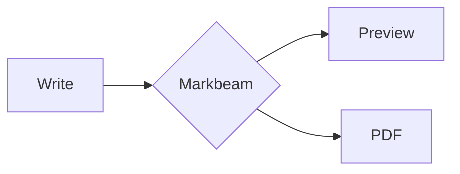

# Markbeam — Tasks

Ordered by priority. **File order is priority order** — `/work` takes the first `[ ]` it
finds unless you name a task.

Status: `[ ]` not started · `[~]` in progress · `[x]` done (moved to Completed)

Commands: **`/work`** picks the next task and completes it · **`/ship`** verifies it,
records how to check it against the reference site, marks it done, commits and pushes.

---

## P0 — Bugs

*Empty — T1, T2, T3, T4, T18, T19, T20 and T21 are all done. New bugs go here, above P1.*

---

## P1 — Markdown gaps

*Empty — T5, T6, T7 and T8 are all done.*

---

## P2 — Product

### [ ] T22 · Autosave history

**Why:** deferred out of T9 rather than smuggled into it. T9's Approach named it, but its
Done-when did not require it, and it is a separate feature: a snapshot cadence, a
localStorage quota strategy and a restore UI.

**Done when:** a document can be rolled back to an earlier autosaved state, and history
cannot grow until it exhausts the origin's storage quota.

---

## P3 — Housekeeping

*Empty — T13, T14, T15 and T17 are all done. New housekeeping goes here.*

---

## Out of scope

**#133 linter.** `MonacoEnvironment.getWorker` returns a no-op `Proxy`, so Monaco runs
with zero web workers and anything worker-backed silently does nothing. Not implementable
as requested without changing that foundation.

**Upstream contribution.** The project is developed independently; there is no upstream
to contribute back to.

---

## Completed

### [x] T12 · Print stylesheet — 2026-08-28

**Why:** there were no print rules anywhere — `grep` for `@media print` across `src/` and
`index.html` returned nothing. Ctrl+P produced the whole app on a dark background.

### The title understated it: printing was losing the document

Hiding chrome is the easy half. The screen layout is built for an app —
`body { height: 100dvh; overflow: hidden }` with the preview pane on `overflow-y: auto` —
and a printed page has no viewport. So the real defect was not an ugly printout but a
**truncated** one: everything past the visible screenful was silently discarded.

```
BASELINE  ✗ a long document prints to more than one page   1 page rendered
FIXED     ✓ 11 pages rendered
```

Every structural check can pass on a clipped document, because a clipped page is not blank
— it is a tidy, wrong first page. That is why the page count is the check that matters.

**A second real bug, found by measuring rather than assuming:** printing while in
Editor-only view produced a **completely blank page**.
`body[data-view='editor'] .pane--preview { display: none }` is a screen rule that survived
into print media. What gets printed is the document, not whichever pane happens to be on
screen, so the print block now forces `display: block`. Covered by its own check.

**Light output without duplicating tokens.** `beforeprint`/`afterprint` swap `data-theme`
rather than copying the light ramp into `@media print`, so the printed page uses exactly the
same tokens as the screen and the two cannot drift. Measured: `app theme dark, at print time
light, text rgb(13, 18, 25)`, restored to dark afterwards.

Two signals are needed and which fires when was measured, not assumed: **`beforeprint` fires
for Ctrl+P and for headless PDF but not for emulated print media**, while a
`matchMedia('print')` change fires for emulation. They can also fight — a PDF render inside
an already-printing context fires `afterprint` while printing is still active — so
`leavePrint` defers to the media query, and `enterPrint` is idempotent. An early-returning
`enterPrint` was a genuine bug: after a few media changes it left the page dark.

### Mermaid diagrams printed black, and that is fixed too

Forcing the light ramp does nothing for a diagram: Mermaid bakes theme colours into the SVG
it emits, and an SVG is not CSS. This was first recorded as a deferred limitation, because
`beforeprint` is synchronous and a re-render is not — re-rendering inside the event is a
race that merely usually wins.

Fixed by removing the race instead: **a light copy of each diagram is rendered to a string
on idle**, so the swap at print time is a synchronous `innerHTML` assignment. Cached by
source rather than by element, since `convert()` replaces `#output`'s children on every
keystroke.

```
BASELINE  ✗ node fill rgb(31, 32, 32)    (32/255)
FIXED     ✓ node fill rgb(236, 236, 255) (237/255), screen still rgb(31, 32, 32)
```

**Cost, measured rather than waved away:**

```
1 diagram   visible at 321ms, light copies ready at 739ms  (+418ms, on idle)
6 diagrams  visible at 436ms, light copies ready at 969ms  (+533ms, on idle)
print swap  apply 2.2ms, restore 2.6ms
```

The extra render is off the critical path and the swap is ~2ms. A cold cache prints exactly
as before — no regression, only a missed improvement — and a diagram that fails to
pre-render now warns to the console rather than being swallowed, because a silent catch
there is indistinguishable from "the cache is merely cold" until someone prints.

**Three false trails, all mine, recorded so they are not re-walked:**

1. `printDiagramsReady()` as an exported predicate read `false` while the feature worked
   perfectly. Vite serves an edited module as `?t=…`, so a plain `import()` from the page
   gets a **second module instance with its own empty cache**. Readiness is now mirrored
   onto `#output[data-print-diagrams]`, observable without importing anything.
2. "6 diagrams never warm the cache in 25s" was that same phantom, not a real failure.
3. A timing run reporting `7ms` was measuring nothing — the clock started after
   `networkidle2`, by which point rendering had already finished.

**Measured page-break behaviour** at an A4 content box of 673×986px: **no block straddles a
page break** — `pre`, `table`, `.mermaid` and `.markdown-alert` all intact — chrome all
`none`, theme light.

One fixture artefact worth naming: an early check showed math as raw `\sum` text. That was
shell escaping in my scratch fixture, not a product bug; re-tested with a heredoc, math
renders correctly.

**Verify vs reference:** the reference has no print handling whatever. Measured:

```
reference @media print rules   0
in print media                 header visible, editor visible
reference printed pages        1
```

Paste a long document — several hundred lines — into both sites and press **Ctrl+P**.

On https://markdownlivepreview.com the preview dialog shows the entire application: its
header, both panes, the editor. It is **one page**, and everything below the fold is simply
gone.

On http://localhost:5173 you get the rendered document alone — no toolbar, no editor, no
status bar — flowing across as many pages as it needs, in light colours even if you were
working in the dark theme, with tables, code blocks, callouts and diagrams never split
across a page break.

Two preconditions worth knowing. Print from the **dark** theme, or the colour handling is
not exercised at all. And give the page a moment after a diagram appears: the light copy is
prepared on idle roughly half a second after the diagram renders, so printing instantly on
load may catch a cold cache and print that one diagram dark.

To measure rather than eyeball, run this in the console on each site:

```js
[...document.styleSheets].reduce((n, s) => {
  try { return n + [...s.cssRules].filter((r) => r.media && /print/.test(r.media.mediaText)).length; }
  catch (e) { return n; }
}, 0)
```

The reference reports `0`. Ours reports its print blocks.


### [x] T11 · Shareable URL links — 2026-08-28

**Why:** there was no way to hand someone a document. Everything lived in `localStorage`,
and the app had no URL handling at all — `grep` for `location.` across `src/` returned
nothing.

**Fix:** `src/share.js`. The document is packed as `{ v, title, content }`, deflated and
base64url-encoded into the URL **fragment**; `Copy share link` in the palette produces it,
and opening a link imports it.

**Two decisions worth keeping:**

- **Fragment, never query.** A fragment is not transmitted, so "without a server" is true of
  any host rather than merely of ours, and document text never reaches an access log. The
  test asserts this structurally — empty query, payload in the hash — because a
  query-string version would work perfectly while quietly leaking every document.
- **Import, never replace.** T9 means people keep several documents, so a link that
  overwrote the open one would be a data-loss path. The fragment is cleared after import,
  or every reload would add the same document again.

**No dependency added.** `fflate` and `pako` are both in `node_modules`, but only
transitively, and T7 established that this project does not build on a transitive
dependency. Native `CompressionStream('deflate-raw')` costs nothing. A one-character codec
flag (`z` / `p`) leads the payload, so a browser without it degrades to a longer link rather
than a broken feature.

### The test found a real product gap, not just its own bug

The first recipient check navigated from `/` to `/#doc=…` and reported the feature broken.
That is a **same-document navigation** — only the fragment changes, so there is no reload
and no second `init`. What the test had actually found is that **pasting a share link into
an already-open Markbeam tab silently did nothing**, which is an entirely normal way to use
a link.

Fixed with a `hashchange` listener. The suite now covers the two paths separately: a genuine
cold load, and a link pasted into an open tab.

**Measured**, six checks either side of the change:

```
BASELINE  ✗ palette offers Copy share link    no such command
          ✗ payload rides in the fragment     not a URL: null
          ✗ opening the link reproduces text  no link to open
          ✗ …and the title                    no link to open
          ✗ importing adds a document         no link to open
          ✗ fragment cleared, no duplicate    no link to open
FIXED     ✓ hash 204 chars, search "", path "/"
          ✓ "# Shared note … ünïcödé … 🎉"
          ✓ title "Shared note"
          ✓ 2 documents: ["Shared note","Untitled"]
          ✓ hash "", 2 -> 2 documents after reload
          ✓ pasted into an open tab: 1 -> 2 documents
```

The round trip is tested the way a recipient experiences it: `localStorage` is wiped first,
so nothing can pass by reading state the sender left behind.

**Link sizes, measured — with a caveat that matters:**

```
source     87 B  ->   162-char URL   codec z
source  5,755 B  ->   408-char URL   codec z
source 46,455 B  -> 1,976-char URL   codec z
```

Every size round-tripped exactly. **The fixture is repetitive Lorem, so real prose will not
compress anywhere near 23:1.** What these numbers prove is that the deflate path is live
rather than silently falling back to plain base64 — not that any document shrinks that far.
A link over ~8000 characters still copies, with the toast reporting its length, because chat
and mail clients mangle long URLs long before browsers do.

**One check is green on both sides, deliberately:** `a hostile link renders inert` —
`executed=false, scripts=0, onerror=0` for a link carrying `<script>` and `onerror` markup.
There was no importer before, so it demonstrates no bug. It guards a feature that renders
content straight from a URL, which is exactly where a sanitiser regression would matter;
imported text goes through `renderMarkdown` and therefore DOMPurify like anything typed.

**Verify vs reference:** the reference has no sharing of any kind. Measured — after typing
into it, the URL is still bare:

```
controls      ["Markdown Live Preview", "Reset", "Copy", "Export PDF"]
hash length   0
query length  0
url           https://markdownlivepreview.com/
```

On https://markdownlivepreview.com, type a document and look at the address bar: it never
changes, and there is no control that produces a link. The only way to give someone the text
is **Copy**, which hands over the Markdown source for them to paste somewhere themselves.

On http://localhost:5173, press `Ctrl+K` → **Copy share link**, then open that link in a
private window (or another browser). The document appears with its title, as a **new**
document alongside anything already there — and the address bar cleans itself, so reloading
does not add it twice. Paste the same link into a tab that already has Markbeam open and it
imports there too.

To measure rather than eyeball, run this in the console on each site after producing a link:

```js
`hash ${location.hash.length}, query ${location.search.length}`
```

The reference reports `hash 0, query 0`. Ours reports a few hundred characters of hash and
`query 0` — the document is in the fragment, which is never sent to the server.


### [x] T10 · Export HTML / Word / `.md` — 2026-08-28 (#99, #57)

**The task said DOCX; this ships `.doc`, and that deviation is deliberate.** A real OOXML
file would mean the `docx` package — 4.65 MB unpacked — plus hand-mapping the markdown AST
to its object model, with Mermaid and KaTeX dropped or rasterised on the way: larger than
the rest of T10 combined. Agreed with the user to ship a Word-compatible `.doc` instead:
HTML served with Word's MIME type, which Word, Pages and Google Docs all open with headings,
tables and styling intact. **It is labelled `.doc` in the palette and in the code, never
`.docx`** — the file would eventually contradict the name.

**Fix:** `src/export/download.js` (`downloadBlob` / `downloadText`, the first shared
download path — PDF had used jsPDF's own `save()`) and `src/export/document.js`
(`buildStandaloneHtml`, `buildWordDocument`). `filenameFromTitle` in `pdf.js` now takes an
extension, so one document yields one basename across all four formats. Three palette
commands; no new toolbar controls, since the row is full and PDF already holds the export
slot.

`document.js` is a **sibling of `html.js`, not a reuse.** T4's clipboard HTML inlines table
styles because a paste target strips stylesheets; a file can carry its own `<style>`, which
is both simpler and covers every element rather than only tables. The styles are read back
out of `document.styleSheets` rather than duplicated, so an export cannot drift from what
the preview actually looks like.

**Measured**, seven checks, all failing against HEAD:

```
BASELINE  ✗ palette offers HTML, Word and Markdown      all three missing
          ✗ Markdown carries the editor source exactly  nothing downloaded
          ✗ HTML is standalone with its own styles      nothing downloaded
          ✗ Mermaid survives into the HTML export       svg=false
          ✗ Word uses the Word MIME type and .doc       nothing downloaded
          ✗ filenames are the slugified title           {}
          ✗ renaming renames the exported file          nothing downloaded
FIXED     ✓ Export as HTML | Export as Word (.doc) | Export as Markdown
          ✓ text/markdown, 238B, "# Export fixture…"
          ✓ text/html, doctype=true, style=true, mb-md=true
          ✓ svg=true, flowchart=true
          ✓ type "application/msword", name "my-export-doc.doc"
          ✓ {"md":"my-export-doc.md","html":"my-export-doc.html","word":"my-export-doc.doc"}
          ✓ "second-name.md"
```

### Two defects the suite passed straight over

Both were caught only by writing the exported file to disk and opening it, and eight green
checks sat happily on top of each:

1. **Mermaid exported black.** It bakes theme colours into the SVG it emits, so a diagram
   exported from dark mode arrived as black boxes on a white page. `pdf.js` already had this
   problem and the same cure: re-render `'default'` before taking the markup, restore after.
   That is what makes the two builders async.
2. **KaTeX math rendered twice** — once laid out and once as raw MathML text beside it
   (`Inline x² + 1x2 + 1`). KaTeX's own stylesheet carries the rule that hides the MathML
   layer, and `collectStyles()` was only matching sheets containing `--beam:` or `.mb-md`,
   so it was excluded. Now matched on `.katex` as well.

**Looked at, not just asserted.** Exported a document with a table, code block, Mermaid
diagram, inline and display math, an alert, a highlight and an emoji, then opened it with no
stylesheet but its own: 5 headings, `1px` table borders, header shaded
`rgb(238, 241, 245)`, light diagram, math rendered once, callout and mark intact, white
background. Palette checked at 1400px and 375px — 14 commands, list scrolls, sheet fully on
screen in both.

**Known limitation, measured:** opening the exported HTML logs `ERR_FILE_NOT_FOUND` for
KaTeX's font files, which its CSS references by relative URL. Math lays out correctly but in
fallback glyphs, and the `@fontsource` faces behave the same way. Embedding them as data
URIs would fix it at a large size cost; adding KaTeX's CSS alone already took the file from
30 KB to 62 KB.

**Not claimed:** opening the `.doc` in Word. No test here reaches Word, exactly as with T4's
Outlook paste — confirm one by hand.

**Verify vs reference:** measured on https://markdownlivepreview.com:

```
controls              ["Markdown Live Preview", "Reset", "Copy", "Export PDF"]
a[download] elements  []
document title field  false
```

Both sites export PDF. Only ours writes HTML, Word or Markdown files — and only ours can
name them, because the reference has **no document title field at all**, so it has nothing
to name a file from.

On ours, set the title (click it in the toolbar), then press `Ctrl+K` and pick **Export as
HTML**, **Export as Word (.doc)** or **Export as Markdown**. The download is named from the
slugified title: a document called `My Export Doc!` produces `my-export-doc.html`. Rename
it and export again — the filename follows.

The HTML file is self-contained: open it with no network and no stylesheet and it still
renders with borders, shading, a light Mermaid diagram and laid-out math.

To measure rather than eyeball, run this in the console on each site:

```js
[...document.querySelectorAll('button, a')].map((e) => e.textContent.trim()).filter(Boolean)
```

The reference lists `Reset`, `Copy` and `Export PDF`. Ours additionally offers the three
export commands in `Ctrl+K`.

### [x] T9 · Multiple documents — 2026-08-27

**Why:** the app held exactly one document in one key. There was no way to keep a second
note without destroying the first.

**The task's Approach was stale, and the code was trusted instead.** T9 said to rename the
`com.markdownlivepreview` namespace with migration, and warned that Storehouse hashes its
keys so everything must go through the library. Both had already been overtaken: Storehouse
was removed during the separation work, `src/storage.js` uses plain `markbeam:*` keys, and
`migrateLegacyStorage()` already recovers the old hashed records. **The migration this task
actually needed was a different one** — adopting the single document in
`markbeam:last_state` as document #1, which is what the Done-when clause protects.

**Schema:**

```
markbeam:docs        [{ id, title, updatedAt }, …]
markbeam:doc:<id>    the markdown
markbeam:active_doc  the open document's id
```

One key per document rather than a single blob: a blob rewrites every document on every
keystroke, and one oversized document would take all the others down with it at quota.

**`markbeam:last_state` is now a compatibility mirror, not the source of truth.** It is
still written on every change so a rollback to an older build still finds the last-open
document — but the app reads the index. That demotion is the single most consequential fact
in this change, and it is what broke the test suite.

**UI:** the title and a caret share one box and read as a combobox; the caret opens a sheet
listing documents with New / Rename / Delete. Reuses the command palette's `.sheet` classes.
Per document: title and content only. View mode, split ratio, sync scroll, theme and
markdown mode stay global — they are preferences about the workspace, not the text.

Rules the implementation holds: there is never zero documents (deleting the last one leaves
a fresh empty `Untitled`); delete sits behind `window.confirm`; switching flushes the
current buffer first.

**Measured**, nine checks, all failing against HEAD:

```
BASELINE  ✗ pre-existing single document adopted as #1   no document index exists
          ✗ document menu opens from the toolbar         no #docs-button
          ✗ creating switches, previous left intact      no New document action
          ✗ switching back restores the other document   editor "# Second document"
          ✗ each document stored under its own key       0 markbeam:doc:* keys
          ✗ renaming updates title and list entry        index []
          ✗ active document survives a reload            null -> null
          ✗ deleting falls back to another document      0 left
          ✗ deleting the last leaves one empty Untitled  0 documents
FIXED     ✓ index ["Legacy note"], editor "# Legacy note keep me"
          ✓ sheet open
          ✓ 2 documents, now on "Untitled"
          ✓ editor "# Legacy note keep me"
          ✓ 2 markbeam:doc:* keys
          ✓ title "Renamed note", index ["Untitled","Renamed note"]
          ✓ dmtcp5f3qkgo08 -> dmtcp5f3qkgo08
          ✓ 1 left: ["Untitled"]
          ✓ 1 document, title "Untitled", editor ""
```

### This change broke seven suites, and two others were green over a false premise

The first full run after implementation failed **storage, alerts, emoji, highlight, math,
editor and copy html**. Every one of them seeds a document with
`localStorage.setItem('markbeam:last_state', …)` and reloads — but by then the app has
already built an index on its first load, so the seed was ignored and then overwritten by
the mirror write. The idiom was stale, not the suites.

Worse, two suites *passed* while measuring the wrong thing:

- **`pdf`** fell back to the welcome document, so its Mermaid crop check was measuring the
  **welcome diagram** rather than its own `graph LR` fixture — the T21 regression check was
  quietly pointed at the wrong diagram.
- **`scroll`** passed only because the welcome document happens to be long enough to scroll.

`gfm` was unaffected solely because it calls `localStorage.clear()` first.

Fixed with a shared **`seedDocument()`** in `tests/lib.mjs` that clears the document index
before writing the legacy keys, so the app's own migration adopts the content — the same
path a returning user takes. Eight suites now call it instead of hand-rolling the write.

**`storage.test.mjs`'s re-migration check had become vacuous** and needed a real correction,
not a mechanical one: it wrote to `markbeam:last_state` to represent "a newer edit", which
the app now simply overwrites from whatever it opened. It writes through the active
document key instead.

**Two self-inflicted false alarms, both worth recording:**

1. The first baseline run **hung forever** instead of failing. `answerDialog` waited on a
   `window.prompt` that never fires when the action being clicked does not exist. The wait
   is now bounded, so a missing action fails the check rather than stalling the suite.
2. The by-hand walkthrough reported catastrophic content bleeding — every document showing
   the first one's text. The script created three documents without renaming them, so all
   three were `Untitled`, selecting by title matched nothing, and no switch ever happened.
   **The script was wrong, not the app.** Every click in it now asserts that it landed.

**Looked at, not just asserted.** The first screenshots caught two real defects the tests
could not: the sheet inherited the palette's centring and opened as a centred modal instead
of a dropdown under the title, and the caret sat ~200px from the title text because
`.doc-title` is a fixed 220px box. Both fixed — `#docs` is positioned under the toolbar, and
the title and caret now share a `.doc-switcher` box with the caret inside the field. Toolbar
stays 48px and there is no overflow at 375px in either theme.

**Verified by hand** after the fixes: three named documents, switched back and forth three
rounds in a non-linear order, each keeping its own content; deleting the middle one leaves
the other two; both survive a reload with their text intact.

**Known limitation:** `localStorage` is ~5 MB per origin, and `write()` warns and drops on
quota. No quota strategy in this task. Autosave history is deferred to **T22**.

**Verify vs reference:** the reference is single-document, so this is an honest "no
equivalent" rather than a behavioural contrast. Measured on
https://markdownlivepreview.com:

```
controls              ["Markdown Live Preview", "Reset", "Copy", "Export PDF"]
document-list widgets 0
localStorage keys     ["27cf344e7411b69e8a80b95a99c321e7"]
```

That single opaque key is the hashed-key scheme this project removed — a neat illustration
of the difference, since ours stores one readable `markbeam:doc:<id>` per document.

Type something into each site. On ours, open the caret beside the title, choose **New
document**, type something different, then switch back — the first document is exactly as
you left it. On the reference there is one buffer: replacing the text loses what was there,
and **Reset** is the only document-level action, which restores the sample rather than
keeping your work.

To measure rather than eyeball, run this in the console on each site:

```js
Object.keys(localStorage).filter((k) => k.startsWith('markbeam:doc:')).length
```

Ours reports the number of documents you have. The reference reports `0` — it has no such
key, only the single hashed one above.

### [x] T8 · GFM toggle, footnotes, task lists — 2026-08-27 (#96)

**Why:** Requested control over GitHub-flavoured vs CommonMark behaviour.

**Fix:** rendering now goes through two module-scoped `Marked` instances instead of the
mutable shared singleton. GFM is the compatibility default and adds MIT-licensed
`marked-footnote` 1.4.0; CommonMark sets `gfm: false` and never registers the footnote
tokenizers. Alerts, emoji, highlight, math, Mermaid code handling and DOMPurify remain in
both paths. Alert bodies reuse the tokens produced by the active parser, so nested tables
and strikethrough follow the selected mode without corrupting marked-footnote's per-parse
state.

**Persistence and control:** `markbeam:markdown_mode` stores only `gfm` or `commonmark`.
Missing, corrupt and legacy-shaped values all resolve to GFM. The command palette says
`Switch to CommonMark` or `Switch to GitHub-Flavored Markdown` according to the next
action; choosing it saves immediately, re-renders the live editor value and confirms the
active mode in a toast. There is deliberately no new toolbar control.

**Footnotes and tasks:** repeated and multiline footnotes render an accessible hidden
heading, numbered references, one back-reference per occurrence, wrapping, target and
keyboard-focus states, all scoped to `.mb-md` and driven by the existing theme tokens.
DOMPurify's defaults are unchanged; its normal pass retains the generated IDs, fragment
links, data attributes and ARIA while removing script and `javascript:` content. GFM task
checkboxes remain disabled, non-interactive preview output and never modify source.

**One adjacent parser bug exposed by the new coverage:** the emoji extension previously
told Marked to stop at every colon, so it suppressed GFM bare-URL autolinking at the colon
in `https:`. Its start hint now finds only a complete shortcode-shaped run; the existing
URL-with-port, time and code-isolation emoji checks still pass.

**Measured:** the dedicated suite was registered before implementation. Against HEAD,
12 of its 17 checks failed — footnotes, mode command, persistence and CommonMark switching
were absent. The finished suite passes 17/17, and the full 12-suite browser run passes with
no console errors, including PDF and Mermaid. A production build to a scratch directory
passes. The initial JS changed from 683.54 kB / 170.37 kB gzip to 687.29 kB / 171.98 kB
gzip (+3.75 kB / +1.61 kB); preview CSS changed from 20.47 kB / 4.70 kB gzip to 21.36 kB /
4.89 kB gzip (+0.89 kB / +0.19 kB).

**Dependency and visual checks:** the installed package reports `marked-footnote` 1.4.0,
MIT, no runtime dependencies and a compatible `marked >=7` peer. `npm audit --omit=dev`
reports the same two pre-existing moderate groups for DOMPurify and Mermaid on both HEAD
and this work; the new package adds none. Dark/light desktop at 1400×900 and preview-only
mobile at 375×720 were inspected: references, back-references, tables and disabled tasks
stay legible, and mobile remains exactly 375 px wide with no horizontal overflow.

**Reference check:** on `markdownlivepreview.com`, paste a table, `~~strike~~`, checked and
unchecked tasks, and `Note[^1]` plus its definition. The reference renders the first three
GFM structures with disabled task boxes but leaves footnote syntax literal and has no mode
control. Markbeam additionally renders the footnote in default GFM mode; use Ctrl+K and
`Switch to CommonMark` to remove all GFM-only structures immediately, reload to confirm
the mode persists, then switch back to restore them.

**Done when:** toggle persists across reload and visibly changes rendering.

### [x] T7 · LaTeX / math rendering — 2026-08-27 (#108, #54)

**Why:** Math notation rendered as literal delimiters and TeX source.

**Fix:** KaTeX 0.16.47 is now a direct dependency behind a dedicated marked inline/block
extension. Inline `$x^2$` stays on one line and never consumes `$$`; display math works on
one or several lines at a block boundary. Currency prose such as `$5 and $10`, unmatched
and escaped dollars, code spans and fenced code stay literal. One idempotent dynamic import
loads KaTeX and its local CSS/fonts on demand, then re-renders the current editor value;
loading failure leaves the delimiters literal.

**Resilience and safety:** rendering uses `htmlAndMathml`, `trust: false`,
`throwOnError: false` and non-warning strict behaviour. DOMPurify still sanitises the full
preview while retaining KaTeX's `<semantics>` and `<annotation>` nodes. Scoped token-based
styles cover malformed formulas and horizontal overflow without theme-specific overrides.
PDF export receives the already-laid-out KaTeX markup.

**Verified:** the pre-implementation math suite failed the rendering assertions (zero
inline/display KaTeX and no retained annotations). Its final 17 browser checks pass,
including both themes, 375 px overflow, malformed and currency input, code isolation,
lazy-load failure, and PDF layout/ink/cleanup. The full 11-suite browser run and production
build pass without console errors. The initial JS changed from 682.04 kB / 169.90 kB gzip
to 683.54 kB / 170.37 kB gzip; KaTeX remains a separate 261.33 kB / 77.57 kB gzip chunk,
with its 29.29 kB / 8.05 kB gzip CSS and fonts bundled locally. This qualifies the original
"almost no bundle weight" guidance: the initial-JS increase is small, but lazy CSS/fonts
still add output assets.

**Reference check:** paste `Inline $x^2$ and $\\frac{1}{2}$.` followed by a block such as
`$$\\sum_{i=1}^{n} i$$` into Markbeam and markdownlivepreview.com. Markbeam should render
KaTeX while the reference leaves TeX literal. The reference domain failed DNS resolution
in the release browser environment, so this comparison was checked against its published
source instead: its dependency list contains marked but no KaTeX or other math renderer.

---

### [x] T6 · `==highlight==` syntax — 2026-08-27 (#89)

**Why:** Common extended-Markdown syntax; only raw `<mark>` worked before this change.

**Fix:** a marked inline extension emits `<mark>` while letting marked continue to own
code spans and fenced blocks. Highlight colours use the shared `--mark-bg` token so both
themes remain legible without component-level theme overrides.

**Verified:** the dedicated browser suite passes all nine checks: rendered and nested
highlight syntax, visible tint in both themes, raw `<mark>` sanitisation, literal equals
syntax, code isolation and a clean console. To compare with markdownlivepreview.com, paste
`Plain ==highlighted== text.` into both editors: the reference leaves the delimiters
literal, while Markbeam renders a tinted `<mark>`.

---

### [x] T5 · `:emoji:` shortcodes — 2026-08-27 (#95)

**Why:** `:x:` rendered as literal text instead of ❌. GitHub-flavoured Markdown treats
`:name:` as a shortcode; Markbeam did not.

**Fix:** a marked **inline** extension in `src/markdown/emoji.js`, registered with
`marked.use({ extensions: [...] })`. It must be an inline extension rather than a regex over
the rendered HTML — the tokenizer walks around code spans, fenced blocks and URLs, whereas a
post-process would corrupt all three.

**The one design decision worth keeping:** the tokenizer returns `undefined` both when the
dataset has not loaded *and* when the name is unknown. Falling through leaves the text
exactly as written, so an unrendered shortcode is always the literal source rather than a
blank or a placeholder. That single behaviour satisfies most of the Done-when list for free.

### The dependency is loaded lazily, and that was measured

`node-emoji` 2.2.0 (MIT, 64 KB) indexes **`emojilib`, 326 KB unpacked** — almost all of it
search keywords this lookup-only use never touches. Loading it eagerly would put ~48 KB gzip
on every page load whether the document has a shortcode or not, which is exactly the cost
jspdf and html2canvas-pro are already kept out of the first paint to avoid.

So it is `import()`ed after boot, and `main.js` re-converts once — but only when the open
document could contain a shortcode, so the welcome document does no extra work and triggers
no needless Mermaid pass.

```
main chunk   681.16 kB / 169.52 kB gzip  ->  681.71 kB / 169.79 kB gzip   (+0.55 kB raw)
new chunk    index-MY49AIz7.js  226.95 kB / 48.49 kB gzip                 (66 -> 67 chunks)
```

Confirmed by needle rather than by chunk name: `heavy_check_mark` appears **only** in the
new chunk and is absent from the pre-change build. If a future change makes the main chunk
jump by ~48 KB gzip, the lazy import has been broken.

**Measured**, either side of the change:

```
BASELINE  ✗ :x:, :tada: and :+1: render as emoji                  no emoji appeared within 8s
          ✗ the shortcodes are replaced, not left alongside       still literal
          ✗ a document rendered before the chunk loaded is re-rendered   never re-rendered
FIXED     ✓ known line reads "Known: ❌ 🎉 👍"
          ✓ Known: ❌ 🎉 👍
          ✓ emoji appeared without an edit
```

**Five of the nine checks pass before the change too, by construction** — with no extension
there is nothing to corrupt. Unknown codes, code spans, fenced blocks, `http://host:8080/x`
and `12:30` are guards against the *fix* over-reaching, not evidence of the bug. They earn
their place because a custom tokenizer runs *ahead* of marked's own inline rules, which is
precisely how an implementation like this eats code spans and URLs.

`tests/emoji.test.mjs` waits on the rendered result rather than sleeping, because the chunk
arrives asynchronously: a fixed delay long enough for a slow machine is padding on a fast
one, and one that is too short fails against working code.

**One check was wrong and failed against a working implementation:** it scanned the whole
document for `:tada:`, which legitimately survives inside the fenced block further down.
Scoped to the line under test.

**Known limitation, matching GitHub:** `12:100:45` becomes `12💯45`, because `100` is a real
shortcode name. Verified `get('30')` is `undefined`, so the Done-when case `12:30` is
unaffected.

**A flaw in this file's own licence check, found while running it.** `CLAUDE.md` documents:

```
git ls-files | grep -v package-lock | xargs grep -lI -i "tanabe\|hideaki\|sindre\|sorhus"
```

as a check that "must stay empty". It can never be empty — it reports `CLAUDE.md` itself,
because the file contains the search pattern. Pre-existing, not introduced here:
`git show HEAD:CLAUDE.md` matches too. Excluding the file itself the result *is* empty, so
no attribution is owed, even though `node-emoji` depends on `@sindresorhus/is` and
`skin-tone` — those names appear only in `package-lock.json`, which the check already
excludes by design. Adding `grep -v "^CLAUDE.md$"` would make the check usable; left alone
here because it is outside this task.

**Verify vs reference:** measured on both, same input.

Paste this into https://markdownlivepreview.com and http://localhost:5173:

```markdown
Known: :x: :tada: :+1:

Time: 12:30 today.
```

```
                    known line rendered           emoji?   literal?
REFERENCE   Known: :x: :tada: :+1:                false    true
OURS        Known: ❌ 🎉 👍                        true     false
```

The reference leaves all three shortcodes as text. Ours renders them. Both leave
`Time: 12:30 today.` alone, which is the point of the guard checks — the feature must not
eat ordinary punctuation.

One precondition on ours: the emoji dataset is a **separate chunk fetched after first
paint**, so on a cold load with a shortcode already in the document you may see `:tada:` for
a moment before it becomes 🎉. That is the lazy load, not a bug. To watch it, open devtools →
Network, filter `index-`, and reload: the emoji chunk arrives after the main bundle.

To measure rather than eyeball, run this in the console on each site:

```js
document.querySelector('#output, #out, .markdown-body').textContent.match(/Known:[^\n]*/)[0]
```

The reference reports `Known: :x: :tada: :+1:`. Ours reports `Known: ❌ 🎉 👍`.

### [x] T18 · Sync scroll is only reachable from the command palette — 2026-08-27

**Why it was hidden:** the Beam redesign replaced the reference site's Sync scroll checkbox
with a palette command. The feature still worked, but nothing on screen said so — which
also meant nobody could tell that T1 had fixed it to sync in *both* directions.

**Fix:** a `SYNC` toggle in the toolbar, immediately after the view-mode control, wrapped in
`.segmented`.

**Reusing `.segmented` is the design decision, not shorthand.** It buys three things that
already existed:

- `.segmented__item[aria-pressed='true'] { color: var(--beam); background: var(--surface-1) }`
  — so "on" reads as the beam colour exactly like the active view mode. That *is* the
  "visible at a glance" requirement, met with no new colour and no new token;
- the pill styling and hover behaviour;
- `@media (max-width: 768px) { .toolbar .segmented { display: none } }`, so it disappears on
  narrow screens. That is correct rather than convenient: below 768px only one pane is ever
  on screen and `.beam` is hidden too, so there is nothing to sync.

The only new CSS is one rule, `.segmented__item[aria-disabled='true'] { opacity: 0.45 }`,
mirroring the existing `.btn[disabled]` precedent.

**Measured**, five checks either side of the change:

```
BASELINE  ✗ a sync scroll toggle is present in the toolbar   not found
          ✗ the toggle changes state and looks different     no button
          ✗ drives the stored setting, survives a reload      stored null
          ✗ marked unavailable outside split view             editor null, preview null, split null
          ✗ hidden at 375px, like the divider                 no sync button at all
FIXED     ✓ labelled "Sync"
          ✓ false rgb(122, 134, 148) -> true rgb(13, 148, 136)
          ✓ stored {"v":true}, aria-pressed true
          ✓ editor true, preview true, split false
          ✓ 0px wide
```

**Why the rendered colour is compared and not just `aria-pressed`:** a control that records
its state but looks identical either way is precisely the defect being fixed, so the
attribute alone would pass straight over it. Same reasoning as `alerts.test.mjs` asserting
its five accent colours are *distinct*.

**Bound to real behaviour, not to a stored flag.** Toggled from the button only, against a
200-paragraph document: with sync off the editor scrolls to line 2 and the preview stays at
0; with sync on the preview follows the editor `0 -> 101`.

**Two self-inflicted test failures worth recording**, both traps this repo has hit before:
a synthetic `WheelEvent` does not move Monaco's emulated scrollbars — real
`page.mouse.wheel` does, which `tests/scroll.test.mjs` already knew — and `Math.min` over
`.line-numbers` reads 0, because Monaco keeps blank line-number nodes in the DOM.

**Deliberate asymmetry:** the palette's `Toggle sync scroll` still works in every view,
because the palette is a settings surface and the preference is meaningful to set from
anywhere. Only the toolbar button declines the click outside Split — it advertises
availability, and would be lying if it looked active while doing nothing.

**Verify vs reference:** this is the one case where the reference has the older, plainer
version of a feature we removed and have now brought back better. Measured on
https://markdownlivepreview.com:

```
control      <input type="checkbox" id="sync-scroll-checkbox"> + <label>Sync scroll</label>
default      unchecked
```

Ours is a labelled `SYNC` button with `aria-pressed`, beam-coloured when on.

Open both sites side by side with a document long enough to scroll both panes.

*Finding it* — the reference's checkbox sits in its header, always visible. Ours is the
`SYNC` toggle beside `EDIT / SPLIT / READ`. Both are reachable without a menu; before this
change ours required `Ctrl+K`.

*The substantive difference* — enable it on each, then scroll the **preview** pane. The
reference's editor does not move: measured, its top line stayed at **77 → 77** after
scrolling the preview to its midpoint. Ours tracks along, because T1 made the sync
bidirectional. Run this in the console on each site after scrolling the preview:

```js
Math.min(...[...document.querySelectorAll('.line-numbers')]
  .map((n) => parseInt(n.textContent, 10)).filter(Number.isFinite))
```

The reference reports the same line it started on. Ours reports a line proportional to how
far the preview moved.

*A third difference* — switch to Editor-only or Preview-only on ours and the toggle dims,
because there is nothing to sync. The reference's checkbox has no such state, having no
view modes at all.

### [x] T21 · Mermaid diagrams are cropped on the right in exported PDFs — 2026-08-27

Reported against the welcome document, on phone and desktop alike — so the crop was in the
generated file, not in a viewer.

**Root cause: html2canvas-pro's own SVG rasteriser.** It draws Mermaid's inline `<svg>`
larger than the box the browser laid it out in, so the right-hand side is clipped away
*inside the svg's own viewport*.

The DOM geometry was never wrong, which is what made this hard to see. The svg measures
**458×174 in the live export sandbox and 458×174 in html2canvas's clone**; only the pixels
disagree. Drawn ink spanned `245..585` CSS where the svg box was `127..585` — 340px of
458px, losing the `Preview` and `PDF` nodes entirely.

The welcome diagram is a four-node `graph LR`, so this was never wide content meeting
`overflow: hidden`. The preview pane was always fine: `.mb-md .mermaid` is
`overflow-x: auto`, so on screen the diagram simply scrolls.

**Three hypotheses were measured and discarded before the fourth was adopted:**

```
onclone's `max-width: 100% !important` stretches the svg   NOT FIRING  clone reported max-width: 458.219px
a transform applied twice in the clone                     NO          attribute and inlined CSS transform matched
explicit width/height attrs + drop inline max-width        NO CHANGE   ink still 340px, identical to baseline
pre-rasterise the svg into an                         FIXES IT    ink 442px, inside the box
```

Worth keeping: **no CSS change can fix this**, because the layout was already correct. That
is why the two attribute-level attempts are recorded — they are the obvious things to try
again otherwise.

**Fix:** `rasteriseMermaidDiagrams()` in `src/export/pdf.js` serialises each Mermaid svg to
a data URL and swaps in an `` of the same laid-out size, **before**
`computePageOffsets`, so what is measured is what is drawn. A diagram that fails to encode
is left alone — a clipped diagram beats a missing one.

Two things went with it. The `.mermaid svg` clamp in `decorateClone` is gone: the svg no
longer exists by the time `onclone` runs, and the rule broke the invariant that `onclone`
may change colours only — page offsets are measured against the live sandbox, so a layout
change there moves content away from the boundaries the crops were computed for. And the
final page's `end` was `content.scrollHeight`, unclamped, so `cropPageFromBand` could be
handed a slice taller than the page canvas and silently discard the overflow.

**Measured**, same check either side of the change:

```
BASELINE  ✗ a Mermaid diagram is exported whole, not clipped at its right edge
            drawn 340px of 458px laid out (74%)
FIXED     ✓ drawn 442px of 458px laid out (97%)
```

**A white-gutter check would not have caught this, and was tried first.** The svg box ends
at 585 while the diagram panel runs to ~700, so a right-hand gutter exists whether or not
the diagram is cropped — the assertion would have been green over a live bug. What
discriminates is the width of the drawn diagram against the width the svg was laid out at.
The test seeds a diagram-only document and ignores a 20px inset so the panel's own border
is not counted as diagram content.

**Looked at, not just asserted.** Exported pages were dumped to PNG and inspected before and
after; the before image shows the two right-hand nodes missing with a sliver of one node box
at the cut. A second document exercised sizes the welcome diagram does not cover — a tiny
`A --> B` (205px), a page-width four-node chain (600px), a six-node flowchart scaled down to
fit, and a tall `sequenceDiagram` (600×418). All four export whole.

**Known, pre-existing, not introduced here:** a diagram wider than about 600px is scaled
down to fit the content box, so a very wide one renders small but complete. That is the
`max-width: 100%` behaviour in `preview.css`.

**Verify vs reference:** both sites render Mermaid and both offer a PDF export, so this is
like-for-like. Measured on the reference: controls are
`["Markdown Live Preview", "Reset", "Copy", "Export PDF", …]`, and pasting a Mermaid fence
produces `pre.mermaid` with one rendered `svg`.

Paste this into https://markdownlivepreview.com and http://localhost:5173, then click
**Export PDF** on each and open both files:

````markdown

````

Ours shows all four nodes — `Write`, `Markbeam`, `Preview`, `PDF`. The reference loses the
right-hand side of the diagram; `CLAUDE.md` has recorded since the original PDF work that it
lets Mermaid diagrams overflow.

Both sites rasterise through html2canvas, so the same measurement works on either. Run this
in the console *before* clicking Export PDF, then click it:

```js
const orig = HTMLCanvasElement.prototype.toDataURL;
HTMLCanvasElement.prototype.toDataURL = function (...a) {
  if (this.width > 400) {
    const d = this.getContext('2d').getImageData(0, 0, this.width, this.height).data;
    let min = this.width, max = -1;
    for (let y = 0; y < this.height; y += 2)
      for (let x = 40; x < this.width - 40; x += 2) {
        const i = (y * this.width + x) * 4;
        if (d[i] < 220 || d[i + 1] < 220 || d[i + 2] < 220) { if (x < min) min = x; if (x > max) max = x; }
      }
    console.log('drawn diagram width', (max - min) / 2, 'css px');
  }
  return orig.apply(this, a);
};
```

Compare that against the laid-out width, `document.querySelector('.mermaid svg').getBoundingClientRect().width`.
Ours reports ~97% of it. Anything near 74% is the crop.

### [x] T4 · Copy rendered HTML with table styles intact — 2026-08-27 (#39, #53)

**Root cause:** Copy wrote the Markdown *source*, and every border, padding and header
shade lives in `src/styles/preview.css`. A paste target — Outlook, Word, Gmail — never sees
our stylesheet, so inline `style` attributes are the only styling that can survive.

**Fix:** `src/export/html.js`. `buildStyledHtml()` clones `#output` into an offscreen
sandbox (the shape of `createSandbox` in `pdf.js`, minus the page-slicing), reads computed
styles and writes them back onto the clone. `copyPreviewAsHtml()` writes `text/html` +
`text/plain` through `ClipboardItem`, falling back to `writeText(html)` where
`ClipboardItem` is missing. Exposed as the palette command **Copy rendered HTML**; the
toolbar Copy button still copies Markdown.

**Two things the approach had to get right, neither obvious:**

1. **The preview stylesheet's own table rules would have broken the paste.** `.mb-md table`
   is `display: block; width: max-content; overflow: auto` so a wide table scrolls sideways
   in the preview pane. Inlined into the clipboard it stops being a grid — the receiving
   application stacks the rows and scatters the borders. Only the six properties the task
   named are copied; `display`, `width` and `overflow` are deliberately omitted, with a
   comment saying so, because it reads as an oversight otherwise.

2. **Computed styles resolve to the live theme, and tokens are scoped to `:root`.**
   `tokens.css` defines the light ramp under `:root[data-theme='light']`, so setting the
   attribute on the sandbox would not re-resolve anything. Copying in dark mode would inline
   `--surface-2: #141822` onto a paste target's white page. `pdf.js` hits the same wall and
   solves it in html2canvas's `onclone`; there is no clone document here, so instead
   `document.documentElement`'s `data-theme` is flipped to light, read, and restored — **all
   synchronous, no `await` in between**. A paint only happens between tasks, so no light
   frame is ever shown; add an `await` in the middle and the page visibly flashes on every
   copy. Measured over 60 animation frames during a copy: **0 light frames**, theme
   `dark → dark`.

**Measured**, same checks either side of the change:

```
BASELINE  ✗ a Copy rendered HTML command exists in the palette   no such command
          ✗ text/plain flavour alongside text/html               nothing written
          ✗ every th and td carries an inline border and padding no table in the copied markup
          ✗ header row shaded differently from body cells        th (none) vs td (none)
          ✗ copied colours are light even though the app is dark no parseable background colours
          ✗ the table is not pinned to display:block             no table
          ✗ border-collapse survives onto the table element      border-collapse="undefined"
          ✗ without ClipboardItem it falls back to writeText     (nothing)
FIXED     ✓ 9 cells, 0 missing
          ✓ th rgb(238, 241, 245) vs td (none)
          ✓ theme=dark, darkest inlined background luminance 241/255
          ✓ display="" width="" overflow=""
          ✓ border-collapse="collapse"
          ✓ flavours: text/html, text/plain
```

**The luminance check is the one that earns its place.** "Border present" and "header
shaded" both pass happily on a black-on-black table; only measuring the brightness catches
an implementation that read the live dark theme.

`tests/copy.test.mjs` intercepts `navigator.clipboard.write` via `evaluateOnNewDocument` —
the instrument-before-app-code trick `pdf.test.mjs` uses on `toDataURL`. Clipboard access in
headless Chrome is permission-gated, and granting it would have made this a test about
permissions rather than about markup.

**One check passes on both sides by design:** `the toolbar Copy button still copies Markdown
source`. It guards against collateral damage, it is not evidence of the bug.

**Looked at, not just asserted:** the generated markup was dumped to a file with **no
stylesheet attached** and rendered — the closest reproducible proxy for what Word receives.
It comes out as a real grid: borders, shaded header, zebra body row, cell padding, dark text
on white. The first dump also revealed every `table`/`thead`/`tr` carrying
`font-weight: 400; text-align: start` — computed defaults, inert but roughly tripling the
markup. Those are now filtered out.

**Scope, deliberately:** only table properties are inlined. Headings, lists, emphasis and
code paste as semantic HTML and every target renders those acceptably unaided; inlining the
whole preview is a far larger job than the task asked for. The header keeps its shading and
weight but loses the uppercase, letter-spacing and grey it has in-app — those are not in the
task's property list, and Done-when asks for borders, header shading and padding, all three
of which are present. `text/plain` carries the HTML markup, per the task's own wording;
rendered text would be the more obvious choice, so it is worth knowing this was specified.

**Palette command only** — no toolbar button and no keybinding. `tests/ui.test.mjs` asserts
the toolbar stays 48px with no overflow at 1400px and 375px, and a spare `Ctrl+Shift+C`
risks the Monaco collision T19 and T20 just cleaned up. Since T19 the palette is reachable
while typing, so this is an affordance rather than a hiding place.

**Verify vs reference:** the reference has one Copy control and it writes plain text only.
Open a document containing a table on each site, then:

*Reference* — click **Copy** on https://markdownlivepreview.com and paste into Word. You get
the raw Markdown pipe syntax, `| Region | Revenue |`, not a table.

*Ours* — press `Ctrl+K` on http://localhost:5173, choose **Copy rendered HTML**, paste into
Word. You get a real table with borders, a shaded header row and cell padding. The plain
Copy button still gives the Markdown source, so both routes remain available.

Measured, with `navigator.clipboard.write`/`writeText` intercepted on each site:

```
                        copy commands offered                      clipboard flavours    inline border
REFERENCE   ["Copy"]                                               text only             n/a
OURS        ["Copy Markdown source", "Copy rendered HTML"]         text/html, text/plain true
```

The reference's payload begins `# Markdown syntax guide\n\n## Headers` — Markdown, no
markup. Ours carries `<th style="border: 1px solid rgb(221, 227, 234); padding: 8px 12px;
background-color: rgb(238, 241, 245); …">`. To measure rather than eyeball, run this on
either site before copying, then copy:

```js
navigator.clipboard.write = async (items) =>
  console.log(await (await items[0].getType('text/html')).text());
```

The reference never calls it — it uses `writeText`. Ours logs the styled markup.

**Not automatable, and not claimed:** the actual paste into Outlook, Word or Gmail. Those
are the Done-when targets and no browser test reaches them. The stylesheet-free render above
is the closest proxy; confirm one real paste by hand.

### [x] T20 · Every shortcut except Ctrl+K is dead while the editor has focus — 2026-08-27

**Root cause:** `handleGlobalKeys` (`src/ui/palette.js`) decided whether a keystroke was
"in a field" by tag name — `INPUT`, `TEXTAREA`, `isContentEditable`. Monaco's hidden input
is a `<textarea class="inputarea">`, so the editor was classified as a form field and every
command was discarded by `if (inField && !dialog.open) return;` before the lookup below it.
`Ctrl+K` survived only because it is handled *above* that guard, which is why T19 could fix
`Ctrl+K` and leave everything else broken.

Not Monaco. Measured with a bubble-phase listener on `document`, editor focused:

```
Ctrl+1  -> reaches document, target TEXTAREA.inputarea, command never runs
Ctrl+S  -> reaches document, target TEXTAREA.inputarea, command never runs
Ctrl+K  -> does not reach document at all (taken by Monaco's own binding — T19)
```

**`Ctrl+S` was worse than inert, which the task body did not anticipate.** The handler
returned *before* `event.preventDefault()`, so the keystroke fell straight through to the
browser's **Save Page As** dialog while the user was mid-document. That is now suppressed,
and the `defaultPrevented` check below is what holds it.

**Fix:** the guard's intent was right — `Ctrl+S` typed in the *title* field should behave
normally — so the classification was narrowed rather than its inverse widened.
`.monaco-editor` is excluded before the tag test. `closest` is guarded because a keydown
target is not always an element. That selector is the one `tests/lib.mjs` already waits on
(`#editor .monaco-editor`), so it cannot drift unnoticed.

**Measured**, same four checks either side of the change:

```
BASELINE  ✗ Ctrl+1 switches to editor-only with the editor focused   data-view=split, preview 559px
          ✗ Ctrl+3 switches to preview-only with the editor focused  data-view=split, editor 839px
          ✗ Ctrl+S starts an export with the editor focused          export never started
          ✗ Ctrl+S is taken from the browser rather than opening Save Page   defaultPrevented=false
FIXED     ✓ data-view=editor, preview 0px
          ✓ data-view=preview, editor 0px
          ✓ export button went busy
          ✓ defaultPrevented=true
```

**A fifth check passes on both sides by design.** `Ctrl+1 stays inert while the title input
has focus` was green before the fix too. It is not evidence of the bug — it guards the fix
against over-reaching into real form fields. Recorded here so it is not later mistaken for
regression cover; this repo's rule is that a both-sides-green check proves nothing alone.

**Manual pass**, scripted rather than eyeballed: view keys cycle mid-typing with no digits
leaking into the document; `Ctrl+A` still selects (53 regions); `Ctrl+Z` still undoes; the
title field ignores `Ctrl+1/3` and starts no export; `Ctrl+K` still opens the palette from
both the title field and the editor.

**Verify vs reference:** the reference has no view modes and no palette, so `Ctrl+1/2/3`
compare against nothing there — that is the honest answer, not a contrast. `Ctrl+S` is the
real comparison: neither site's editor used to handle it, so both handed it to the browser.
Ours now takes it.

Click **into the editor** on each site — with focus anywhere else the difference does not
arise — and run this in the console, then press `Ctrl+S`:

```js
document.addEventListener('keydown', (e) => {
  if (e.ctrlKey && e.key.toLowerCase() === 's') console.log('handled by the app:', e.defaultPrevented);
});
```

Measured:

```
                      view-mode controls   palette   Ctrl+S   Ctrl+1   Ctrl+3
REFERENCE                              0     false    false    false    false
OURS                                   5      true     true     true     true
```

On the reference nothing is handled, so `Ctrl+S` reaches the browser and opens **Save Page
As** — expect the native save dialog. On ours it starts a PDF export and no browser dialog
appears; `document.body.dataset.view` also flips to `editor` / `preview` on `Ctrl+1` /
`Ctrl+3`, where the reference has no such attribute at all.

### [x] T19 · Ctrl+K cannot open the palette while the editor has focus — 2026-08-27

**Root cause:** Monaco owns `Ctrl/Cmd+K` as a *chord prefix* (`Ctrl+K Ctrl+C` add comment,
`Ctrl+K Ctrl+X` trim trailing whitespace, and others). Entering chord mode calls
`preventDefault` **and `stopPropagation`** on the keydown, and the app's only global
shortcut handler is a bubble-phase listener on `document` (`handleGlobalKeys`,
`src/ui/palette.js`), so the keystroke never arrived while the editor had focus. The
palette is the only route to Sync scroll, Reset, Clear, Copy and Switch theme, so all of
them were unreachable mid-document — including T1's sync-scroll fix.

**Fix:** `createEditor` takes an `onPaletteKey` callback and registers a *single-chord*
`Ctrl/Cmd+K` via `editor.addCommand` (`src/editor/index.js`). Dynamic keybindings are
appended after Monaco's defaults and the resolver scans candidates backwards, so this entry
shadows the chord prefixes; the resolver then reports a complete match instead of "more
chords needed", which is what stops chord mode being entered at all. Configuration rather
than a capture-phase race with the editor.

**Measured**, same two checks either side of the change:

```
BASELINE  ✗ palette opens with Ctrl+K while the editor has focus
            open=false, 9 commands
          ✗ Ctrl+K does not put Monaco into chord mode
            document changed to "# Welcome to Markbeam Write Markdown on the left"
FIXED     ✓ open=true, 9 commands
          ✓ document unchanged
```

**The chord probe is what makes the second check worth having.** Asserting only that the
palette opened would not prove chord mode was avoided. Pressing `Ctrl+K` then `Ctrl+C`
does: with a live chord prefix Monaco runs `addCommentLine` and mutates the buffer, which
it demonstrably did against the unfixed code. Focus is asserted separately too — a click
that failed to land in Monaco would make the whole thing pass for the wrong reason.

`editorText()` moved from `tests/editor.test.mjs` to `tests/lib.mjs`; both suites need it.

**Found while verifying, filed as T20 rather than fixed here:** `Ctrl+S` and `Ctrl+1/2/3`
still do nothing with the editor focused. Not Monaco — measured with a bubble-phase
listener on `document`, editor focused:

```
Ctrl+1  -> reaches document, target TEXTAREA.inputarea, command never runs
Ctrl+S  -> reaches document, target TEXTAREA.inputarea, command never runs
Ctrl+K  -> does not reach document at all (taken by Monaco's binding — this fix)
```

`handleGlobalKeys` returns early on its own `inField && !dialog.open` guard, because
Monaco's hidden input is a `<textarea>`. `Ctrl+K` was exempt only because it is handled
above that guard. Folding it in here would have shipped a second behaviour change under
this task's test evidence.

**Correction to the task as written:** it said Monaco "swallows" `Ctrl+K`, which is accurate
for that key — but the broader symptom it implied, shortcuts being unreachable mid-typing,
is mostly T20's guard, not Monaco.

**Verify vs reference:** both sites run Monaco, so this is the same keystroke behaving two
ways, not a missing feature. Click **into the editor** on
https://markdownlivepreview.com and on http://localhost:5173 — focus in the editor is the
whole point; with focus anywhere else the bug does not reproduce.

Press `Ctrl+K`. Ours opens the command palette. The reference does nothing visible, because
it has entered a Monaco chord and is silently waiting for a second key.

Press `Ctrl+C` next, and the difference becomes something you can see rather than infer:

```
REFERENCE  Ctrl+K        -> no dialog, document unchanged
           Ctrl+K Ctrl+C -> line 22 "* Item 1" becomes "<!-- * Item 1 -->"
OURS       Ctrl+K        -> <dialog id="palette"> open
           Ctrl+K Ctrl+C -> document identical, palette still open
```

The reference's comment markers are `addCommentLine` — the completed `Ctrl+K Ctrl+C` chord,
i.e. direct proof the first keystroke was consumed as a prefix. To measure rather than
eyeball, run this in the console on each site after pressing `Ctrl+K` with the editor
focused:

```js
document.querySelector('#palette')?.open ?? 'no palette on this site'
```

The reference reports `'no palette on this site'`. Ours reports `true`.

### [x] T13 + T15 · Delete dead files — 2026-08-26

Removed, each confirmed to have **zero references** outside this ledger first:

- `public/image/GitHub-Mark-Light-32px.webp`
- `public/image/Markdown-mark.svg`
- `public/image/sample.webp`
- `public/404.html` — a Firebase Hosting leftover; Vercel serves its own 404

The original T13 body also listed `public/css/github-markdown-dark.css`. That file, and the
entire `public/css/` directory, went with the self-authored preview stylesheet in `9a2fee5`,
so only the images remained by the time this ran. `public/` now holds the two favicons and
nothing else.

**Verify vs reference:** markdownlivepreview.com serves a real image at
`/image/sample.webp`; ours no longer has the file.

```
curl -sI https://markbeam.vercel.app/image/sample.webp | grep -i content-type
curl -sI https://markbeam.vercel.app/favicon.svg       | grep -i content-type
```

Expect **no** `image/webp` for the first and `image/svg+xml` for the second. Check the
content type, not the status code: the Vite dev server answers an unknown path with the
SPA HTML fallback, so `/image/sample.webp` returns **200 text/html** on `:5173` even though
the file is gone. A status-code check there would read as "still present" and be wrong.

---

### [x] T14 · Markbeam favicon — 2026-08-26

`public/favicon.png` was still the original project's mark — the single most visible piece
of the old identity, sitting in the browser tab of every user.

**Fix:** an original mark drawn from the design tokens rather than eyeballed — the `--void`
field, the `--beam` stripe, fading to nothing at both ends exactly like `.brand__mark` in
the toolbar, with the halo that CSS gets from `box-shadow: 0 0 8px var(--beam-glow)`.

Shipped as two files: `public/favicon.svg` (primary, stays crisp on hidpi tabs) and a
regenerated 32×32 `public/favicon.png` fallback for browsers that still refuse an SVG icon.
The PNG was generated from the same maths as the SVG rather than exported by hand, so the
two cannot drift apart.

**Three things only a look caught**, all of which left a file that every tool called valid:

1. The first SVG did not render at all. Its comment named the design tokens as `--void` and
   `--beam`, and **a double hyphen is illegal inside an XML comment** — Chrome rejects the
   whole document, not the comment. `file` still reported "SVG Scalable Vector Graphics
   image". Keep `--` out of comments in any SVG in this repo.
2. A hard vertical seam ran either side of the glow. SVG filter regions and mask regions
   both default to a percentage of the element's *bounding box*, and these rects are a few
   px wide, so the blur was clipped mid-spread. Both now use `userSpaceOnUse`.
3. The SVG read dimmer than the PNG once the browser downsampled it to 16px. Measured
   rather than argued: peak green at the mid row went 173 → 197 against the PNG's 211, with
   the beam centre at exactly 7.5 of 16 for both.

**Verify vs reference:** open both sites in adjacent tabs. markdownlivepreview.com shows
the black-and-white Markdown wordmark; ours shows a teal beam glowing on a near-black
rounded square. Legible at 16px in both light and dark browser chrome.

---

### [x] T17 · Finish wiring automatic deploys — 2026-08-26

**Root cause (four, found in sequence):** the deploy job failed four times for four
different reasons. `VERCEL_TOKEN` was missing; then `--scope` was absent, so the CLI could
not find the team project; then `--scope` was given the *org id* instead of the team slug,
producing `Not able to load user ... User not found (404)`; then, with the deploy finally
succeeding, the smoke test failed on a healthy site.

The last one is the interesting one. The smoke test curled the per-deployment URL that
`vercel deploy` prints. Deployment-specific URLs on a Vercel **team** sit behind Deployment
Protection and are not anonymously reachable — measured:

```
https://markbeam.vercel.app                              -> 200, serves Markbeam
https://markbeam-4ug0gpgeg-dev-projects-816.vercel.app   -> 302 vercel.com/sso-api?...
```

CI saw `404` rather than `302` because it asks in the window right after deploy, before the
SSO redirect settles. Either way the URL was never going to return 200 to an anonymous
request, so the check could not have passed — on a deployment that had already aliased
successfully and was serving fine.

**Fix:** smoke-test `PRODUCTION_URL` (`https://markbeam.vercel.app`) instead — public, and
the surface a user actually loads — polling up to 20×3s for a 200 rather than asking once.
`environment.url` now points there too, so the Environments link opens the site instead of
an SSO page. The analytics check became an explicit `if grep -q`: in the healthy case that
grep is *expected* to fail, and leaving the step's exit status riding on it is a trap for
the next editor.

**No regression test.** There is no browser suite that can exercise workflow YAML. The
evidence is the measurement above plus the run itself going green; recorded here rather
than dressed up as coverage.

**Verify vs reference:** not applicable — markdownlivepreview.com has no CI to compare
against. Verify instead on this repo:

1. `gh run list --repo sharjeelfaiq/markbeam --limit 1` — latest push to `main` shows
   **Build and test** green *and* **Deploy to Vercel** green. Before this change the deploy
   job reached "Deployed to ..." and then failed on the next step.
2. `curl -s -o /dev/null -w '%{http_code}
' https://markbeam.vercel.app` — `200`.
3. `curl -s -o /dev/null -w '%{http_code} %{redirect_url}
' <the per-deployment URL from
   the run log>` — `302 https://vercel.com/sso-api?...`, which is why the old check could
   not pass.

---

### [x] T3 · No select-all on Android, no way to clear the document — 2026-08-26 (#146)

**Root cause:** Monaco's `contextmenu` option defaults to `true`, so Monaco intercepted the
right-click and showed its own menu. On Android the browser's native menu is the only route
to **Select All**, so with Monaco's menu in place the document could not be selected at
all. Separately, Reset restores the welcome text, leaving no way to reach an empty
document.

**Fix:** `contextmenu: false` in `src/editor/index.js`, plus a `#clear-button` in the
toolbar wired to the `clearDocument` that already existed. Grouped with the utility buttons
rather than beside Copy/PDF, because it is destructive.

**Smaller than the task described:** `clearDocument` and `resetDocument` already existed
(`src/main.js`), already behind `window.confirm`, already in the palette. The gap was test
coverage and a way to reach Clear without the palette — not missing behaviour.

**Trade-off accepted:** disabling Monaco's menu costs its editor-specific entries (Command
Palette, Go to Definition, Format Document). The native menu still offers Cut / Copy /
Paste / Select All, which is the whole vocabulary prose needs.

**Measured**, same test either side of the change:

```
BASELINE (contextmenu: true)   ✗ no contextmenu event reached document — Monaco swallowed it
FIXED    (contextmenu: false)  ✓ event propagated, defaultPrevented=false
```

Toolbar stays 48px with no overflow at 1400px or 375px. Covered by `tests/editor.test.mjs`.

**The test needed four attempts, and two of them were silently wrong:**

1. Counted `.context-view` elements — Monaco keeps empty ones in the DOM permanently, so
   the count was noise.
2. Counted only *visible* ones — **passed with the fix reverted**. Green and meaningless.
3. Asserted `contextmenu` event propagation to `document`. This is the real signal: with
   its menu enabled Monaco stops propagation; disabled, the event arrives un-prevented,
   which is exactly the condition under which the browser shows its own menu.
4. A separate check compared raw `.view-line` text — Monaco renders spaces as ` `, so
   `includes('Scratch document')` failed on text plainly visible on screen. `editorText()`
   now normalises whitespace.

Attempt 2 was caught only by re-baselining against reverted code rather than trusting the
earlier red. Attempt 4 was caught only because the failure detail printed the actual text.

**Verify vs reference:**

*Context menu* — right-click inside the editor on https://markdownlivepreview.com and on
http://localhost:5173. The reference shows Monaco's own dark menu (Cut / Copy / Paste /
Command Palette). Ours shows the browser's native menu, which is the one containing
**Select all**. To measure rather than eyeball, paste this into the console on each site,
then right-click in the editor:

```js
document.addEventListener('contextmenu', e => console.log('reached document', e.defaultPrevented));
```

The reference logs nothing — Monaco swallows the event. Ours logs
`reached document false`.

*Clear* — the reference has **Reset** in its header, which reloads the tutorial text; there
is no way to reach an empty document. Ours has a Clear button in the toolbar that empties
both panes behind a confirm, and Reset still restores the welcome document.

**Manual QA, not automatable:** the native menu is browser chrome and invisible to
automation. On an Android device, long-press in the editor and confirm the browser's own
menu appears with **Select all**.

### [x] T2 · `> [!NOTE]` alerts don't render — 2026-08-26 (#127)

**Root cause:** the `.markdown-alert` CSS was already vendored in `github-markdown-*.css`;
only the renderer was missing, so alert syntax fell through to the default blockquote
renderer and rendered as a plain quote.

**Fix:** a `renderer.blockquote` override in `src/markdown/index.js` detecting a leading
`[!NOTE|TIP|IMPORTANT|WARNING|CAUTION]`, stripping it and re-lexing the remainder.
Re-lexing rather than editing tokens in place, because marked folds the marker into the
first paragraph — and a blank line after the marker produces two paragraphs instead — so
re-lexing handles both shapes without unpicking inline tokens. A marker sharing its line
with text stays an ordinary blockquote, matching GitHub.

**A second bug, found only by looking at it:** all eleven assertions passed while the icons
rendered as solid blobs. `src/styles/preview.css` set `fill: currentcolor` on alert-title
SVGs — added during the Phase 1 redesign in anticipation of GitHub's *fill*-based octicons
— and a CSS declaration overrides an element's own `fill="none"` presentation attribute,
flooding every stroked glyph. "svg present, viewBox intact" is true of a blob. The `fill`
declaration is gone, with a comment recording why it must not come back.

**Measured:** 0 of 5 callouts before, 5 of 5 after, with five distinct border colours —
which is what proves the vendored stylesheet binds to our markup rather than the class
names merely being present. Blockquote count went 9 → 4, exactly the plain, nested and
inline-marker cases. Covered by `tests/alerts.test.mjs`.

**Known limitation:** Note and Caution have similar silhouettes at 17px — an info circle
and a caution octagon both read as roughly circular that small. Colour and label carry the
distinction; GitHub's own octicons share this characteristic.

**Verify vs reference:** paste this into both https://markdownlivepreview.com and
http://localhost:5173 —

````markdown
> [!NOTE]
> Useful information a reader should notice.

> [!WARNING]
> Urgent content needing attention.

> An ordinary blockquote, for comparison.
````

The reference renders all three identically as plain grey-bordered blockquotes, with
`[!NOTE]` and `[!WARNING]` visible as literal text. Ours renders the first two as coloured
callouts — blue with an info icon, amber with a warning triangle — and leaves the third a
plain blockquote.

To measure rather than eyeball it, run this in the console on each site:

```js
document.querySelectorAll('.markdown-alert').length
```

The reference reports `0`. Ours reports `2`.

### [x] T1 · Sync scroll only works one way — 2026-08-26 (#61)

**Root cause:** only `editor.onDidScrollChange` was wired (`src/main.js:91`); nothing
listened to `#preview`, so the editor drove the preview and never the reverse.

**Fix:** a mirrored `#preview` scroll listener driving `editor.setScrollTop()`. The real
difficulty was the feedback loop — syncing one pane scrolls the other, which fires that
pane's handler, which scrolls the first back, locking the UI if it escapes. Guarded by a
`syncingFrom` ownership flag released on `requestAnimationFrame` (sound because scroll
events dispatch *before* rAF callbacks within the same rendering update), plus a 1px
position short-circuit that damps rounding drift between panes of differing height.

**Correction:** this task previously claimed a live divide-by-zero in the existing
handler. That was stale — `src/main.js:97` already guarded `maxScrollTop <= 0` from the
Phase 1 rewrite onwards. No such bug existed; the new handler simply needed its own guard.

**Measured**, same test either side of the change:

```
BEFORE   ✗ scrolling the preview moves the editor         top line 1 -> 1
         ✗ the setting survives a reload and still syncs  top line 1
AFTER    ✓ scrolling the preview moves the editor         top line 1 -> 282
         ✓ the setting survives a reload and still syncs  top line 226
```

Alternating scrolls settle at `line 369→369, preview 8584→8584` across two samples 500ms
apart — identical values mean the loop is damped, not merely slow. Covered by
`tests/scroll.test.mjs`.

**Verify vs reference:** paste a document long enough to scroll both panes into
https://markdownlivepreview.com and http://localhost:5173.

Enable the setting on each — the reference has a **Sync scroll** checkbox in its header;
on ours press `Ctrl+K` and choose **Toggle sync scroll**, since the redesign replaced the
checkbox with a palette command (see T18).

Scroll the **editor** on both: both previews follow. Now scroll the **preview** on both:
the reference's editor stays exactly where it was, ours tracks along.

To measure rather than eyeball it, scroll the preview halfway down and run this in the
console on each site:

```js
Math.min(...[...document.querySelectorAll('.line-numbers')].map(n => +n.textContent))
```

The reference reports `1` — its editor never moved. Ours reports a line proportional to
how far the preview scrolled.

### [x] CI pipeline gating deploys, and full separation from the upstream project — 2026-08-26

**CI:** `.github/workflows/ci.yml`. `verify` runs on every push and PR — `npm ci`, build,
an assertion that `dist/index.html` exists and actually says Markbeam, then all four
browser suites against real Chrome. `deploy` has `needs: verify` and runs only on a push
to `main`; it fails fast if `VERCEL_TOKEN` is missing rather than skipping silently, and
smoke-tests the live URL for a 200, the right title, and the absence of third-party
analytics.

**Separation:** the significant one was not a mention but a live supply-chain link —
`storehouse-js` was installed from a third-party GitHub repository on every `npm install`,
including in CI. Removed outright rather than vendored: we only used `getItem`/`setItem`,
and its records embedded `{namespace, key, value}` as JSON, so legacy data can be found by
parsing stored values instead of recomputing its MD5 key derivation. Storage now uses
readable `markbeam:*` keys. Also removed: the second git remote, an empty tracked
`.gitmodules`, and the remaining documentation references. `package-lock.json` now has
zero occurrences.

**Data safety:** `tests/storage.test.mjs` was written and run against the pre-change code
first — **5 of 7 checks failed**, including "legacy document content is migrated —
MISSING, user content would be lost". After the change all 7 pass, including a guard that
a second load does not re-run migration and overwrite newer edits.

**`LICENSE` deliberately still carries the original copyright notice.** MIT requires it be
retained in derived work; removing it would make distribution unlawful. `CLAUDE.md` now
says so, so it is not mistaken for leftover cruft later.

**Verify vs reference:** open devtools → Application → Local Storage on
https://markbeam.vercel.app. Keys read `markbeam:last_state`, `markbeam:doc_title` and so
on — legible and clearable by hand. The reference site stores its state under opaque
32-character MD5 hashes with no indication of what any of them hold.

### [x] Deploy to Vercel — 2026-08-26 (T16)

Live at **https://markbeam.vercel.app** (project `dev-projects-816/markbeam`, Vite preset,
`npm run build` → `dist`). Deployment `dpl_35nxBnsM9mDMtVNQwp9RqB2NFyyw`, target
production, aliased.

Verified end to end by running the full suite against the live URL, not just a 200 check:
`MARKBEAM_URL="https://markbeam.vercel.app/" npm test` → **23/23 passing**, including real
PDF rasterisation (2 pages, 0 blank, sandbox cleaned up, no console errors).

Also confirmed on the deployed bundle: `suppressErrorRendering` present and
`mermaid-${Date.now()}` gone (the #156 fix), no Google Analytics, no cdnjs `html2pdf`,
both preview stylesheets and the favicon 200, unknown paths 404.

**Followed by:** the project had **no git connection**, so pushes did not auto-deploy.
That was T17, now done.

**Verify vs reference:** Open https://markbeam.vercel.app beside
https://markdownlivepreview.com. Ours is dark with a luminous beam divider, a status bar,
Ctrl+K palette and Ctrl+1/2/3 view modes; the reference has a flat grey bar, raw
checkboxes and an empty footer. In the reference's Network tab you will see
`html2pdf.bundle.min.js` fetched from cdnjs and a Google Analytics request; ours makes
neither.

### [x] Beam redesign + module extraction + real tests — 2026-08-26

856-line closure → 17 modules; dark-first design system; view modes; responsive layout;
keyboard-accessible divider; command palette; `npm test` with 23 checks across 3 suites.

**Verify vs reference:** Reference has a flat grey `#444` bar, Helvetica, a 5px grey
divider, an empty footer and raw checkboxes. Ours is dark with a luminous beam divider
that pulses on re-render, a status bar, icon buttons, Ctrl+K palette, Ctrl+1/2/3 view
modes, keyboard-resizable divider, and a stacked layout with tabs below 768px. Reference
loads Google Analytics; ours loads none.

### [x] PDF export: blank pages, page breaks, oversized diagrams — 2026-08-26 (#130, #131)

Root cause: the whole preview was rasterised as one canvas; past ~16384px the browser
silently returns a blank bitmap. Now one bounded canvas per page, page breaks at
block boundaries, bands of ≤6 pages per rasteriser call, `html2canvas-pro` for modern CSS
colour support.

**Measured:** 18 pages 3.2s · 35 pages 5.5s · 69 pages ~20s (was >300s timeout).

**Verify vs reference:** Paste a 1500+ line document into both and export. Reference
produces blank pages; ours has content on every page. Reference splits pages through
headings and table rows and lets Mermaid diagrams overflow; ours breaks between blocks and
fits diagrams to the page. Reference fetches `html2pdf` from cdnjs — block that CDN and
its Export PDF is permanently unavailable; ours is bundled.

### [x] Mermaid error containers stacking up — 2026-08-26 (#156)

Root cause: `mermaid.render` throws on a parse error *before* reaching its own
`removeTempElements()`, stranding a `d<renderId>` container in `<body>`. A `Date.now()`
render id defeated Mermaid's own id-matching cleanup, so they accumulated.

**Verify vs reference:** Clear the editor and type a Mermaid fence slowly, pausing ~0.5s
per line — rendering is debounced 150ms, so fast typing will not reproduce it. Watch
`document.querySelectorAll('body > div[id^="dmermaid"]').length` in the console: on the
reference it climbs 1→5 and grey error boxes stack until the page is unusable; on ours it
stays 0.
